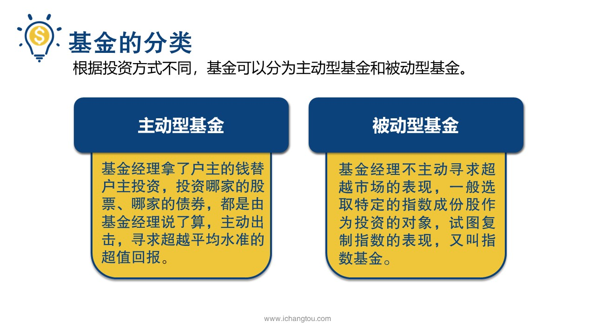
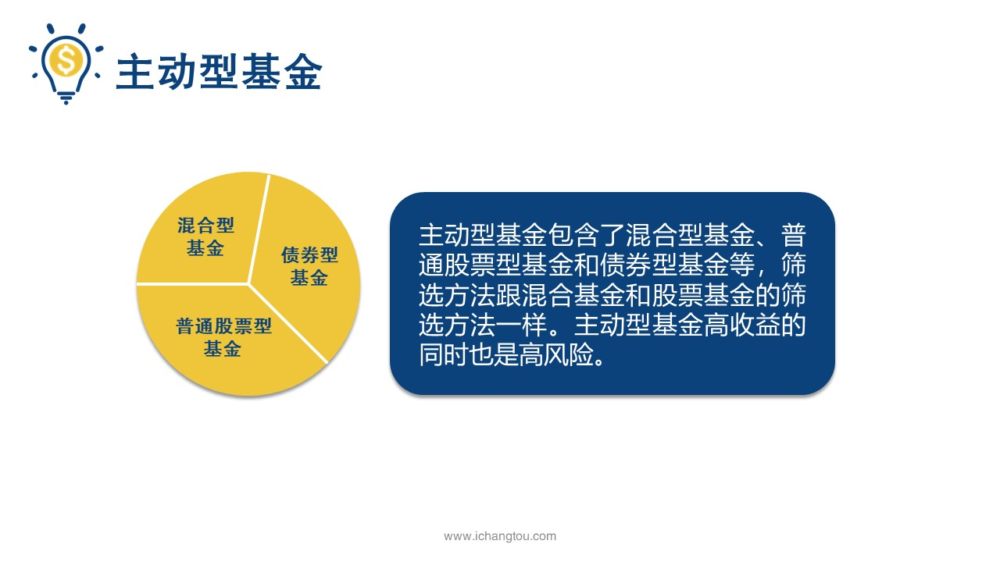
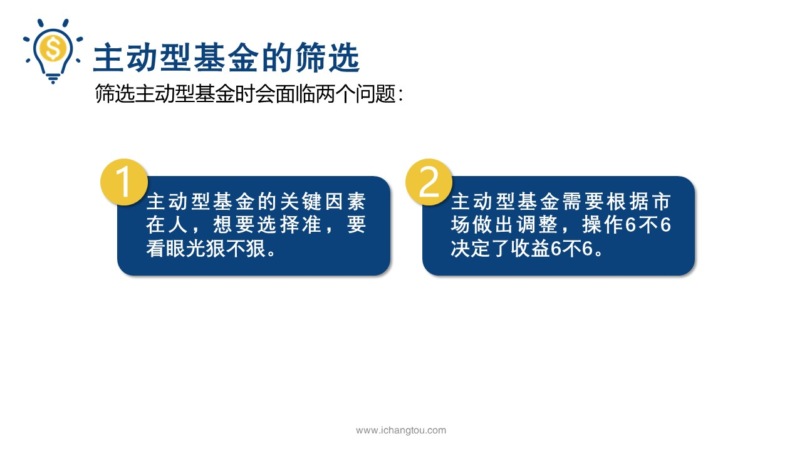
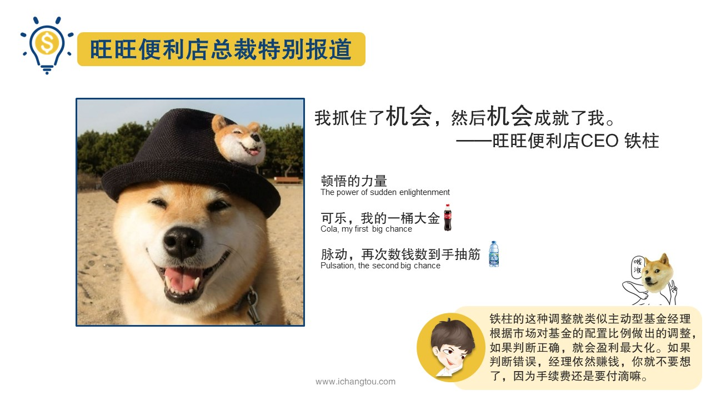
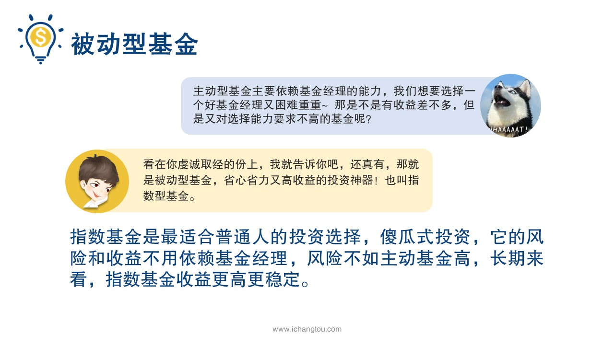
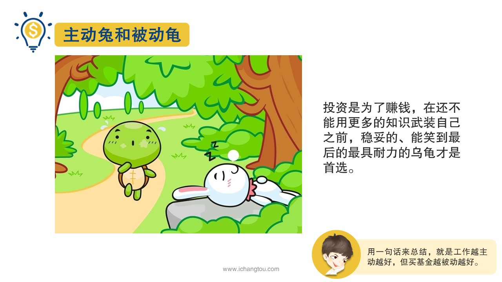
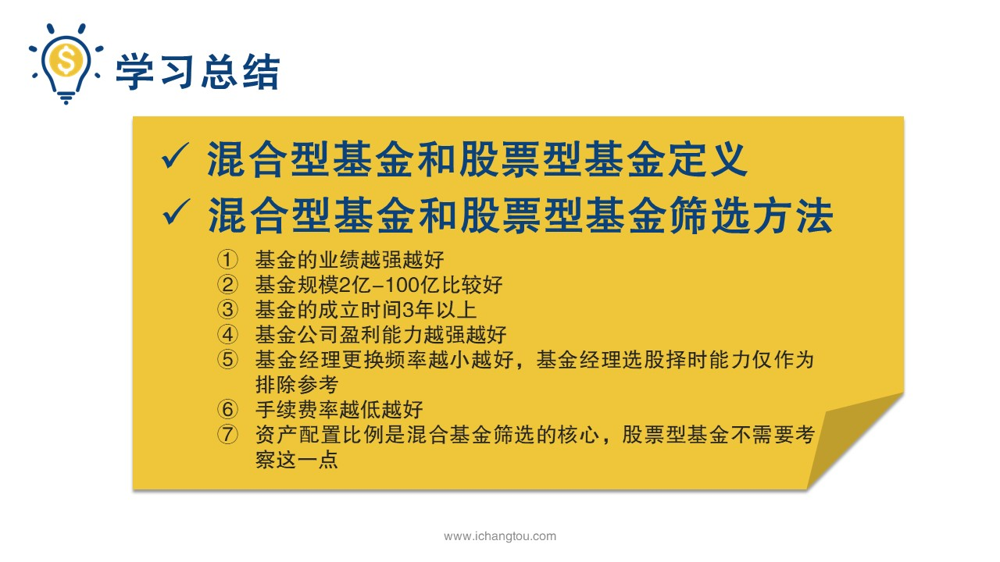
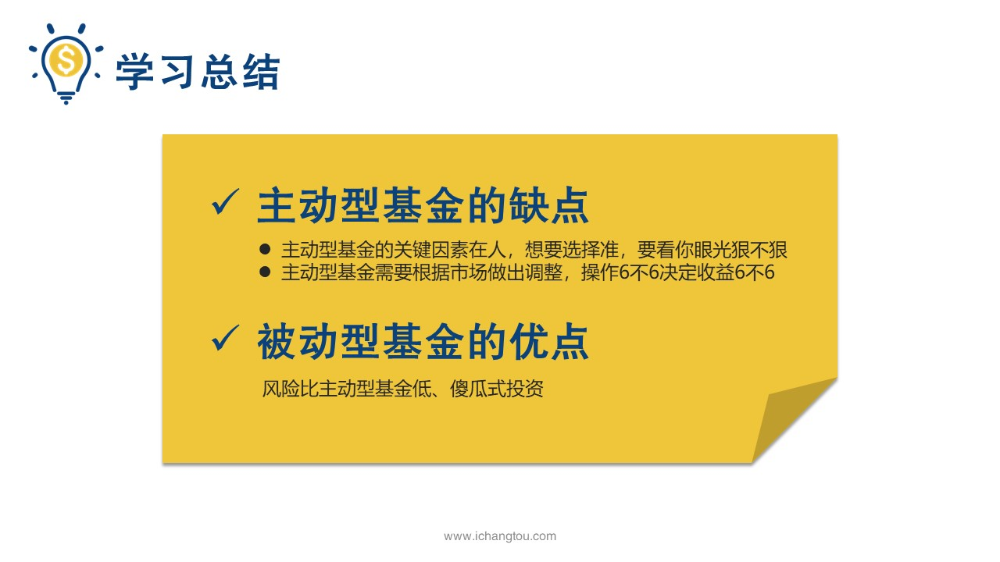

# 基金4-6-主动型基金：想说爱你不容易

## PPT

## 课程内容

### 主动型基金和被动型基金的区别

- xxxx1

  > 好了，到这里我们已经学会了基金按照投资品不同划分的4种类型以及筛选方法，我们还收获了一个筛选技能，可还是感觉种类多的基金让自己眼花缭乱，有没有更省心更省力，还能获得更高收益的投资基金的方法呢？你们这样想好吧，还真有谁让我是师兄的，要想找到这个方法，我们就要先来看看基金，按照不同的投资方式是如何分类的，根据投资方式不同基金可以分为主动型基金和被动型基金，我只知道谈恋爱有主动，被动基金也分主动被动主动型基金，就是基金经理拿了我们的钱来替我们投资投资，哪一家股票，哪家债券都是由基金经理说了算，主动出击，寻求超越水准的超值回报打个比方，小学春季校运会要开始一年级2班的班主任要在班级里面选出参加团体接力比赛的同学，班主任根据自己的观察和掌握的学生数据，最终挑选出了4名同学，根据各自的特点安排好了，接李泗旭组成了小二小二，独一无二的，这里的班主任就像我们的主动型基金的基金经理，4名学生，就是他挑选出来的投资股票债券之类的品种，之所以这么选择和安排，是为了寻求接力大赛最终的好成绩运行机制就是心里不主动寻求超越市场的表现，一般选取特定的指数成份股作为投资的对象，试图复制指数的表现，它又被叫做指数基金，被动型基金其实也是股票型基金的一种，就是比较特殊，所以单独拿出来说，如果继续参加旺才小学的春季校运会呢，比如摸高比赛，看谁跳起来摸的最高，那么基金经理这个班主任只需要按照某个指数，比如身高指数选出班级里面身高前10名的同学组成队伍就可以了，不用费心去多选，等下半年秋季运动会的时候，同学们的身高可能有变化了，但是不用担心还是按照身高指数把不符合的换下来，把符合的加进去就可以了，那么哪种才是我们要寻找的懒人高收益投资神器呢？我们先看看主动型基金，其实主动型基金包含了普通的股票型基金和债券型基金等等他的筛选方法跟今天讲到的混合基金和股票基金的筛选方法一样，需要大家在众多基金中用心挑选主动型基金，高收益的同时也是高风险，它的高风险来自于哪里呢？跟他的致命缺点有关，筛选主动型基金时会面临两个问题，以及主动型基金的关键因素，在人想要选择准，要看你眼光很不好，主动性基金的收益和风险与基金经理个人能力密切相关，这件事好呢，还是不好呢？如果你运气好，遇到的基金经理能力爆棚，眼光独到，行情也给力，那么你的投资收益就好，反正经理能力很挫，眼光差，行情又不给力，那么投资业绩就一塌糊涂了，比如说我们回到前面去的班主任的例子中，班主任负责组建接力大赛的队伍，他需要根据自己对学生运动体能等情况来作出判断，谁最适合参加接力赛，让我起跑快的领跑，第一棒冲刺宽带接最后一棒，这些安排是班主任根据大家日常的表现自己判断的是他觉得厉害的团队，万无一失的团队，那么假如有些同学的发挥不如他的判断，就会影响到整个团队最终的成绩，甚至是惨败告终也是有可能的，因为主观的感知不等于实际啊第2点主动型基金需要根据市场作出调整，操作，六不六决定了收益留不留，时尚先生是有些许的股市是有波动的，股票的投资也需要根据投资环境的改变来做出调整，尽量避免损失惨重，股票型基金也好，混合型基金也罢，都投资了股票，而且股票型基金还有60%的最低仓位限制，所以即使基金经理判断市场出现了危机，需要调整资产配置比例，但也不能将股票全部卖出，混合型基金比股票基金灵活可以自由配置比例，股市上涨可以多配股票获取巨大收益，股市下跌可以完全放弃股票投资转投债券以隔离风险，但能选到这样操作666的混合型基金还是需要有一定的能力和运气的，比如说铁柱经营一家便利店，各种零食，饮料，香烟都有不咸不淡的，卖了很多年，因为你只是突然发现一半的利润来自可乐，铁柱马上意识到自己的春天来了，它减少了其他货物的品种和数量，统计了大量的可乐，每个月的最后一天躲在被子里数钱数到手抽筋，又过了两年，她发现可乐卖的慢了，大家貌似更喜欢喝脉动了，铁柱又囤积了大量的脉动，继续躲在被子里数钱，及时敏感的捕捉到了市场的变化，并且迅速的对自己的生意结构作出了调整，才赢了长久的盈利，提出的这种操作就类似主动型基金经理根据市场对基金的配置比例做出的调整，如果判断正确就会盈利最大化，如果判断错误，反正基金经理一定要赚钱，你妈就不要想了，因为手续费还是要付的吗？可能有小伙伴要郁闷了，基金主要依赖基金经理的能力，我们想要选择一个好经理，有困难重重，那是不是有收益差不多？但是又对投资能力要求不高的基金，看在你虔诚取经的份上，我就告诉你吧，还真有，那就是被动型基金，省心省力，有高收益的投资神器也被叫做指数型基金，指数型基金是最适合普通人的投资选择，傻瓜式投资，它的风险和收益不用依赖基金经理长期来看指数，基金收益更高更稳定不是，他跑的故事大家都听过，如果我们把主动型基金比喻成兔子，那么被动型基金就是乌龟了，兔子的行为不可控，短期内可能会跑得很快，但兔子有时候还会像股市大跌一样睡着了不跑了，或者有时脑子坏掉了还往回跑，反而是慢腾腾的乌龟，慢悠悠的马不停蹄的向前爬行，久而久之乌龟竟然赢过了兔子，我们投资是为了赚钱，但你还不能用更多的知识武装自己，之前稳妥的能笑到最后的，最需要哪里的乌龟才是我们的首选乌龟，虽然跑得慢，但也不影响他成为马拉松小能手啊，因为谁坚持到最后谁才是最大的赢家，只要你坚持投资指数基金就能够成功，穿越牛生活在至少每年12%的收益，如果你再学习一些投资指数基金的方法，就能够获得15~%20%的收益，安全有保障是不是很爽呢？用一句话来总结就是工作越主动越好，但是买基金要越多越好好的，通过今天的学习我们了解了混合基金和股票型基金的定义和特点，并且学会了如何对他们进行筛选和分析，我们也发现其实对他们的筛选是有共通之处的，因此我们可以总结出混合型基金和股票型基金的筛选指标，主要考虑7个方面，第一基金的业绩越长越好，第二基金的规模两个一套110比较好，第三基金在成立时间三年以上，第四基金公司盈利能力越强越好，第五基金经理更换的频率越少越好，你的选股择时能力仅作为排除参考指标，第六手续费越低越好，资产配置比例是混合基金筛选的，核心股票型基金不需要考虑这一点，并且我们后面还学习了由基金经理主动选股的股票型基金的缺点，就是他太依赖姐姐需要看基金经理的人品，还要看他应对市场调整的能力，接着我们最后认识了一种不需要基金经理，主动选股的品种就是指数基金具有风险比主动型基金的傻瓜式投资的优点，那么到底什么是指数基金？它为什么能有这样的优势呢？小学的话把今天教的筛选方法先动手做一遍，我们明天继续来学习指数基金

### 主动型基金的缺点

### 神奇的指数基金

## 课后巩固

- 问题

  > 你关于主动型和被动型基金，下面哪个说法是错误的？
  >
  > A.主动型基金投资风险更高
  >
  > B.被动型基金风险低，长期来看盈利稳定
  >
  > C.主动型基金是新手最理想的投资选择

- 正确答案

  > C。本题选择的是错误的，C选项错误。新手最理想的投资选择是被动型，即指数基金，嗯风险最低，而长期看来盈利稳定。