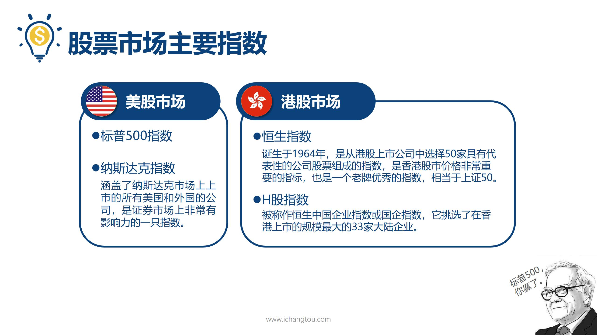
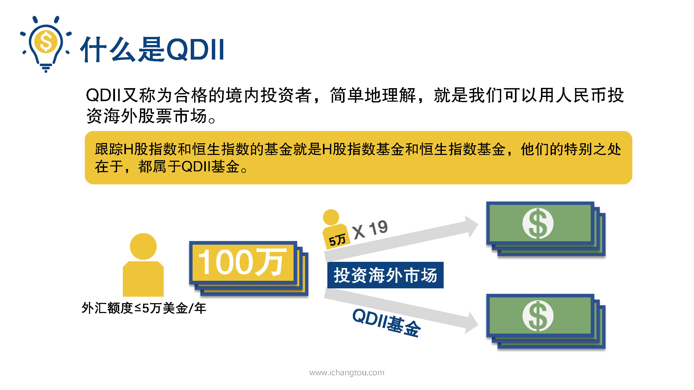

# 基金5-2-除了A股指数还有哪些指数？

## PPT

## 课程内容

### 标普500、纳斯达克指数

- xxxx1

  > 

### H股指数、嗯恒生指数

### QDII基金的定义及优点

## 课后巩固

- 问题

  > 下列有关H股指数说法错误的是？
  >
  > A.每个成分股只能出现在一只指数里
  >
  > B.中证500指数是由指数公司开发的
  >
  > C.沪深300是国内影响力最大最重要的指数

- 正确答案

  > A。本题选择的是错误的，A选项错误。不同指数里可以出现相同的成份股，比如上证50选择的是上海证券市场前50家龙头企业，沪深300是从上海、深圳两市挑选前300家大公司，嗯他们就会出现相同的成分股。