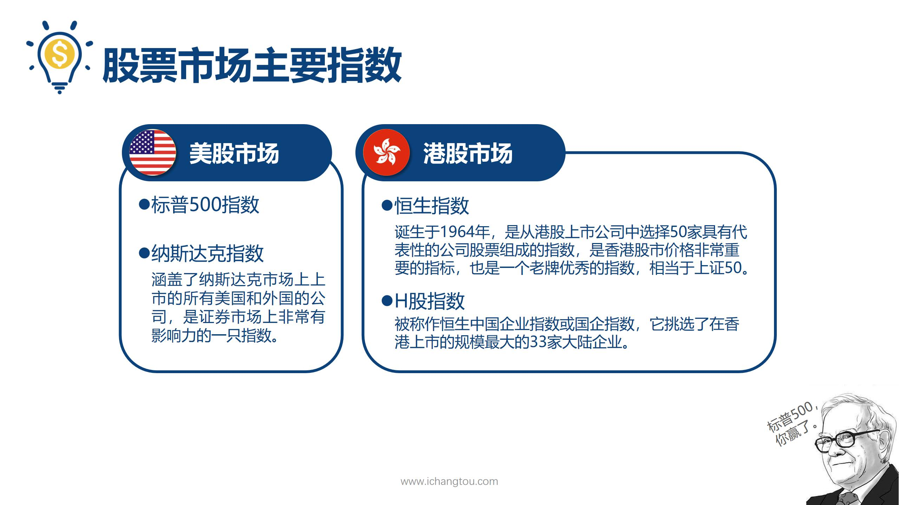
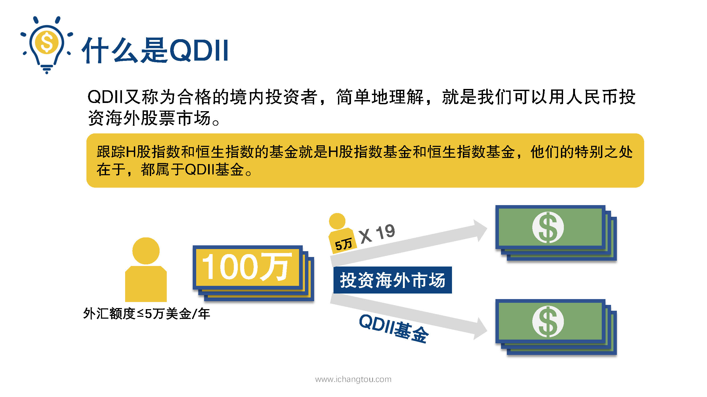

# 基金5-2-除了A股指数还有哪些指数？

## PPT

## 课程内容

### 标普500、纳斯达克指数

- xxxx1

  > 上一节我们学习了A股市场常见的几个指数，这一节师兄要和大家介绍美股和港股市场上常见的指数，小伙伴们还记得上一届师兄说的打败武神巴菲特的标普500吗？他是美股市场的指数，由美国标准普尔公司选定的美国各行业所代表的500家上市公司指数跟咱们的沪深300差不多在10年之前，巴菲特曾经和一位主动型股票基金的经理管理人员立下了一个赌约巴菲特押了100万美元，都标普500会跑赢这个基金经理人选的股票基金，10年之后标普500的收益达到了125.8%，这是基金经理人选的主动性基金的三倍年化收益率达到了8.5%，不过有趣的是巴菲特在赢得赌局的同时，自己近10年的年化收益率普500指数美国还有一个比较著名的指数是纳斯达克指数，涵盖了纳斯达克市场上市的所有美国和外国的公司，是证券市场上非常有影响力的一致指数，比起遥远的美股市场，港股市场和国内的关系会更加紧密，常见的有恒生指数和h股指数，恒生指数诞生于1964年，是从港股上市公司中选择50家具有代表的公司组成的指数，是香港股票市场价格非常重要的指标，也是一个老牌优秀的指数，相当于上证50在过去的54年，他的点位从最初的100点上涨到3万多点，足足上涨了300多倍，恒生指数里有我们很熟悉的公司，比如中国移动，工商银行，腾讯，中石油等等h股指数又被称为恒生中国企业指数或国企指数他挑选了在香港上市的规模最大的33家国内企业，比如中国银行，中国平安青岛啤酒等等h股指数和恒生指数的成分股里有些是相同的，比如工商银行中石油也在h股指数里结合本节介绍的这些指数都有对应的指数基金，而跟踪h股指数和恒生指数的基金就是h股指数基金和恒生指数基金，他们的特别之处在于都属于QDII基金，又称为合格的境外投资者，简单的理解呢，就是我们可以用人民币投资海外股票市场，不知道小伙伴们知不知道我们国家是有外汇管制的什么意思呢？就是我们每一个人往国外汇钱是有限制的，最高不能超过5万美金，如果小伙伴们有100万想要在海外投资房产的话能汇出5万元美金超出的部分，你得想办法用其他朋友啊，亲戚的账户汇钱出去只有100万元，你可是需要找19个愿意不嫌麻烦，可以帮你跨境汇款的好基友，好闺蜜，如果是投资QDII基金就不受这个金额的限制了，也就是说你可以任性的一次性用100万买入有什么好处呢？如果碰上人民币贬值投资QDII基金可是个很好的对冲人民币贬值风险的投资方法

### H股指数、嗯恒生指数

### QDII基金的定义及优点

## 课后巩固

- 问题

  > 下列有关H股指数说法错误的是？
  >
  > A.每个成分股只能出现在一只指数里
  >
  > B.中证500指数是由指数公司开发的
  >
  > C.沪深300是国内影响力最大最重要的指数

- 正确答案

  > A。本题选择的是错误的，A选项错误。不同指数里可以出现相同的成份股，比如上证50选择的是上海证券市场前50家龙头企业，沪深300是从上海、深圳两市挑选前300家大公司，嗯他们就会出现相同的成分股。