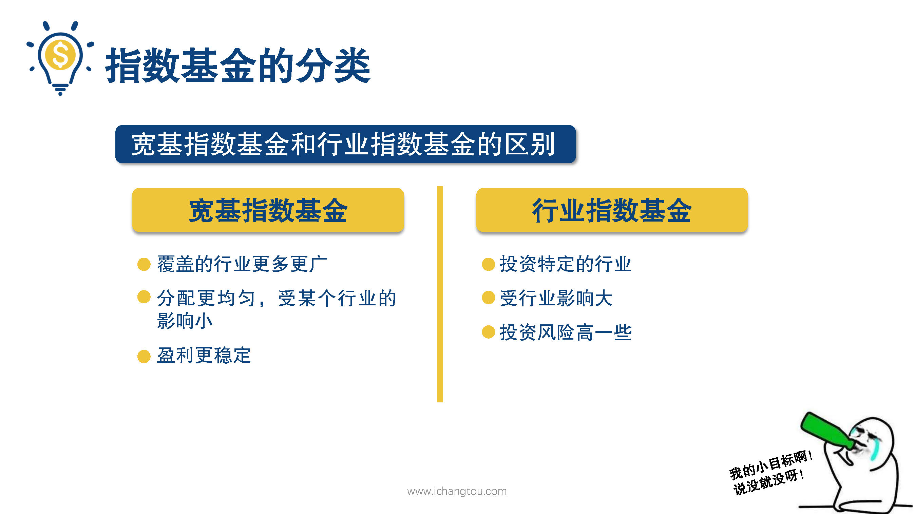
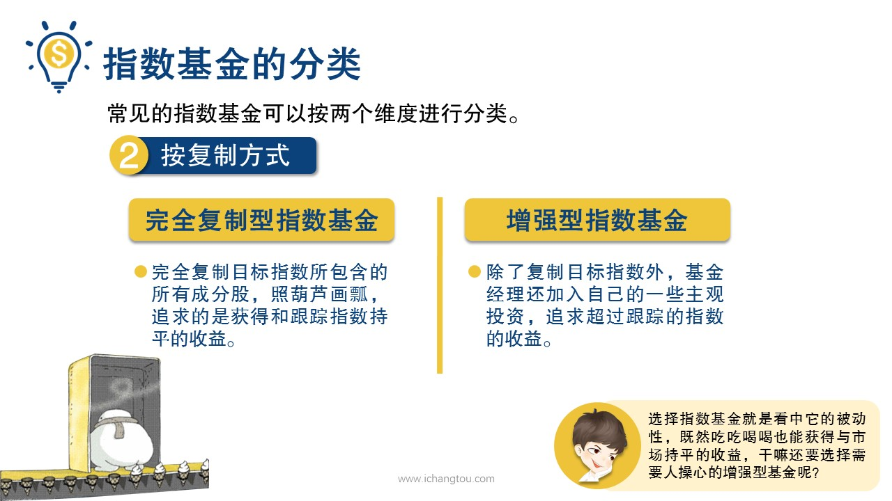

# 基金5-3-指数基金还能怎么分？

## PPT

## 课程内容

### 宽基指数基金和行业指数基金

- xxxx1

  > 上一届师兄带大家认识了美股市场和港股市场的常见指数，还向大家介绍了投资基金，可以对冲人民币贬值的风险，这一届师兄会向大家介绍一下指数基金的分类，常见的指数基金可以按两个维度进行划分第1种植树基金是否通知各行各业，按照这个标准可以把它们分为宽基指数基金和行业指数基金，什么叫通吃各行各业，就是有的指数基金在挑选股票的时候并不限制非得是投资哪些行业，它覆盖了各行各业，这种就属于宽基指数基金，像沪深300上证50，中证500，恒生指数标准普尔500，纳斯达克100等就属于宽基指数，有的指数基金在挑选股票的时候会要求只投资哪些行业的股票，这就属于行业指数基金行业知识。代表消费行业的上证消费80中证消费指数，代表医疗行业的中证，医疗指数和代表白酒行业的中证白酒指数等等这些不用做重点了解，小伙伴们指导一下就行了，指数基金和行业指数基金有什么区别呢？投资行业指数基金因为需要考虑到整个行业的发展特点与阶段受行业的影响更大，所以它的投资风险会高一些，对比行业指数，基金宽基指数基金的最大优势是覆盖的行业更多更广，分配得更均匀，所以它的盈利也就更稳健，这就像是理科，文科都有好的学霸成绩呢，就更加稳定了，而偏科的学生成绩波动就比较大了，比如当年白酒塑化剂事件出来后，第2天中证白酒指数下跌了5.48%，所有酒类指数合计下跌4.58%是因为。意味着市值蒸发了300多亿，这是多少个人的小目标？而同一天沪深300指下跌了0.01%，还有一种分类方法是按复制方法分为完全复制型指数基金和增强型指数基金，完全复制型指数基金，顾名思义就是完全复制目标指数所包含的所有成份股，照葫芦画瓢追求的是获得和跟踪指数持平的收益，而增强型指数基金除了复制目标指数外，基金经理还加入自己的一些主观投资，追求超过跟踪的指数的收益，说到复制型和增强型的区别，会不会有似曾相识的感觉，一个是啥也不做就跟着市场走，永远不掉队，一个呢，还想有自己动些小心思，有可能跑的更快，当然也有可能掉队了，复制型和增强型基金的区别呢，其实就跟主动性和。跟基金的区别是一个道理，不过师兄个人的意见，选择指数基金就是看中它的被动性，既然吃吃喝喝也能获得与市场持平的收益，干嘛还要选择需要人操心的增强型基金呢？有时候操碎了心还不一定能跑赢市场呢，另外要知道选择增强型基金操作更频繁手续费也更高哟。嗯

### 完全复制型指数和增强型指数

## 课后巩固

- 问题

  > 下列不属于宽基指数基金的是哪一项？？
  >
  > A.恒生指数
  >
  > B.上证50
  >
  > C.中证白酒

- 正确答案

  > C。一般行业从字面就能知道，中证白酒指数属于行业指数。