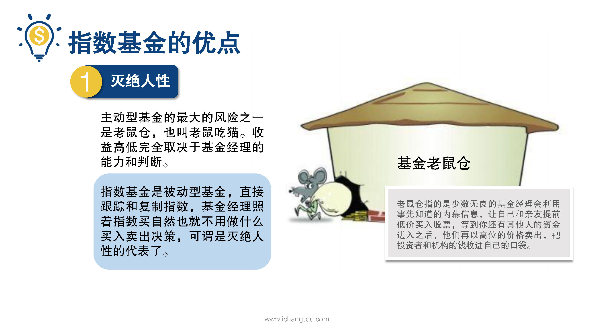
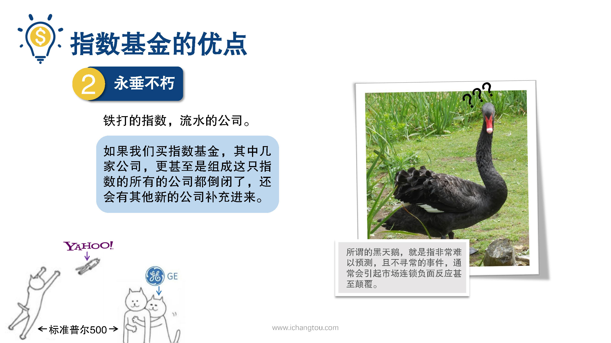

# 基金5-4-霸气侧漏的指数基金

## PPT

## 课程内容

### 基金的被动性（灭绝人性）

- xxxx1

  > 

### 指数基金的永续性（永垂不朽）

### 指数基金的周期性（笑到最后）

## 课后巩固

- 问题

  > 下列哪项是指数基金永垂不朽的表现？
  >
  > A.不断有新的公司可以代替不符合的老公司成为指数的成份股
  >
  > B.长期来看指数基金的收益能一直向好
  >
  > C.买入指数基金，永远不会碰上老鼠仓事件

- 正确答案

  > A。指数没有生命只有标准，不符合的基础组合的纳进来。铁打的指数，流水的公司指数，下面的某家公司倒闭了，还是会有新的公司补充进来。