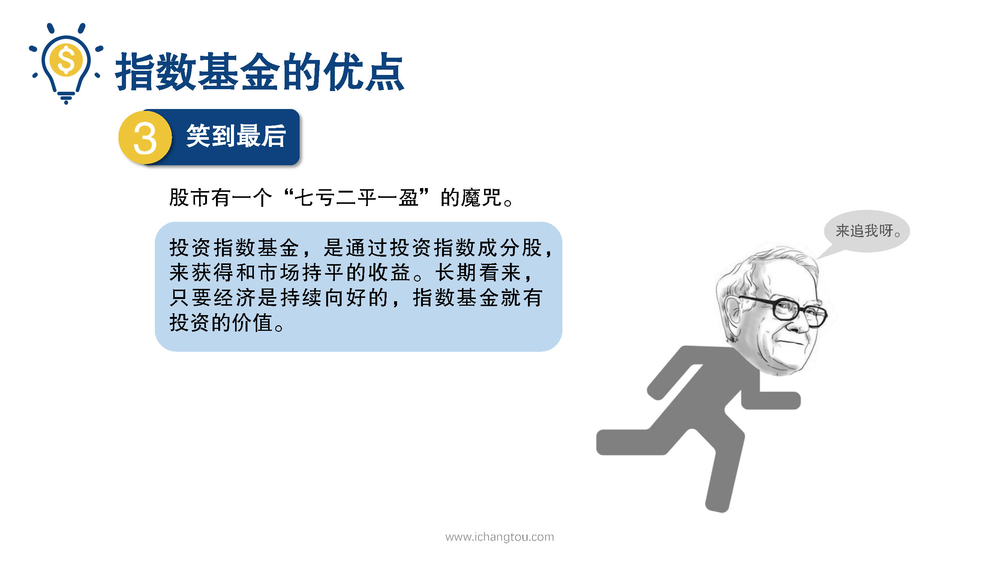

# 基金5-4-霸气侧漏的指数基金

## PPT

## 课程内容

### 基金的被动性（灭绝人性）

- xxxx1

  > 。向大家介绍了指数基金的分类，那么指数基金到底神奇在哪里呢？他凭什么能打败股神巴菲特，在这一届师兄就来和大家说说指数基金的优点，其中可以用12个字来归纳，那就是灭绝人性永垂不朽和笑到最后，我们先来看第1个优点，灭绝人性主动型基金的最大风险之一是老鼠仓，也叫老鼠吃猫，什么意思呢？我们知道主动型基金经理主动选择投资对象和投资时机，买什么，什么时候买都是基金经理说了算，但是呢，基金经理也是人，是人就有私心，有的经理选股的首要标准不是能不能帮投资者赚到钱，而是他们自己能不能挣到钱。指的是少数无良的基金经理，会利用事先知道的内幕消息，让自己和亲友提前低价买入股票，等到你还有其他人的资金进入之后，他们再以高位的价格卖出，把投资者和机构的钱收进自己的口袋，而指数型基金就是被动型基金，基金经理找这只数码就行了，不用做什么买入卖出的决策自然也就没有这个风险了，另外主动型基金的收益高低，完全取决于基金经理的能力和判断，更不要提基金经理在投资的过程中也会犯我们普通人会犯的错误，比如迫于市场和业绩的压力，在市场疯狂的时候还继续买入，在市场萧条的时候不敢进场，而指数基金直接跟踪和复制指数是被动的，可谓是灭绝人性的代表。指数基金的第2个优点永垂不朽，我们都知道公司是有可能因为经营不善而倒闭的一家公司发行的股票不同于债券，如果你买了一家公司的债券，那么即使这家公司倒闭了，他砸锅卖铁也要欠债还钱。但是如果你买入的是股票，那么这家公司要是倒闭了，你作为股东也就只能回家多吃几碗泡面了，除此之外股票还有黑天鹅风险，所谓的黑天鹅是指非常难以预测且不寻常的事件，通常会引起市场连锁的负面反应甚至颠覆当年美国的川普当选时还造成了全国的股市暴跌，这一类的黑天鹅事件一旦发生，即使是再强大的公司，它的股价也会造成巨大的波动。如果我们买的是指数基金，那么即便是其中几家公司，甚至是组成这只指数的所有的公司都倒闭了，还是会有其他新的公司补充进来，比如美国的标准普尔500指数1957年诞生，至今长期存在，但是就像人的新陈代谢一样，纳入标准普尔500指数的公司在这几十年中不断的被更新，比如曾经的互联网教父雅虎公司因为全面出售了，主营业务不再符合标普500成分股的标准，在2017年5月被剔除出局，不过厉害的是标准普尔500种有一家长期存在的公司也就是唯一一家他叫通用电气。只是他没有生命，只有标准不符合的提出符合着那进来铁打的指数流水的公司，60年之后，标普500指数依然存在着，这就是指数基金的永垂不朽的特点，指数基金在第3个优点是笑到最后股市里有一个7亏2平一赢的魔咒，也就是说炒股的人70%都会亏损，20%的人不赚不赔，只有10%的人是最终能赚到钱的，而投资指数基金则是通过投资指数的成分股来获得和市场持平的收益，长期看来只要经济是持续向好的指数基金就有投资的价值，这意味着什么呢？因为只要你坚持长期投资指数基金就能够成功的穿越牛熊获得市场平均每年12%的收益，如果你在学习一些。指数基金的方法就能够把投资收益提高到每年15~%20%，这样一来你就能够打败股市中90%的投资者，成为那赚钱的10%，一不小心也有可能会打败巴菲特。

### 指数基金的永续性（永垂不朽）

### 指数基金的周期性（笑到最后）

## 课后巩固

- 问题

  > 下列哪项是指数基金永垂不朽的表现？
  >
  > A.不断有新的公司可以代替不符合的老公司成为指数的成份股
  >
  > B.长期来看指数基金的收益能一直向好
  >
  > C.买入指数基金，永远不会碰上老鼠仓事件

- 正确答案

  > A。指数没有生命只有标准，不符合的基础组合的纳进来。铁打的指数，流水的公司指数，下面的某家公司倒闭了，还是会有新的公司补充进来。