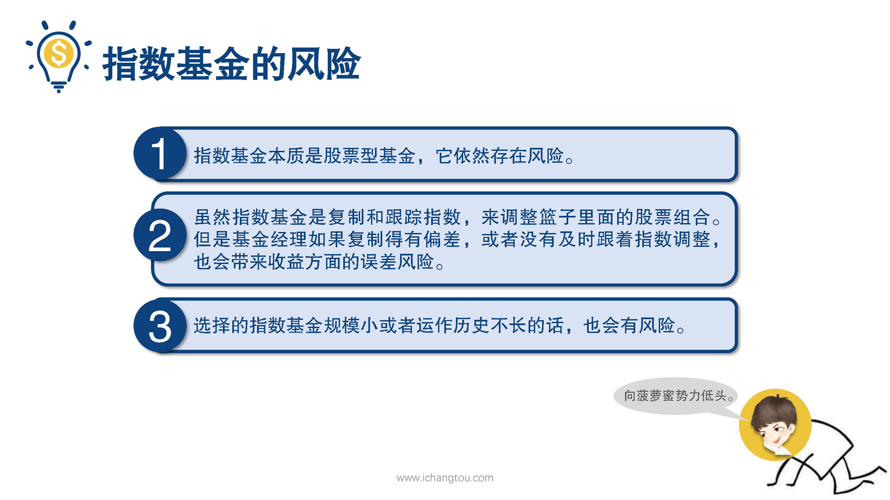
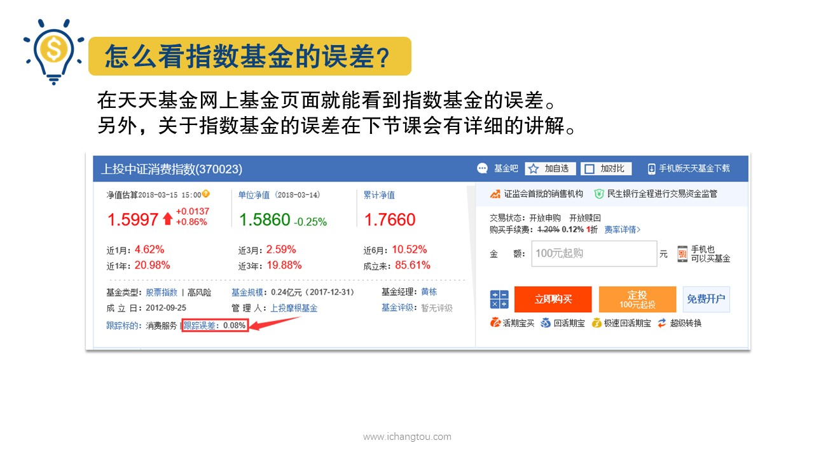

# 基金5-5-指数基金一定安全吗？

## PPT

## 课程内容

### 本质是股票型基金

- xxxx1

  > 师兄一直在向大家介绍指数基金的好处，那么投资指数基金是不是就完全没有风险了呢？先问大家这个世界上会有完美的情人吗？并没有同理，这个世界上也没有完美的投资品，即便是被巴菲特老爷子偏爱的指数基金也有隐藏的风险。如果哪一天有谁向你推荐收益又高，风险又小的投资品，那么师兄只有一句话就是林林霍元甲整体来说指数基金有三方面的风险，首先指数基金本质上是股票型基金，它依然存在风险，短期内它会跟着市场波动，市场指数基金跟着市场跌的话它也会跟着跌，可以说是一损俱损，一荣俱荣，虽然指数基金是复制和跟踪指数来调整篮子里面的股票组合，但是基金经理如果复制的有偏差，或者没有及时跟着调整指数，也会带来收益方面的误差风险，比如说吧，师兄一般不会推荐股票给别人，但是有一天要是师兄的同事二狗承包了我一个星期的菠萝蜜的话，我太感动了，所以呢，我给他推荐了一组股票组合，只要二狗跟着师兄调整这个组合，他就能。可是用一样的手艺，但是有时候会出现误差，比如说师兄调整的时候，二狗出去约会了，没有及时跟上，或者二狗资金不够，没有买齐师兄一样的股票组合啊，谁让他不早点开始理财呢？那么这些情况就会导致它的收益和师兄的产生误差。我们在天天基金网上基金页面就能看到指数基金的误差，另外关于指数基金的误差，我们在下节课还会有更详细的讲解哟，风险的最后一点是选择的指数，基金规模小或者是运作的历史不长的话也会有风险指数，基金规模太小，那么遇到有大额赎回的话，基金公司如果没有足够的现金就要抛出手里的股票，而如果恰好这时股票又还没赚钱或者股票都跌停了，无法卖出基金公司就会有资金流的危机，还有就是基金公司成立时间太短的话，它的历史数据少，我们就无法通过大量的数据来判断它复制指数的误差程度以及与其他指数基金的对比情况，而且成立时间短盈利未必稳定，也不能知道曾经的牛市熊市，它的表现如何，所以风险也会相应的更大。

### 指数复制的不好

### 基金规模小，成立时间短

## 课后巩固

- 问题

  > 嗯下列有关指数基金风险，错误的说法是？
  >
  > A.基金经理的选股能力会影响值基金的收益
  >
  > B.指数基金超过80%投资的事情，相应就会有风险
  >
  > C.只要是投资就会有风险，指数基金也不例外

- 正确答案

  > A。本题选择的是错误的，A选项错误嗯。指数基金是被动型基金，基金经理们只需要根据相应指数组建股票组合，他们选股能力的高低对指数基金的影响很小。