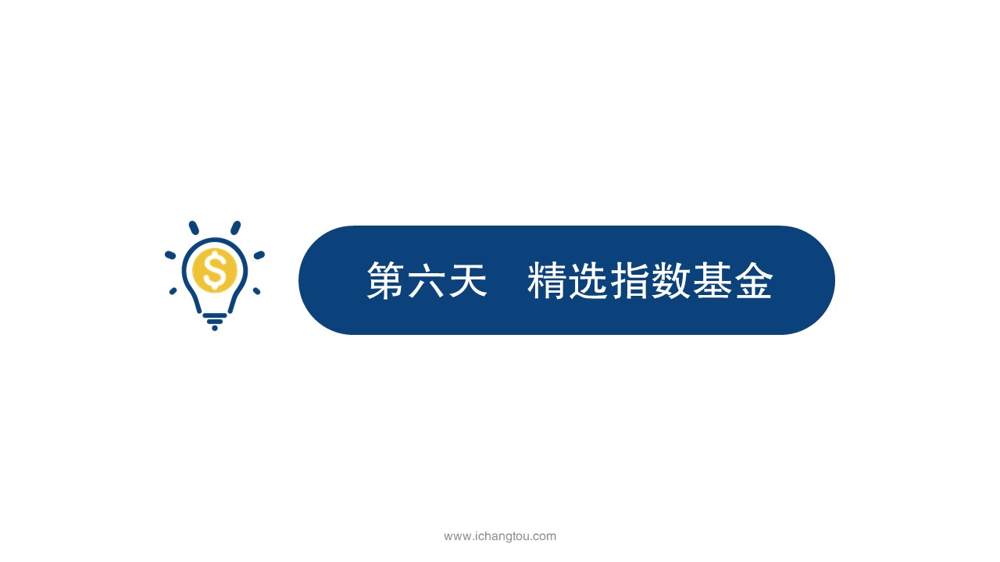

# 基金6-1-选基三部曲（上）

## PPT

## 课程内容

### 确定想要投资的指数（宽基）

- xxxx1

  > 小伙伴们大家好，我是百合学姐，接下来这几天的内容将由我带大家一起学习，相信前面师兄已经跟大家介绍过我了，这里就不再多说，直接开始我们指数基金之旅，昨天师兄给大家介绍了一个非常好的投资品种指数基金，我们知道了，它具有灭绝人性永垂不朽和笑到最后这几大优势，那我们是不是就能像大妈抢黄金一样直接冲进指数基金呢，当然不信昨天师兄也跟大家说了熊市跟踪误差以及指数基金规模的大小，成立时间的长短，这几个因素都会影响它的收益水平，为了买到能帮我们好好赚钱的指数基金，我们还是需要在指数基金中淘一淘，排除掉差的选出好的那指数基金千千万。才能选到比较靠谱的那个他呢，步骤会不会很复杂？先别担心，我们先看看生活中的经验，比如买化妆品时会怎么选？不管是女孩子买给自己还是男孩子送女朋友，我们一般分三步，首先确认好要什么，要三秒提气色就锁定口红，那接着看哪家公司出的，你会去买一个今年刚起步做化妆品的品牌吗？不会的，肯定会从最经典的香奈儿迪奥阿玛尼这些知名品牌里选确认好这些后最终再看看哪个颜色最火爆，哪个效果最自然，哪个价格最便宜等等最终付款买回家就算这样选出来不是最好的，那个也不会差到哪儿去的，其实指数基金也可以参考这个思路，我们分三个步骤来筛选。确定想要投资的指数，精选基金，公司锁定基金第1步确定想要投资的指数，选择指数基金的本质就是要选择指数指数本身没有好坏之分，只有合适与否，对于大部分投资者来说，选择一个代表性强主流的指数即可，只要指数本身是长期向上就可以纳入投资范围，选择指数还可以结合自己的偏好或根据收益预期来决定，就像买化妆品要三秒提气色就锁定口红，想面如桃花就选择腮红，如果你想获得市场平均收益，就可以选择代表A股的沪深300指数，学姐的建议是最好选择宽基指数，至于原因嘛，师兄昨天已经讲过，我就不再赘述了第2步。精选基金公司基金公司的实力对指数基金的表现起着至关重要的作用，在2015年股灾的时候，很多股票连续跌停，那个时候很多投资者手里拿着股票想卖都卖不出去，大量的投资人要赎回基金，而基金公司在应对大额赎回上的表现差距非常大，拓普斯的基金公司无论实力还是经验都胜过小基金公司，这跟我们购物的原理也是一样的，就还是拿买口红来说吧，我肯定首选迪奥雅诗兰黛，娇兰，阿玛尼这些响当当的牌子，为什么呢？因为他们的色系多色号全产品质量信得过，而且专柜也多，服务也到家，水里试到满意才下单，这样的购物体验真的太好了，因此选择大规模的基金公司非常必要。大基金公司经过长时间运营的指数基金更是首选，如何判断基金公司有没有实力呢？公司规模是一个重要的衡量标准，目前国内一般资金规模超1000亿的基金公司实力都不可小觑。

### 精选基金公司（规模超过1000亿）

## 课后巩固

- 问题

  > 在筛选指数基金的过程中，下列哪种说法是错误的？
  >
  > A.选基金公司只要看这家公司名字好不好听就行
  >
  > B.投资指数基金最好选择宽基指数
  >
  > C.资金规模超1000亿的基金公司是首选

- 正确答案

  > A。本题选择的是错误的，A选项错误。基金公司好不好，看的是他的实力、规模，而不是名字，投资是一件理性的事情，并非靠占卜算卦哦。