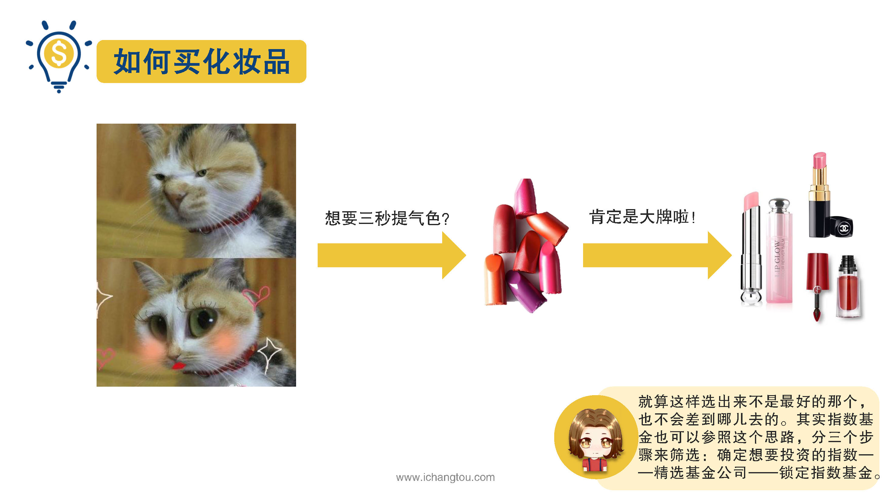
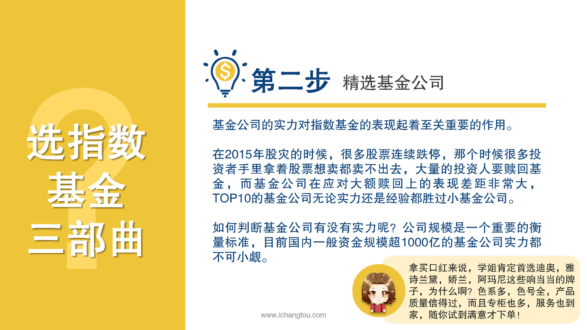

# 基金6-1-选基三部曲（上）

## PPT

## 课程内容

### 确定想要投资的指数（宽基）

- xxxx1

  > 

### 精选基金公司（规模超过1000亿）

## 课后巩固

- 问题

  > 在筛选指数基金的过程中，下列哪种说法是错误的？
  >
  > A.选基金公司只要看这家公司名字好不好听就行
  >
  > B.投资指数基金最好选择宽基指数
  >
  > C.资金规模超1000亿的基金公司是首选

- 正确答案

  > A。本题选择的是错误的，A选项错误。基金公司好不好，看的是他的实力、规模，而不是名字，投资是一件理性的事情，并非靠占卜算卦哦。