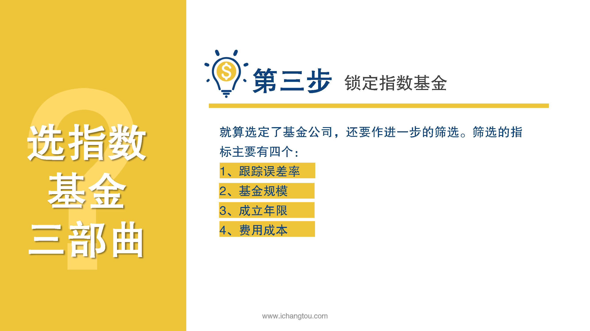
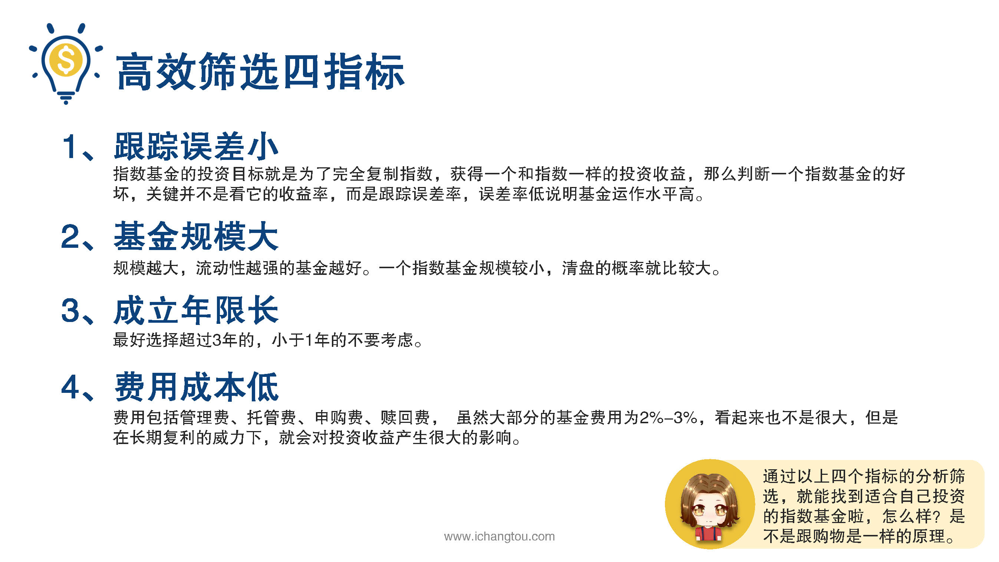

# 基金6-2-选基三部曲（下）

## PPT

## 课程内容

### 跟踪误差率小

- xxxx1

  > 上一节我们学习了塞选指数基金的前两部确定想要投资的指数和精选基金公司这一节我们继续第3部锁定指数基金的4个指标，就算我们选定的基金公司，我们还要做进一步的筛选，才能最终锁定好的指数基金筛选的指标主要有4个跟踪误差率，基金规模及费用成本，先看第1个指标跟踪误差率，判断标准是要低于同行平均水平，而且越低越好指数基金的投资目标就是为了完全复制指数获得一个和指数一样的投资收益，那么判断一个指数基金的好坏，关键并不是看它的收益率，而是跟踪误差率，误差率低说明。作水平高选口红的时候，你肯定喜欢颜色更正的色差更小的，色差相差太大的，我们肯定不乐意买。第2个指标是基金规模规模越大，流动性越强的基金越好，为什么要避开规模小的指数基金呢？一个指数基金规模小盘的概率就比较大，基金清盘并不是说我们的投资血本无归了，而是按照某一个基金净值强制赎回，说白了就是强制你卖出持有的基金，导致我们的投资中断规模和流动性是互相促进的，规模越大，选择的人也就越多，流动性就会加强，也进一步吸引更多人选择，又提高了规模，这点也很好理解了，大品牌公司产品更好卖，赚的就多，在技术开发，运营管理投入更多产品资料就更加秒杀小长假，又进一步提升品牌，购买的人就越多简单说。卖的好就会卖得更好。第3个指标是陈丽联系，最好选择超过三年的，小于一年的，不要考虑，这点也很容易理解，时间是最好的证明，基金刚成立时他的运作能力谁也不知道，可能实力超强又或者水平超赞，就是第1年他表现优异，但不排除是走了狗屎运又或者突然人品大爆发，才捡了个大便宜，但如果连续三年都能保持成绩优良的话，那就说明这家伙经受了时间的考验，确实有几把刷子，第4个指标是管理费用率，要在经过上述指标排查后，找出费用最低的指数基金，这些费用包括管理费，托管费，申购费，赎回费，虽然大部分的基金费用为2~%3%，看起来也不是很多，但是在长期复利。一下就会对我们的投资收益产生很大的影响，在挑选基金时选择费用越低的越好，相对来说场内基金无论是管理费或交易费都远低于场外基金，这点不用学解释，大家都能秒懂，遇到一只口红，颜色更色差更小，价格还更实惠，你难道会不喜欢吗？通过以上4个指标的分析筛选，我们就能找到适合自己的指数基金了，怎么样？是不是跟购物是一样的道理呢？在这两节中我们学习了指数基金筛选的三个步骤指数，建议选择有代表性的宽基基金，公司的规模超1000亿，最后通过跟踪误差率小，指数基金规模大，成立年限长及管理费率低，选出好的指数基金，如此这般货比三家，你心目中的他就浮出水面了，虽然思路有了，但仅仅纸上谈兵是不够的，下一届学姐将通过一个实际案例演示，如何筛选出一支好的指数基金。

### 基金规模大

### 成立年限超3年

### 管理费率低

## 课后巩固

- 问题

  > 下面哪一个指标不是锁定指数基金的筛选指标？？
  >
  > A.跟踪误差率
  >
  > B.管理费率
  >
  > C.收益率

- 正确答案

  > C。本题选择的是不属于筛选指标的，c选项不属于。判断指数基金好坏的关键并不是看它的收益率，跟踪误差率低，说明基金运作水平高，基金规模和管理费率也是衡量指数基金好坏的一个指标。