# 基金6-3-指数基金筛选实操

## PPT

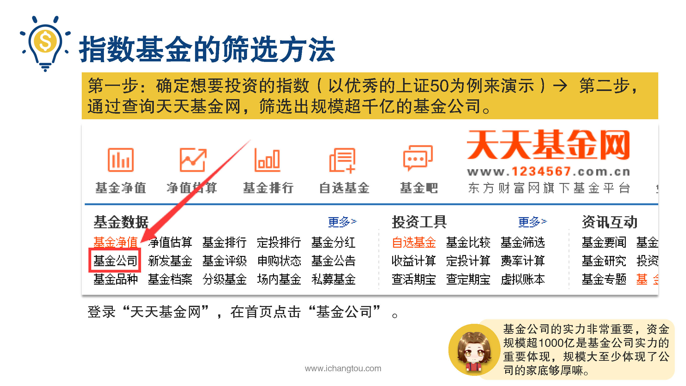

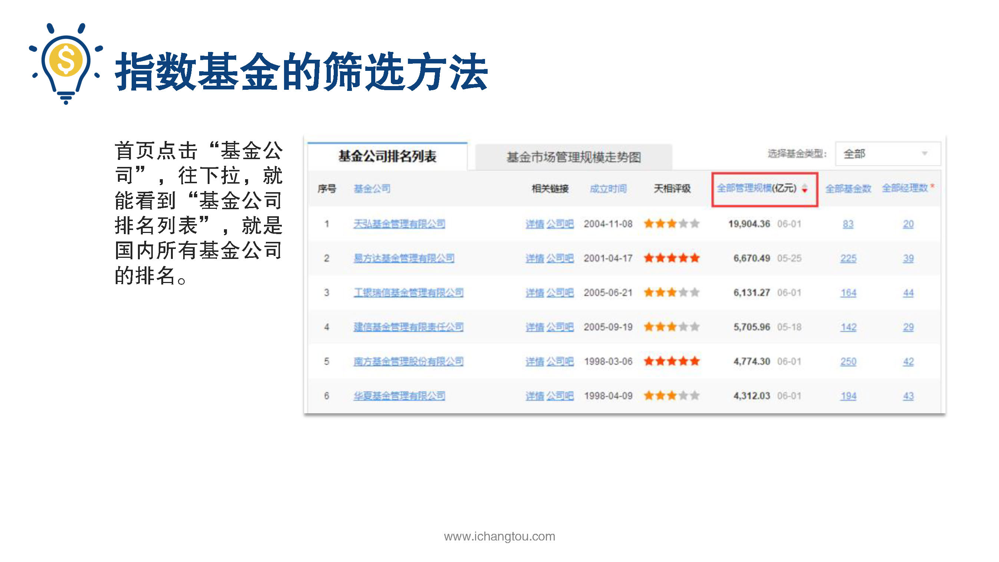

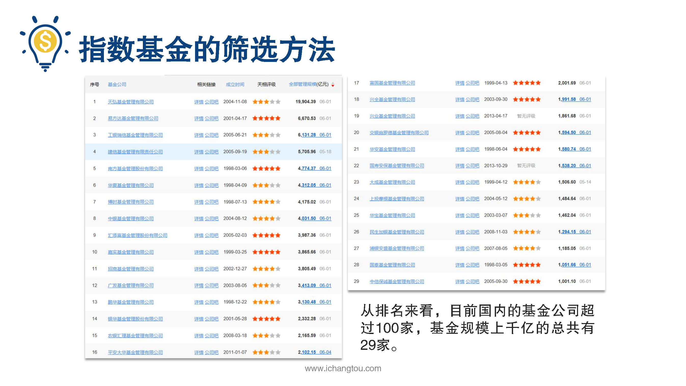

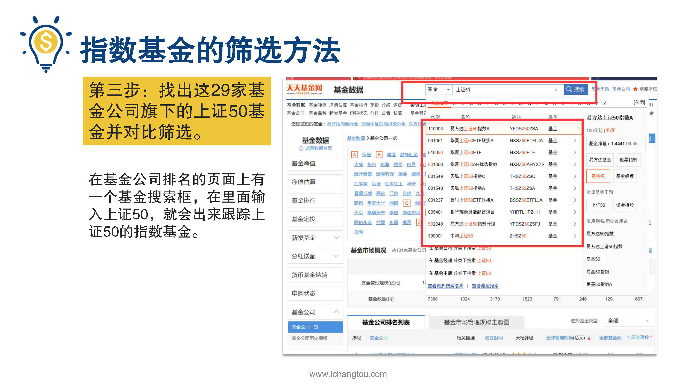

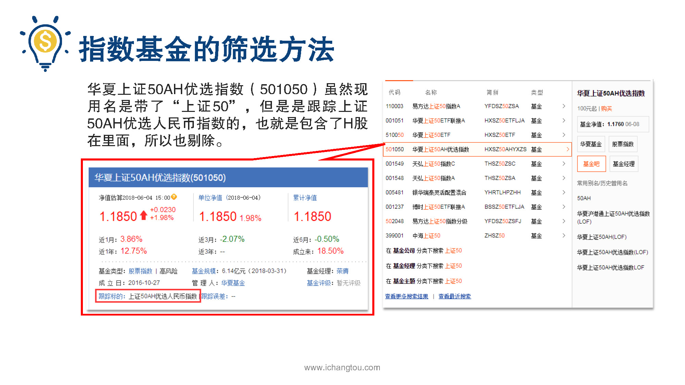

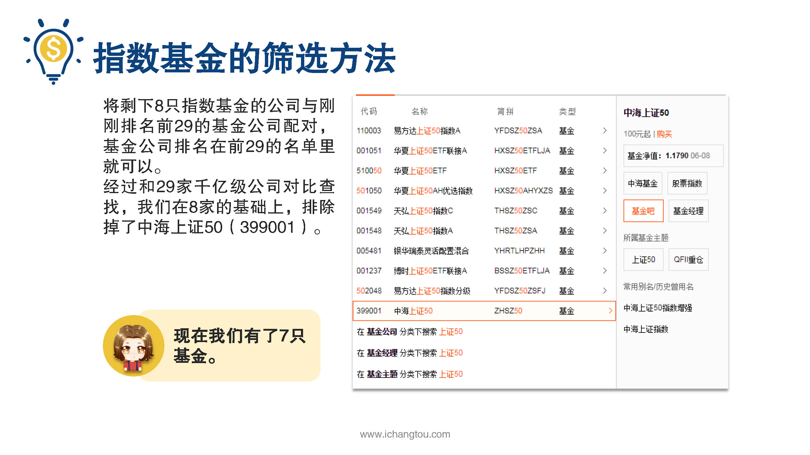

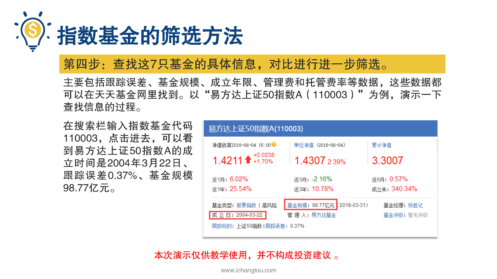

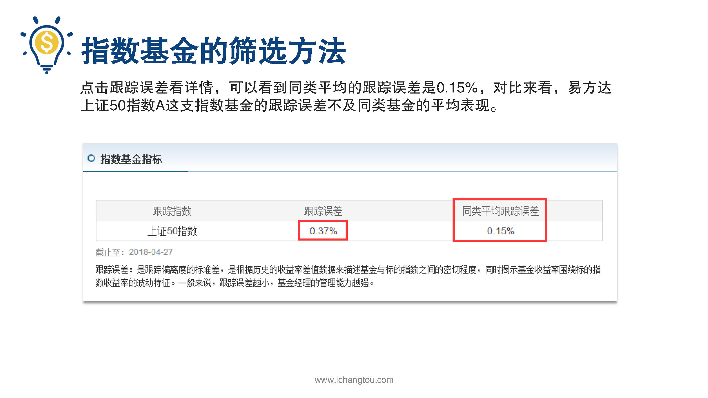

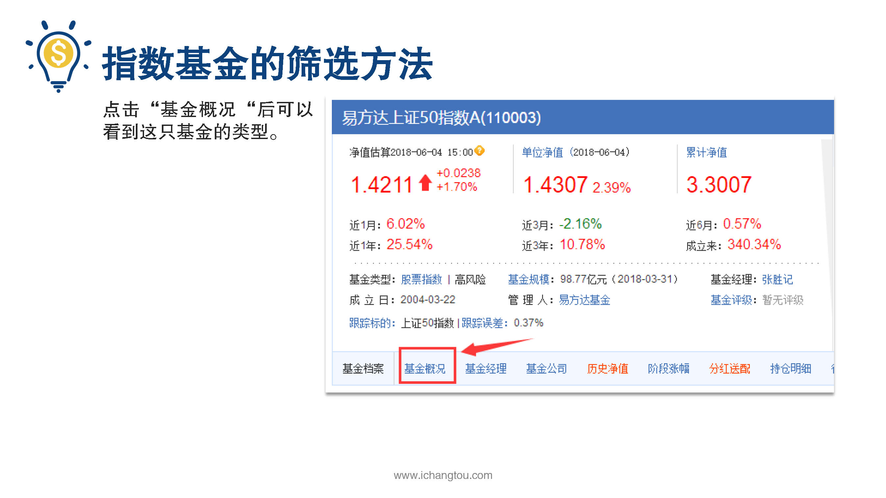

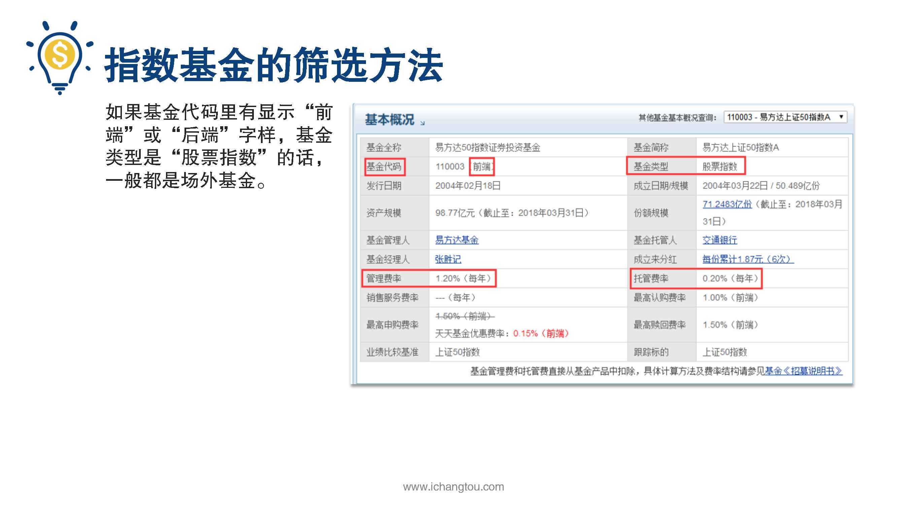

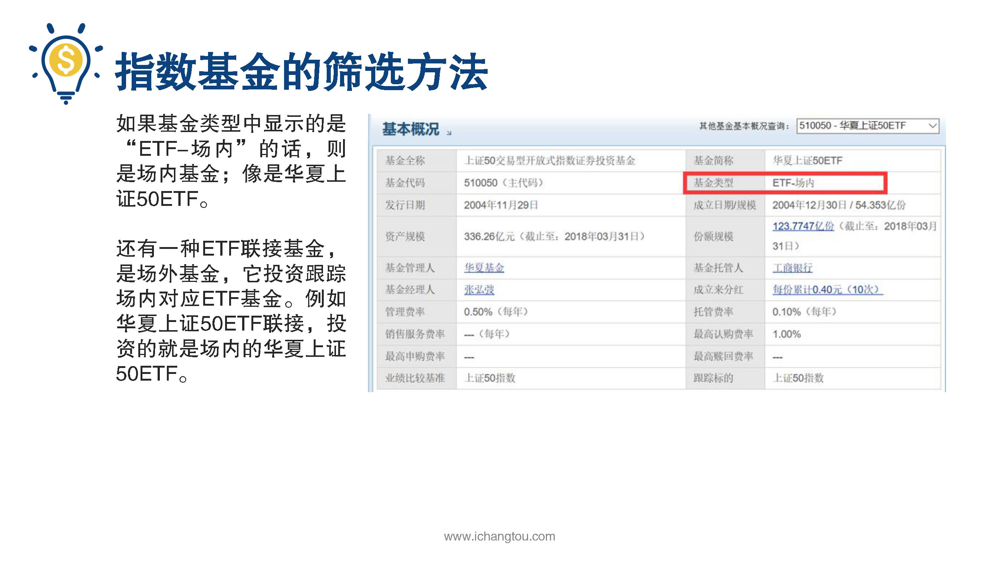

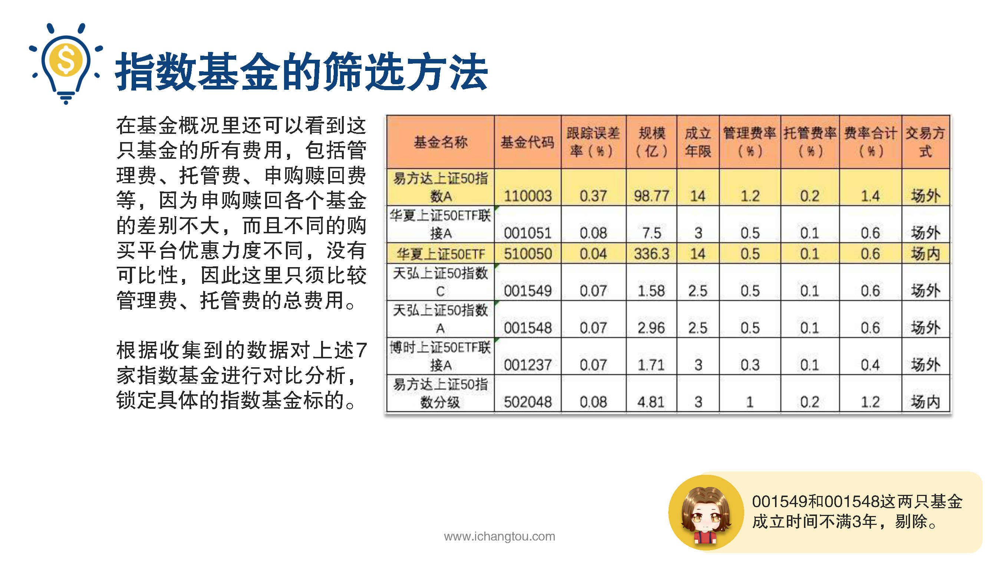

## 课程内容

###确定想投资的指数（上证50）

- xxxx1

  > 

### 上天天基金网根据基金公司排名，筛选出规模超1000亿的基金公司

### 在天天基金网查找基金数据，根据四个指标锁定好的基金

## 课后巩固

- 问题

  > 下面说法中，哪一项是锁定指数基金必须首先考虑的指标？
  >
  > A.成立年限
  >
  > B.跟踪误差率
  >
  > C.基金规模

- 正确答案

  > B。筛选指数基金首先要考虑基金的跟踪误差率，误差率越小越好，其他另外三个指标在此筛选基础上再综合考量。