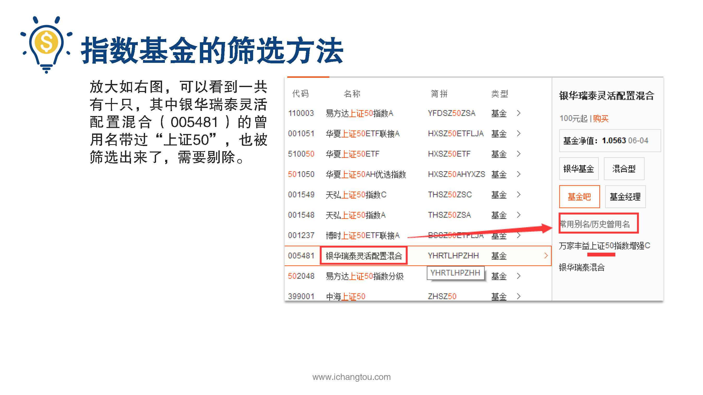
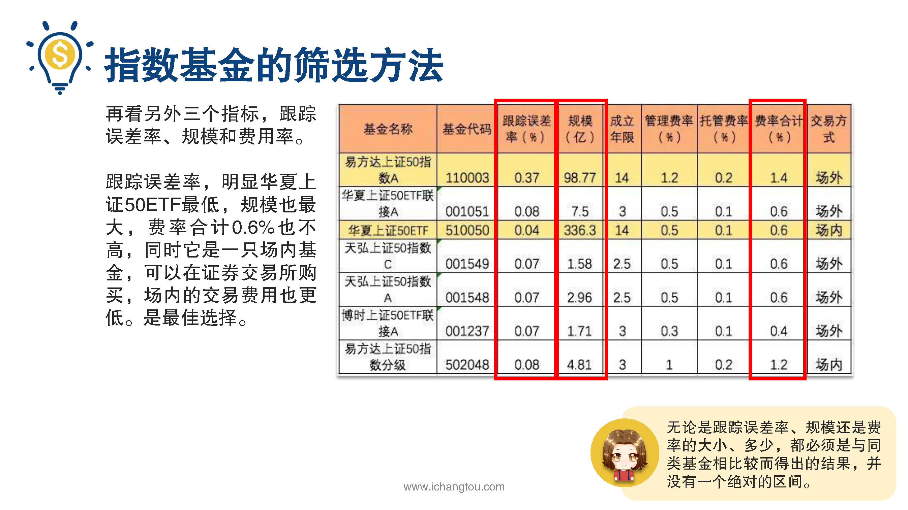

# 基金6-3-指数基金筛选实操

## PPT

## 课程内容

###确定想投资的指数（上证50）

- xxxx1

  > 上一节我们学习了3选指数基金的方法，方法虽然很简单，但估计不少小伙伴还是有很多疑惑，比如按上面的方法，我们要了解的基金数据还是不少的，那这些数据要去哪里找呢？找到数据之后又要怎么去分析筛选呢？对于这么爱思考的小伙伴们，学姐是超喜欢的，为了让大家能够理解得更加深入透彻，我就按照上面三个步骤带着大家一起操作一下，怎么筛选指数基金，第1步确定想要投资的指数，既然学姐推荐的是宽基指数，那就以优秀的上证50为例来演示第2步，通过查询天天基金网，筛选出规模超千亿的基金公司，前面我们已经说过基金公司的实力非常重要。资金规模超1000亿是基金公司实力的重要体现，这里可不是我势利眼，我们把自己的钱交给基金公司打理，如果他们没点实力，我们怎么能放心呢？规模大至少体现了公司的家底够厚吗？那要怎样才能找到规模超千亿的基金公司呢？我们登陆天天基金网，在首页点击基金公司往下拉，就能看到基金公司排名列表，就是国内所有基金公司的排名。从排名来看，目前国内的基金公司超过100家基金规模上千亿的，总共有29家，就是下面这些了。继续第3步，找出这29家基金公司旗下的上证50基金对比并对比塞选具体如何操作呢？仍然在刚刚那个基金公司排名的页面上面有一个基金搜索框在里面输上证50就会出来跟踪上证50的指数基金，放大看就是这个图，我们可以看到一共有10只，其中银华瑞泰灵活配置混合的曾用名带过上证50也被筛选出来了，需要剔除华夏上证50ah优选指数，虽然谢永明是带了上证50，但是是跟踪上证50ah优选人民币指数的，也就是包含了h股在里面，所以也提出将剩下8只指数基金的公司与刚刚排名前29的基金公司配对。基金公司排名在前29的名单里就可以了，经过和29家千亿级公司对比查找，我们在8家的基础上排除了中海上证50公司太小爱不起。现在我们有了7只基金，接下来进行第4步，查找这7只基金的具体信息对比进行进一步筛选，主要包括跟踪误差基金规模，成立联线管理费和托管费率等数据，这些数据都可以在天天基金网里找到，下面以易方达上证50指数a为例，演示一下查找信息的过程，首先我们在上一张截图的界面中点击易方达上证50指数a，又或者直接在搜索栏输入基金代码110003，点击进去后，我们就看到了易方达上证50指数a的成立时间是2004年3月22日，跟踪误差0.37%，基金规模98.77亿元。你跟踪误差看详情可以看到同类平均的跟踪误差是0.15%，对比来看易方达上证50指数a指数基金的跟踪误差不及同类基金的平均表现。基金概况后可以看到这只基金的类型，如果基金代码里有显示前端或后端字样，基金类型是股票指数的话，一般都是场外基金，如果基金类型中显示的是ETF场内的话，则是场内基金像是华夏上证50ETF，还有一种ETF联接基金是场外基金，他投资跟踪场内对应的ETF基金，比如华夏上证50ETF联接投资的就是场内的华夏上证50ETF。该基金概况里还可以看到这只基金的所有费用，包括管理费，托管费，申购赎回费的，因为申购赎回各个基金的差别不大，而且不同的购买平台优惠力度不同，没有可比性，因此这里我们只需比较管理费托管费的总费用，我们把这些关键资料都汇总到Excel表里，其他另外6家子鼠基金也用同样的方法进行信息收集，PPT中的图表就是我整理出来的Excel表格了，最后我们根据搜集到的数据对上述7家指数基金进行对比分析，锁定具体的指数基金标的，从学姐整理好的Excel表中可以看到在这7只基金中只有易方达上证50指数a和华夏上证50ETF成立时间。14年，其余几只成立年限刚满三年2001549和001548，这两只基金成立时间不满三年退出，再看另外三个指标跟踪误差率，规模和费用率，跟踪误差率明显，华夏上证50ETF最低规模也最大，费率合计0.6%也不高，同时它是一只场内基金可以在证券交易所购买，场内的交易费用也更低，是最佳选择，但是有些小伙伴想在场外购买怎么办呢？在选出的几只场外基金中虽然易方达上证50的跟踪误差率略高，但是它的规模大，成立年限也相对另外几只，成立刚满三年，规模只有个位数的基金而言更稳定，因此如果在场外投资的话。而且会选择易方达上证50，在这里学姐想提醒的一点是，无论是跟踪误差率规模还是费率的大小多少都必须是与同类基金相比较而得出的结果，并没有一个绝对的区间，只要在同类基金中他各方面的指标都明显优于对手，那么就可以判断出这家基金在同类中是属于优秀的好了，到这里我们已经可以筛选出合适的指数基金了，那接着该怎么做呢？打开华泰的软件输入选出指数基金的代码选好数量，然后点击购买吗？恭喜你离韭菜又近了一步，不想成为韭菜的话就不要错过下节的内容，我们会介绍给指数基金估值的指标。

### 上天天基金网根据基金公司排名，筛选出规模超1000亿的基金公司

### 在天天基金网查找基金数据，根据四个指标锁定好的基金

## 课后巩固

- 问题

  > 下面说法中，哪一项是锁定指数基金必须首先考虑的指标？
  >
  > A.成立年限
  >
  > B.跟踪误差率
  >
  > C.基金规模

- 正确答案

  > B。筛选指数基金首先要考虑基金的跟踪误差率，误差率越小越好，其他另外三个指标在此筛选基础上再综合考量。