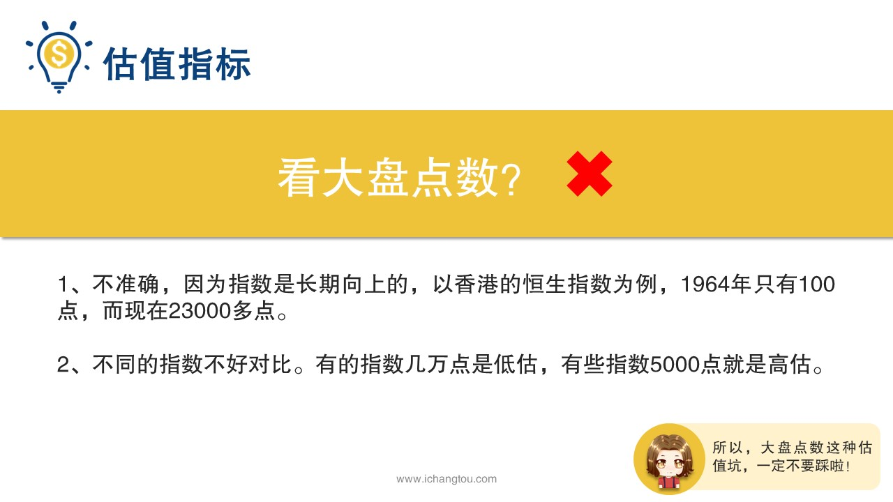
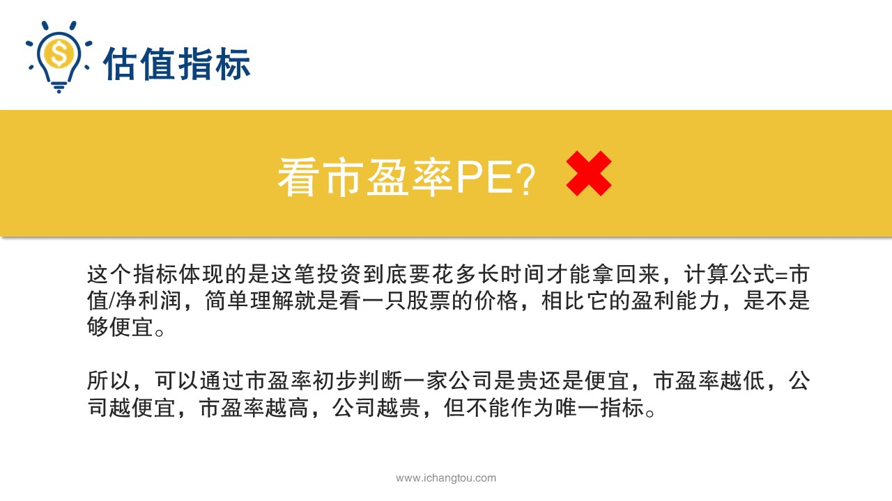
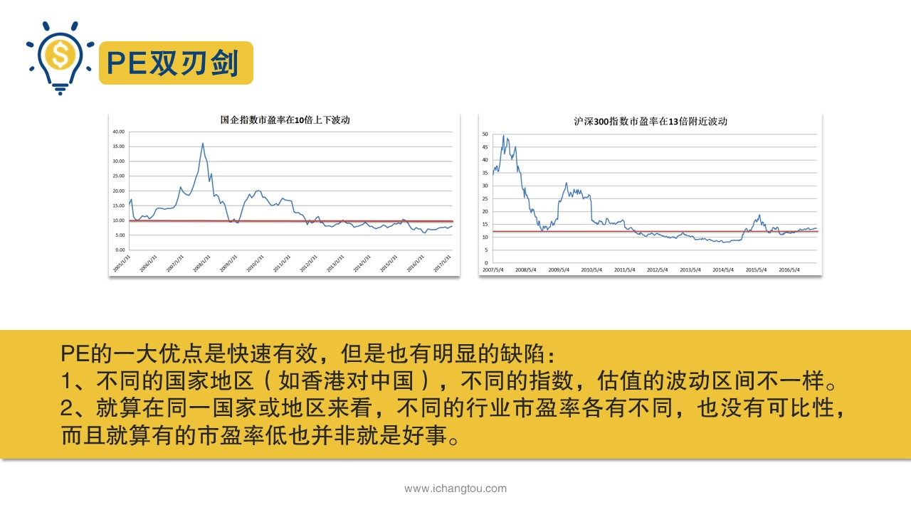
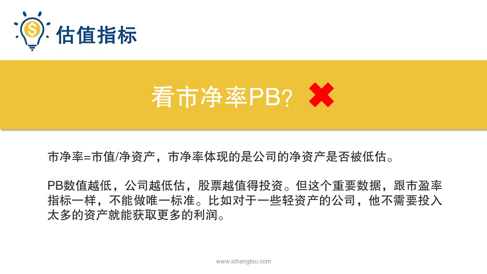

# 基金6-4-有的指标不靠谱

## PPT

## 课程内容

### 1、大盘点数

- xxxx1

  > 上一节我们学会了查找基金的相关数据，运用选集三部曲，轻松选出好的指数基金也知道，就算选出指数基金后也不能贸然就买，否则就成韭菜了，那样怎样才能避免韭菜的命运呢？先看你现实中是不是韭菜吧，假如有个胡子拉碴的卖水果大叔每天都会来你小区门口卖水果，但是价格永远不固定，任性的大叔会根据太阳升起的角度，鸟叫的音量决定价格，有时候香蕉卖5元一斤，有时候又会要价20元一斤，你会到小区摊位就掏钱买吗？学姐相信你一定会先问问价格，如果价格合理才买，价格贵的离谱，那就下次再说万一。撞大运。就可以多买点。那指数基金也是一样啊，我们买入之前需要看看它现在的价格贵不贵，在便宜的时候买才更划算呀，有的小伙伴可能会说这个简单，我看大盘点数就行，大盘点数15年，最高位是5100点，到现在只有3300点，接近打6折了，现在买划算，学姐必须要说大盘点数，如果是买卖指标的话，绝对是第1个不靠谱指标，这里的大盘点数就是很多股民常常挂在嘴边的，今天大盘涨了多少？跌了多少的那个大盘一般的大盘点数指的是上证综合指数的点数，靠大盘点数决定入场时机，这个做法非常常见，有的人说以大盘3000点为基准低于3000点。2800点的时候就多买，等到了4000点以上的时候就减少定投或者是分批撤出。但是这种判断方法第一不准确，因为指数是长期向上的，以香港的恒生指数为例，他1964年只有100点，现在23,000多点，在90年代恒生指数大部分时候只有几千点，而现在已经不可能跌到1万点以下了，我们的A股市场1990年的时候是100多点，你又怎么能够拿3000点作为基准呢？对，还有一个问题就是不同的指数不好对比，有的指数几万点是低估，有的指数5000点就是高估，那我问你恒生指数23,000点是低估还是高估呢？上证指数3000点是低估还是高估呢？你能回答出来吗？所以大盘点数这种估值坑一定不要踩。第2个不靠谱指标市盈率p这个指标体现的是你这笔投资到底要花多长时间才能拿回来？它的计算公式是只除以净利润简单，理解就是看一只股票的价格相比，它的盈利能力是不是够便宜，假设一家公司市值是100万美元，每年净利润40万美元，那市盈率就是10倍，如果你是个财大气粗的土豪，拿出100万美元收购了这家公司，那每年公司为你赚10万美元，10年就可以回本，如果市值是100万美元，每年净利润只有1万美元，那市盈率就是100，也就是要100年才能回本，如果明知道这笔买卖要100年回本，你还愿意买，那你真就是脑残级土豪了。我们可以通过市盈率初步判断一家公司是贵还是便宜，市盈率越低，公司越便宜，市盈率越高公司越贵。这个指标并非一无是处，简单粗暴，快速有效是它的一大优点，但是也有明显的缺陷，首先不同的国家地区不同的指数估值的波动区间不一样，有的15倍是高估，有的15倍是低估，比方说香港市场的重要指数，国企指数也就是h股指数过去十几年的市盈率在4倍上下波动，但是代表沪深300的中国内地指数市盈率在13倍附近波动13倍的国企指数可能就是较高估值了，但13倍的沪深300是低估，所以不能横向比较，只能自己跟自己的历史水平进行纵向比较。其次就算在同一国家或地区来看，不同的行业市盈率各有不同，也没有可比性，而且有的市盈率低也并非就说明估值低，比如很长一段时间银行股的市盈率普遍低于5倍，股价接近净利润数据是不是比较完美？然而银行股当时所处的市场环境不好，利润并不会有很大改善，第1次赢率也并不代表收益会好。再举个例子，地产股的市盈率很多都低于10倍，即使销售创新高，股价也很低迷，为什么呢？因为大部分地产的负债都很高，所以单单看市盈率这一个重要指标，而不考虑其他的结论也是不负责任的。最后一个不靠谱指标是市净率PB。市净率等于市值除以净资产和市盈率相似，市净率体现的是公司的净资产是否被低估？还是以上面那家公司为例，如果公司的市值是100万，而他的净资产才10万，那它的市净率PB就是10，很显然这种状态下这家公司是被高估了的，所以PB也是数值越低估值越低，股票越值得投资，但市净率指标跟市盈率指标一样，也有它的局限性，比如对于一些轻资产的公司，它不需要投入太多的资产就能获取更高的利润，在这种情况下几瓶4斤率高就断定公司是高估，未免就太武断了，所以如果以市净率做估值的唯一标准并不靠谱，这一节我们知道了大盘点数。银率和市净率这三个估值指标单独使用的话，都有它不太靠谱的地方，听到这里小伙伴们是不是觉得情绪低落，向投资者数基金也太难了吧，明明已经选出了好的基金，居然还是不知道现在能不能买，也太憋屈了，大家先别急着伤心，事情没有大家想的那么糟，下一届会给大家介绍一种靠谱的估值指标。

### 2、市盈率

### 3、市净率

## 课后巩固

- 问题

  > 下属的估值指标中，哪一个是靠谱的工资指标？
  >
  > A.大盘点数
  >
  > B.长投温度
  >
  > C.市净率

- 正确答案

  > B。本题选择的是靠谱指标，b选项靠谱。三个不靠谱指标分别是大盘点数、市盈率、市净率。