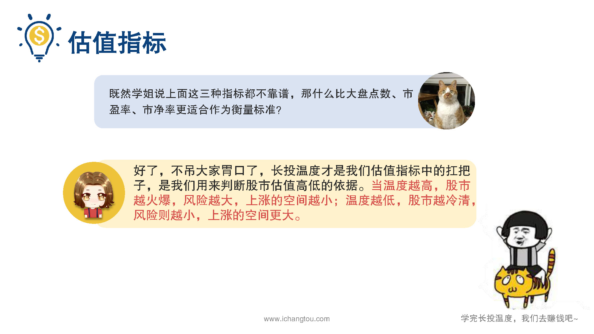
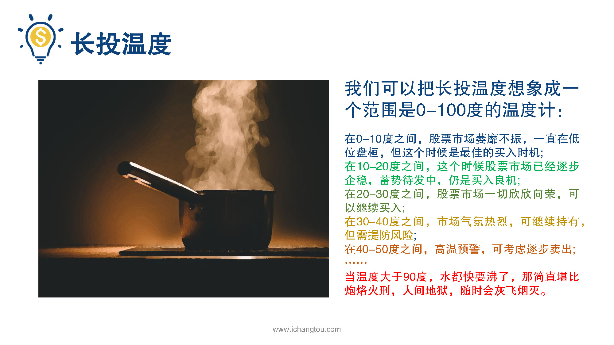
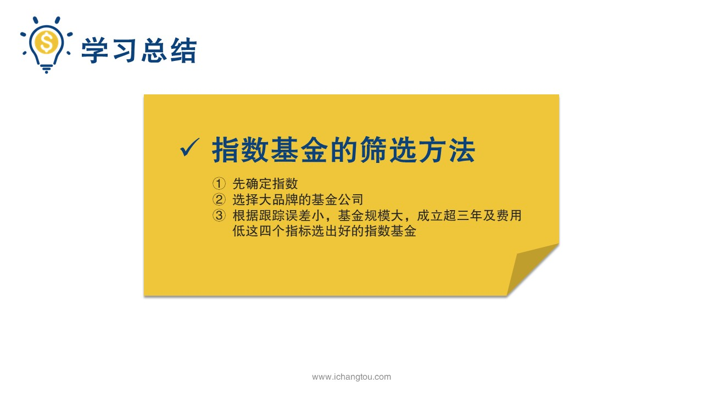
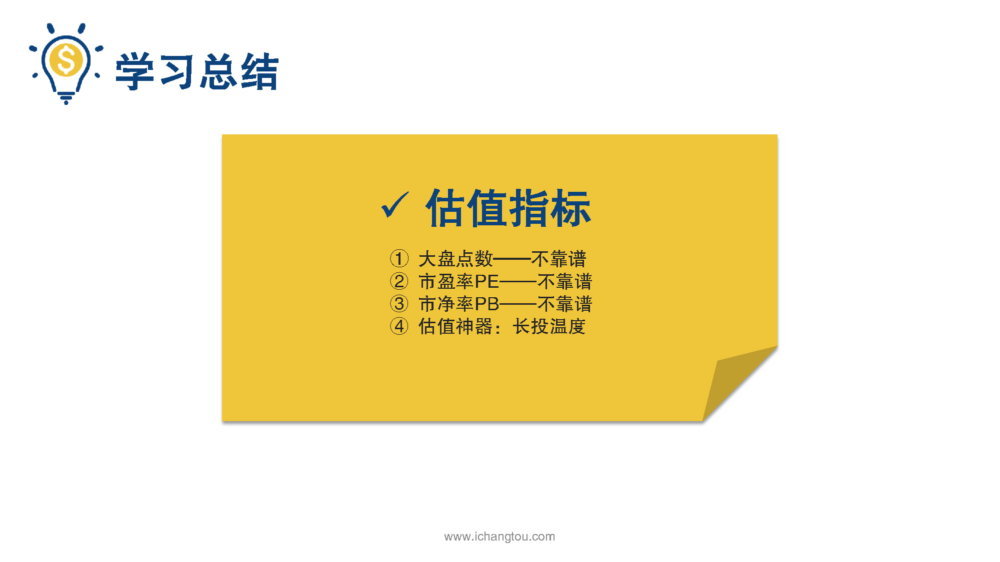

# 基金6-5-初识长投温度

## PPT

## 课程内容

### 长投温度越高，股市越火爆，风险越大，上涨空间越小

- xxxx1

  > 嗯，上一节我们知道给指数基金估值的三大不靠谱指标是大盘点数市盈率和市净率，小伙伴们听了估计挺闹心的，学姐总跟我们说这个不靠谱，那个不靠谱，那到底还有没有一种靠谱的指标呢？这个必须有，之所以一上来就把所有不靠谱的指标告诉你们，就是不想让你们掉坑啊，我们如果不想掉坑的话，首先要知道坑在哪里，这样以后再看健康的时候就能够完美避开，现在学姐就把压箱底的干货告诉大家，我们现在手里就有一个非常靠谱，而且经过市场验证的估值指标，那就是墙头温度好学的小伙伴又要问了，既然上面这些如雷贯耳的重要指标都不靠谱那。大盘点位市盈率市净率更适合作为衡量指标呢，好了，不吊大家胃口，床头温度才是我们估值指标中的扛把子，温度越高，说明股市越火爆，风险越大，上涨的空间越小，温度越低，说明股市越冷清，风险则越小，上涨的空间更大，我们可以把长头温度想象成一个范围是0~100的温度计，那么在0~4度之间，寒冬季节万物萧条，股票市场萎靡不振，一直在低位徘徊，要等到春天到来，但这个时候是最佳的买入时机，既然冬天已经来了，春天还会远吗？在10~20度之间寒冬已过初春绽放，这个时候股票市场已经逐步企稳。发展仍是买入良机，在20~30度之间是春暖花开的季节，股票市场一切欣欣向荣可以继续买入，在30度到40度之间，酷暑难耐，市场气氛热烈可继续持有，但需提防风险在40度到50度之间，高温预警可考虑逐步卖出，当温度大于90度，那简直堪比好老火星人间地狱随时会灰飞烟灭，有了墙头温度这个大温度计，我们再来理解股市估值的火爆程度是不是只关了很多呢？听起来是不是很神奇，居然可以用温度来判断估值的高低，则到底靠不靠谱啊，小伙伴们不必心急，明天我们就给大家想想。藏头温度的原理和具体的计算方法，到时候大家就知道我是不是在吹牛了，好了，今天的课已经讲完了，现在回顾一下学习内容，我们学习了指数基金的筛选方法，具体步骤是先确定指数在选择大品牌的基金公司，然后根据跟踪误差率小，基金规模大，成立超三年及费用低，这4个指标选出好的指数基金，紧接着我们知道了，看大盘点数市盈率和市净率，PB这三个都是不靠谱的估值指标，最后给小伙伴们介绍了估值神器枪头温度，但是它是什么原理？为什么有这样的效果？如果我想自己计算能够算得出来吗？放心我们不会尝试，肯定会给大家讲解清楚的。记得复习哦，明天我们不见不散。

### 温度越低，股市越冷清，风险则越小，上涨空间更大

## 课后巩固

- 问题

  > 下面对于长投温度的描述，哪一项是错误的？
  >
  > A.指数的长投温度越高，股市越火爆， 市场机会越大
  >
  > B.指数的长投温度越低，风险越小，上涨空间更大
  >
  > C.指数的长投温度越高，风险越大，上涨空间越小

- 正确答案

  > A。本题选择的是错误的，A选项错误。长投温度越高，股市越火爆，风险越大，上涨的空间越小；温度越低，股市越冷清，风险则越小，上涨的空间更大。