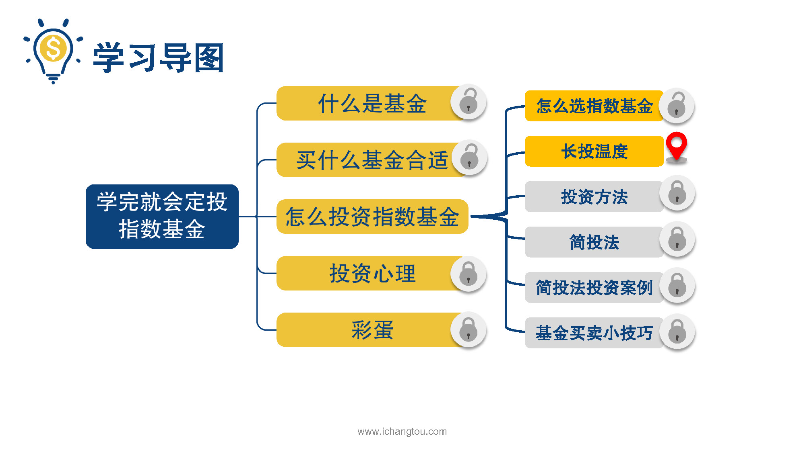
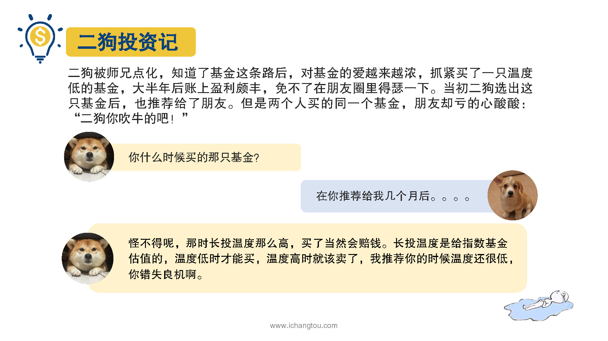
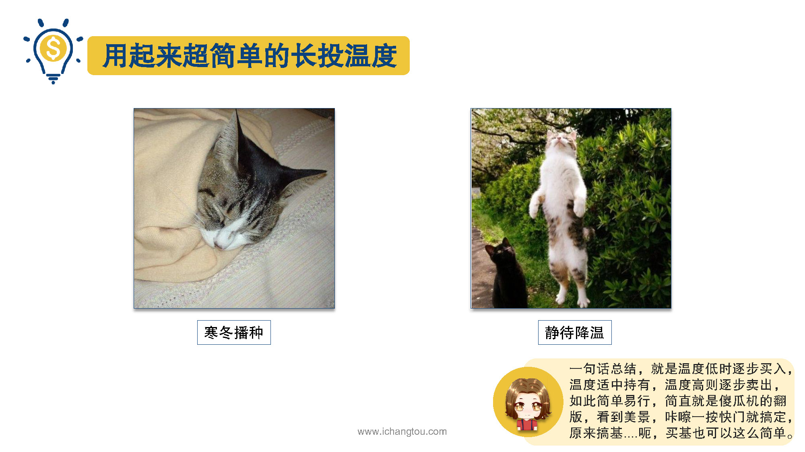
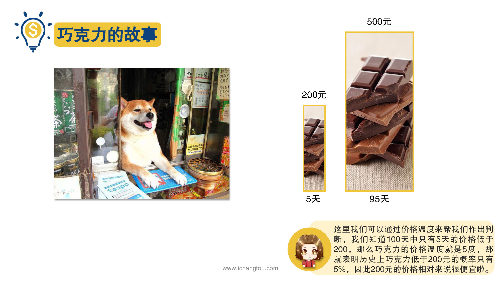
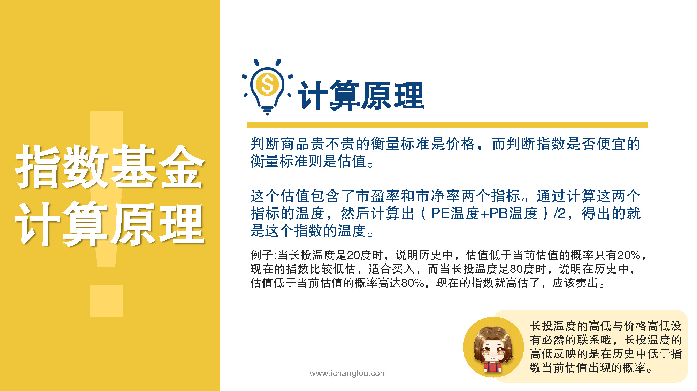

# 基金7-1-长投温度怎么玩

## PPT

## 课程内容

### 长投温度的高低反映的是在历史中低于指数当前估值出现的概率

- xxxx1

  > 昨天我们知道了，就算指数基金很好，但也是要精挑细选的，而且就算选出好的基金也要在便宜的时候才能买确定基金是否便宜呢，需要对它进行估值，但是我们发现大盘点数p PB这些指标单独使用都不太靠谱，不能直接用来给基金估值。看到最后我给大家介绍了藏头温度，一个测温范围是0~100度的温度计，在指数基金界是个很靠谱的估值指标，还记得吗？可能有小伙伴要问了，哎呀，学姐，市场上的指数又不是一个真实的人，哪会让你增量到温度呢？墙头温度是不是真的那么靠谱呢？先来看一下我们同事二狗的投资故事，二狗被师兄点化，知道了基金这条路后对基金的爱越来越浓，抓紧买了一只温度低的基金，大半年后账上盈利颇丰，免不了在朋友圈里得瑟一下，当初二狗选出这只基金后，也推荐给了他朋友，朋友还算新的二狗，但买基金之前怕亏损，所以就犹豫了几个月，而且果然。买完就亏钱，看到二哥的朋友圈，还以为这家伙骗点赞呢，不过等两人见面的时候，朋友才发现二狗是真赚了钱，这下纳闷了，怎么可能？我们买的是同一只基金怎么差别这么大？二狗也纳闷了，问他什么时候买的朋友说隔了几个月呀，2狗一查手机说怪不得呢，那是长途温度那么高，买了当然会赔钱了，他朋友议论阿强头温度什么东西？买基金还要测温度，二狗说当然床头温度是给指数基金估值的，温度低时才能买，温度高时就该卖了，我推荐你的时候温度还很低，你是错失良机啊。聪明的小伙伴应该想起来了，这就是昨天课程的结尾，我们讲过的墙头温度的使用原理，买指数基金要看藏头温度，紫苏温度越低说明越接近寒冬的尾声，这个时候就可以开始慢慢播种了，当床头温度升到40度以上时，已是酷热难耐，这个时候就可以逐步卖出悄悄离场，回家吹着空调静待市场的降温，等待下一次机会的来临，简单一句话总结就是温度低时逐步买入，温度适中，持有温度高则逐步卖出如此简单易行，简直就是傻瓜机的翻版，看到美景咔嚓一下快门就搞定，原来买基金也可以这么简单。再说了，现在网络这么发达，大部分人都在家上网交易，谁还会那么露啊？所以这肯定是行不通的，要解释长头温度该如何计算，还是先听我讲个故事吧，我们想象一下你去一个遥远的欧洲小镇旅游，这个小镇的特产是巧克力，你当然要买点特产带回去，当你走进当地最好的巧克力商店，看见一盒巧克力竟然要200块，这个时候你是不是在想这巧克力太贵了吧，但是如果店员告诉你在过去的100天只有5天的价格比200块更低，剩下的95天一般都卖五六百，这个时候你就会觉得200块好便宜呀，这里我们可以通过价格温度来帮我们作出判断，我们知道100天中只有5天的价格低于200。颗粒的价格温度就是5度，那就表明历史上巧克力低于200块的概率只有5%，因此200元的价格相对来说很便宜了，而如果价格温度为95度，则说明历史上绝大部分时间都比今天卖的便宜。肠头温度的计算原理也是一样的，只不过判断商品贵不贵的衡量标准是价格，而判断指数是否便宜的衡量标准，这是估值，这个估值包含了市盈率和市净率两个指标为什么要选这两个指标呢？因为在昨天的课程里我们就已经说过市盈率和市净率都有他们的优点和局限性，单独用其中任何一个指标都不太靠谱，但如果我们在估值时将这两个指标结合起来，这样的估值方法是不是靠谱很多呢？床头温度就正好结合了这两个指标的优点，墙头温度的计算方法就是分别算出市盈率和市净率这两个指标的温度再算出这两个温度的平均值，这样计算得出的就是指出的温度了，然后我们就可以用巧克力的例子中价格温度的原理来判断出目前的指数估值所出现的概率，进而就能判断出他们是否高。我低估了。当长途温度是20度，是说明历史中估值低于当前估值的概率只有20%，现在的指数比较低，估值和买入，而当头温度是80度，是说明在历史中估值低于当前估值的概率高达80%，现在的指数就高估了，应该卖出，比如2016年初国企指数的藏头温度只有9度，此时正是投资的好时机，如果当时开始买入到现在一年盈利接近60%，再比如2015年5月沪深300指数达到了60度的警戒温度进入高温危险区，根据温度，其实当时应该买出在接下来的半年里，沪深300跌了40%以上，在这里学姐要强调的1.4长头温度的高低与价格高低没有必然的联系，温度的高低反映的是在历史中低于指数当前公司出现的概率温度越低，说明在历史上低于当前估值的概率越小指数的价值越被低估，上涨的概率越大，温度越高则说明在。低于当前估值的概率越大，指数的价值越被高估，下跌的概率越大，这一节我们知道了藏头温度的计算原理也知道了墙头温度的计算，PE。的温度加上PB的温度除以2，再下一节，我将手把手教大家来计算抢头温度。

### 长投温度=（PE温度＋PB温度）／２

## 课后巩固

- 问题

  > 下面几个选项中，哪一个说法是错误的？
  >
  > A.长投温度是20度时，说明历史中低于当前估值的概率只有20%
  >
  > B.长投温度越高，基金的价格肯定越高
  >
  > C.长投温度的高低反映的是在历史数据中低于指数当前估值出现的概率

- 正确答案

  > B。本题选择的是错误的，Ｂ选项错误。长投温度体现的是指数所处的安全程度，与价格没有必然的联系哦，有时可能会出现长投温度升高，但价格却下降，又或者长投温度下降，但价格却没有降下来的现象。