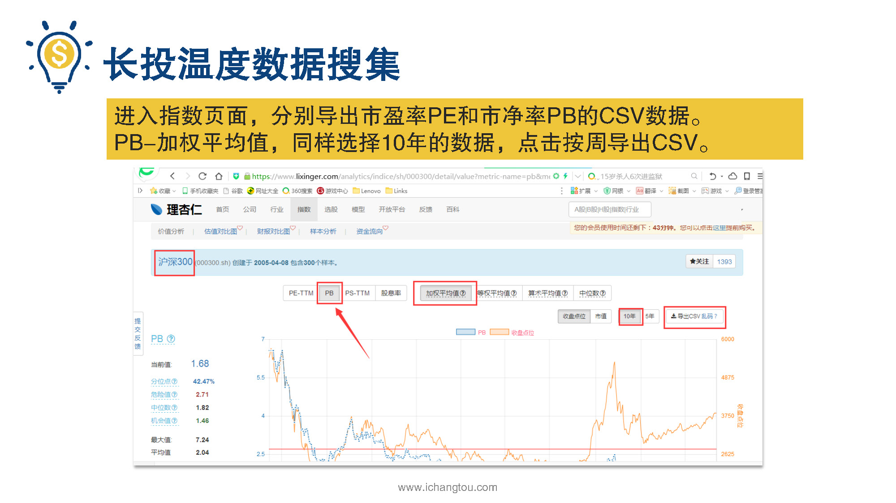

# 基金7-2-巧算长投温度

## PPT

## 课程内容

### 沪深300长头温度计算过程示范

- xxxx1

  > 通过上面的学习，我们知道长头温度越低，估值越低，风险就越小，而且藏头温度的计算需要先分别计算出p和PB的温度，这两个温度对应的就是低于当前PB的概率，但是计算p和PB的温度是需要使用大量的历史数据的，那这些数据在哪里才能找到？找到后又该如何计算呢？温度的计算其实很简单，首先获取指数的PB数据在李兴任网站就能找到，听着好像很复杂，但只要用Excel来计算也就是多点几下鼠标而已，下面我以沪深300指数为例，一步步演示墙头温度的计算步骤，好学的小伙伴也可以跟着我的操作一起来算一下，验证一下自己的学习成果，也是一件非常有成就感的事情，第1步我们在百度搜索理性的打开理性人关了，小伙伴们自己注册登录一下这个步骤，我就不多说了。第2步点击指数栏目，找到你需要的指数的历史数据，既然我们是以沪深300为例，那么我们就找到沪深300并点击进去第3步进入指数页面，分别导出市盈率和市净率，PB的csv数据选择10年的数据点击导出csv导出。PB和PE是一样的方法，选择10年的数据点击导出csv。下载好的csv文件就是下图这个样子的。第4步使用Excel，打开csv文件，嗯。b和p是一样的方法，选择10年的数据点击按周导出csv。下载好的csv文件就是下图这个样子的。第4步使用Excel，打开csv文件，我们以p为例PB同意除了日期和批那两列的数据，其他全部删除。第5步将p和PB数据整理到同一个Excel表格里，在ptm呢，右边增加一列温度，在PP右边增加一列PB温度和长头温度整理后的效果如截图所示。第6步日期以升序排列，这步很重要，选择第一行的文字，点击数据里面的筛选工具，每个单元格里都会出现一个方框，里面有个小三角，点击时间，单元格里的图标会出现持续降雪的工具选项，选择升序完成后日期就会以生序排列了。指数温度是把点击时间单元格里的图标会出现升序降序的工具选项，选择升序完成后日期就会以升序排列了。开始计算温度和PP温度公式如下。你要注意第1季算是第1行空白的单元格中下不算将上面的公式直接复制第2行，解释一下美元符号2代表的是固定住一行的意思，一定不能去掉这个美元的符号，不然是会算错的，第二呢，通过这个公式就计算出了的温度，大家注意在Excel公式中已经成100了，这里我还想提醒一点，这个公司的原理，大家不用深究，毕竟我们只是想通过投资赚钱，并没有要做一个数学家的野心，大家只要能够记住公式在Excel表中直接套用就足够了，效仿此法同样的步骤，计算字数的四金率PB温度即可。指数温度是把市盈率温度和市净率温度相加求平均公式是c3+13÷2如下图所示，直接在Excel中把刚才的公式复制到PB温度和长头温度的相应位置即可，不过一定要注意最早日期的数据，要使用美元符号固定住，为什么呢？因为我们是要计算指数的估值数据在过去一段时间内的概率分布，既然是一段时间，当然得有开始时间和结束时间，我们这里固定首行数据就是要固定开始的时间，在最新日期的床头温度一定就是我们要的最新藏头温度，亲手烹制的热气腾腾的肠头温度就新鲜出炉了，看着历时10年的庞大数据，居然被自己在短短的时间内就算出来，超激动的感觉，有没有是不是觉得自己很厉害呢？不过可能有些小伙伴也会觉得很痛苦，这个估值是每天。那我岂不是经常要计算，那也太麻烦了，有没有一个更简单的方法能让我不用计算就可以直接拿来用的，当然是有的，下一节我们就来告诉你一个省时省力的好办法。

## 课后巩固

- 问题

  > 计算长投温度时，我们需要找哪些指标的数据？
  >
  > A.市盈率
  >
  > B.市净率
  >
  > C.市盈率、市净率都需要

- 正确答案

  > C。长投温度的计算公式是（PE温度+PB温度）/2，所以市盈率和市净率这两个指标的数据我们都需要。