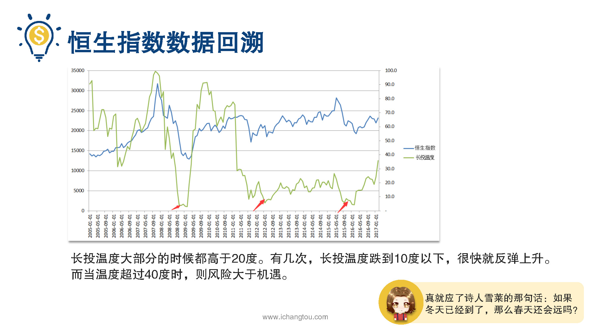

# 基金7-3-长投温度靠谱吗

## PPT

## 课程内容

### 长投公号每天更新长投温度

- xxxx1

  > 上一节我们以沪深300为例，教大家计算床头温度的方法，但是有的小伙伴还是觉得不够方便，还希望能够有更省心的方法，现在我们就来放福利吧，贴心的为了减少大家的工作量，每周二都会对常用指数计算一次温度，大家只要在长投学堂服务号里回复墙头温度，就会看到下面这个界面这个界面里有常见指数的温度及对应的基金代码，大家可以根据这里的数据来选择自己的投资标的，有的小伙伴心里可能会犯嘀咕，听起来床头温度好像很牛逼，但这都是你在说，你说是就是嘛，效果谁知道呢？吹牛又不用上税，对呀，吹牛确实不用上税，但数据却能够打猎，下面我们回溯恒生指数沪深300指数中证500指数的历史表现，看看长头温度是否有效，看看学姐是否会被打脸，这里咱们先上。我们可以看到过去10年恒生指数的指数点位和长头温度走势图，蓝线代表恒生指数，月线就是我们的藏头温度波动完全一致是不是？不仅如此，温度还提前预判了指数的走势呢，可以看出藏头温度大部分的时候都高于20度，有几次长头温度跌到10度以下，很快就反弹上升，真就应了，诗人雪莱的那句话，如果冬天已经到了，那么春天还会远吗？而当温度超过40度时则风险大于机遇，已经夏天已经到了秋天也就不远了，说完了香港股市我们再来看看中国的沪深300指数，从图中你可以看到沪深300的长头温度和指数的走势更加一致，当温度低于4度时，也就是08年股灾之后15年牛市之前机遇巨大，而当温度超过40度时也就是在07 08年疯子和林权。还有15年的时候有巨大的下跌风险，除了沪深300代表的这些大公司，还有中证500指数代表的中小型公司也都是如此，这张图显示了过去10年中证500指数走势和长头温度之间的关系，同样是温度越低的时候，指数的点数越低，熬过了冬天你就能迎接春暖花开，而高温预警的时候，如果你已经头脑发热不想出来，那么紧接着等待你的可能就是漫漫无期的数九寒天了，通过这些历史回测，大家看到床头温度的效果了吧，相比我们毫无选择的避险投资获得长期年化收益率是8~%4%，而如果用长头温度的这个策略收益率可以达到15%股神巴菲特的收益率，你们知道吗？累计45年复合收益率20.5%，所以我们使用长途温度可以获得15%的收益是不是开心死了呢？在股票市场上你的感觉会出错，你的主观情绪会影响。但是素质不一样，虽然冷冰冰的，但是足够理性客观，从上面的数据我们可以看出，通过长投温度的投资方式，就可以尽可能的避免主观情绪的影响，可以强化你的投资纪律，从而达到投资收益最大化，讲到这里与藏头温度相关的内容，我们已经做了详细介绍，最后我们一起来回顾一下这一课的内容，今天我们学习了长投温度的原理，具体的计算方法，当然如果不想每次下载数据计算，可以直接看长投学堂服务号里的温度，回复藏头温度即可查看每周二更新为了验证温度是不是真的靠谱，我们还回溯了恒生指数沪深300指数和中证500指数这三个指数的历史温度。结论是墙头温度效果杠杠的，通过这些学习对如何投资指数基金我们已经有了一个行之有效的估值指标，那是不是掌握了这个指标就可以不管不顾的买基金的呢？当然不是在开卖之前，我们还要掌握正确的买入之时，想要赚更多姿势很重要明天的精彩内容，大家敬请期待。

### 回溯长投温度历史表现

## 课后巩固

- 问题

  > 计算长投温度需要使用多少年的数据？
  >
  > A.5年
  >
  > B.20年
  >
  > C.10年

- 正确答案

  > C。计算长投温度使用最近10年的数据就可以哦~。