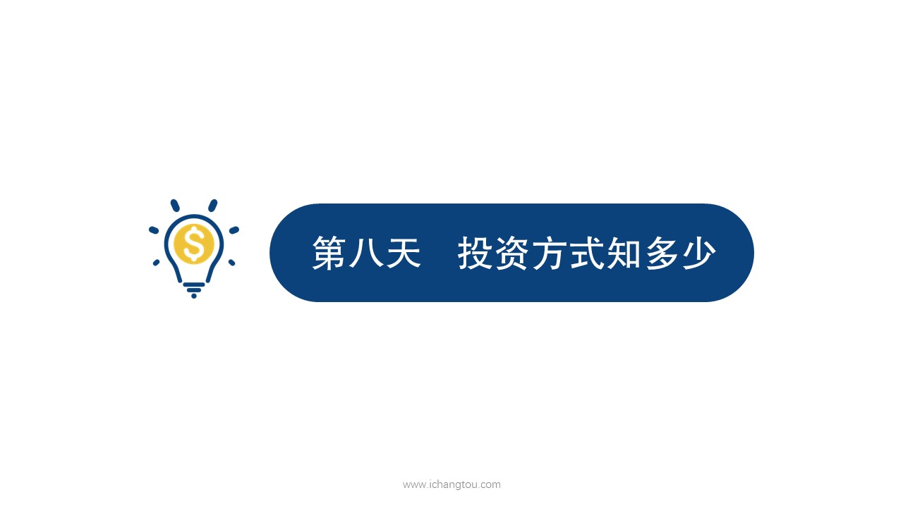

# 基金8-1-智慧草怎么买？

## PPT

## 课程内容

### 一次性投资的定义和特点

- xxxx1

  > 昨天我们弄清楚了靠谱估值法，藏头温度的原理，学会了用Excel表来计算指数的温度，并通过沪深300和中证500检验了床头温度的有效性，有的小伙伴可兴奋了不停的问，既然已经学会了怎么选指数，基金也学会了，怎么选好时机，那是不是我已经掌握了基金投资的核武器，可以伺机而动一举拿下心仪的指数基金啊，别急虽然你已经选出了好的指数基金，也找到了适合的买入时机，但我问你你知道怎么买吗？有知道在哪儿买吗？不知道吧，投资指数基金的水还深着呢，今天我就带你给他道指数基金的证券买入姿势吧，俗话说磨刀不误砍柴工，想要赚的更多。很重要，千万要学好，我们先看应该怎么买，这里学姐先给大家讲个故事，面膜大家应该都熟悉吧，就是能够让女朋友或者妈妈安静20分钟的东西，我跟师兄的同事2狗他老家余山村就是做面膜生意发展起来的，他们村盛产一种叫智慧草的中草药，村民们发现可以用经验磨砺出了4年吗？但是他们发现这样还不够吸引客户，要知道市面上已经有面膜带脖子一块的那种了，于是二狗就发明了头目，就是可以直接在头上，大人带了美丽，小孩带了聪明，打出的广告语是爱她就送她自会头目，有人可能会问二狗不是程序员吗？怎么还去倒腾面膜呢？二狗也是为了开心。好有更多的资金用来投资，所以就借着老家得天独厚的资源，发展了自己的第1个副业。做这个生意只会炒是必不可少的材料，但是让人头疼的是智慧，草的价格很不固定，便宜的时候20元一两，贵的时候100元一两还完全没规律好了，如果你12个经营着一家智慧投魔法，你会怎么进货才买呢？进货的方式无非以下几种，一次性拿一大批货，不定期进货或者定期进货，更精明一点的是定期进货，是根据价格灵活调整进货数量，这和我们投资基金的方式很像，我们先一起来看看投资基金的方式有哪些吧，一般来说常见的基金投资方式有一次性投资不定期投资定期定额以及定期不定额4种，他们各有自己的优缺点，哪一种最适合基金投资呢？下面我们一个一个来看，通过比较我们一定会找到基金投资的最佳姿势。但第1种一次性投资最简单省事无脑操作的买入知识这个很简单，如果你手头有10万元，现在选定了买哪只基金，你就把这10万元一次买入你选定的那只基金也就是俗称的一锤子买卖这种投资方式的缺点是，如果你买入基金后，基金的表现没有如你所愿总是喋喋不休，这是你想趁着价钱低再买入时，手里已经没有子弹，只能干瞪眼了，二狗最开始买只会吵就闹过一次性买入的笑话，那是智慧草，已经连续两个月60元一两了，突然有一天智慧草的价格变成了40元一辆，二狗，激动过头，把智慧草的预算全用了，下个月降价成20元，一两的时候自然没买成。接下来看第2种不定期投资，也就是择时投资，找到合适时机才下手买入，但是理想很美好，现实很骨感，一般来说这种投资方式会受到主观情绪的极大干扰，遇到市场暴涨暴跌的时候很容易心态不稳，情绪失控，从而影响到自己的决策，理论上如果我们拥有不错的选股，择时能力确实可以自由选择买卖时间，但是大多数人是没有这种择时能力的，连巴菲特都做不到，我们普通人还是不要想了。比如前面故事里的二狗，在多次交易后他学聪明了一些，有时看到挺便宜的，就觉得可能之后还有更便宜，想等等看，结果后来不但没便宜还涨价了，自己又急需原材料生产面膜必须买，结果最后成本还高了，把他抱了个半死，另外不定期投资，因为它的难度和时间的不确定性，一般不像钉头那样更能长期坚持，好比你想锻炼成魔鬼的身材，你觉得是坚持每天打卡坚持的时间更长了，还是随机锻炼坚持的时间更长了，一次性投资的优点是一次性投入全部资金简单省事儿，缺点是以后再遇到很低价格的时候，手里没钱会有多心痛啊，不定期投资要找到合适的时机再投入缺点是则是。直接也具有不确定性，不那么容易持久很明显，这两种基金投资方式都不是基金投资的最舒服的姿势，那真正舒服的姿势应该是什么呢？下届我们再继续吧。

### 不定期投资的定义和特点

## 课后巩固

- 问题

  > 一次性投资的缺点是什么？
  >
  > A.简单省事、无脑操作
  >
  > B.买入后再遇到更低的价格，手里没钱，无法加仓
  >
  > C.可以尽量选择低价买入

- 正确答案

  > B。一次性投资俗称一锤子买卖，这种投资方式的缺点是如果你买入基金后，基金的表现没有如你所愿，总是跌跌不休，这时你想趁着价钱低再买入时，手里已经没有子弹，只能干瞪眼啦。