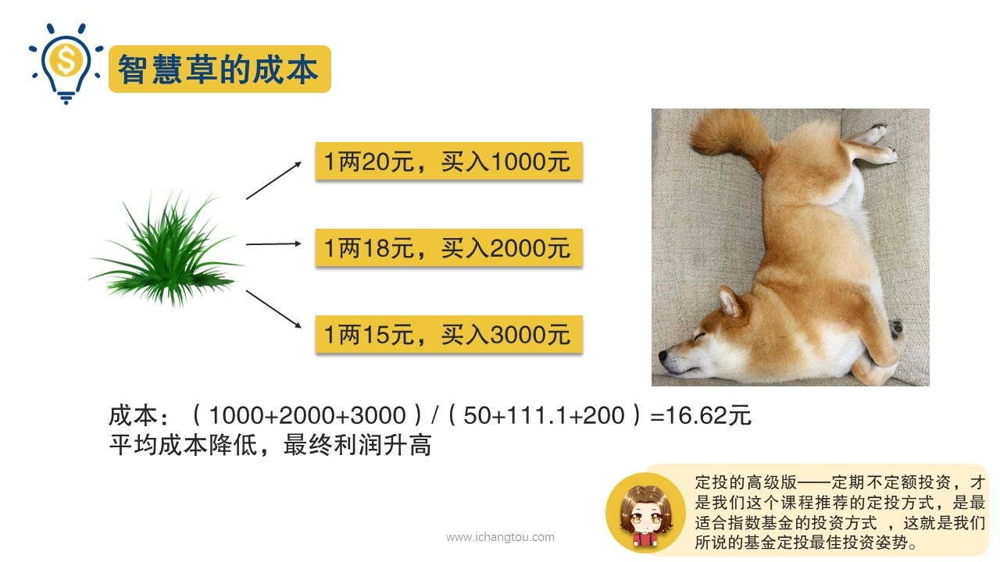

# 基金8-2-定期定额与定期不定额谁是最佳姿势？

## PPT

## 课程内容

### 定投的好处

- xxxx1

  > 上一节我们介绍了一次性和不定期投资的优缺点，发现都不是我们投资基金的好方式，这一节就要为大家介绍真正正确的基金投资方式定投，其实我们每个人不管有没有自己投资过基金，每个月都在定投，具体到生活中就是我们每月的五险一金，我们的社保和公积金都是每个月从工资里扣除一部分，然后另一部分由单位帮你交，等到你退休了或者要买房子需要用钱的时候就可以把这个部分的钱取出来，这其实就是一种典型的定投，这么重要的人生大事都被默默的选择了，定投的方式来实现镜头的重要性以及有效性自然不言而喻了。那镜头究竟有哪些好处呢？首先基金定投需要设定一个固定的投资频率，通常是一个月定投一次，然后每个月的这一天或者临近的时间里就要把一笔钱投入进去，如果你每个月15号发工资，你可以设定16号进行基金定投的扣款，这样既可以达到强制储蓄的目的，也可以给自己实现资金的增值，其次，定投操作可以避免主观情绪的干扰，你既不用每天盯着股市，也不用时时刻刻想着这一刻是赚了还是亏了，因为你知道只要用了正确的定投策略，坚持定投，你就能获得合理的投资收益，而无需关注市场短期的涨跌，你需要做的就是制定定投计划并严格执行。那头居然这么好，我们具体如何操作呢？其实定投还分为定期定额投资和定期不定额投资，从名字可以看出两者的主要区别是定额还是不定额这两种哪一种才是我们投资的终极之事呢？先来看定投的基本款，定期定额投资就是在固定时间购买固定金额，比如每月固定某天投资某资金500元，不管这个时候这只基金多少钱是涨还是跌，只要到了顶头，反正我雷打不动，就是要买简单粗暴不费了，像上文说到二狗买智慧草的事情，在他经历了多次预估，只会炒价格失败后二狗索性决定固定每个月的初一去采买智慧草。管当天价格怎么样，都拿2000块钱来买，所以运气好遇到便宜了就能多买一些，要是贵就能够买得少一些，这种购买方式就类似于我们的定期定额投资方式，这种投资方式的主要问题是，无论价格高低都买入固定金额，会使得收益打折扣，不能高效利用资金。另外一种就是定期不定额了，顾名思义，定期不定额就是投资时间固定，但金额不固定，话说二狗经过一段时间的摸索后，终于发现了智慧草的价格规律，智慧草最高也就100元一辆，最低15元一两，他就还是每个月初一去采买智慧草，但是当天价格越接近15元，她就买得越多，价格越接近100元，他就只买够这个月够用的就行，如果下个月便宜了，就到时候再多买一点二狗，这种购买方式就类似定期不定额的方式，定期不定额就是根据基金的估值高低调整投资金额，如果基金估值低，说明基金比较便宜，就多买一些，如果基金估值不算太低就少买或者不买。这样就主动的做到了，便宜的时候多买点，贵的时候少买点绳子不买，这样在基金便宜的时候就能够买到更多的基金份额，这也是定期不定额最重要的一个优点，投资坚持时间越长越划算，主要体现在滩薄成本上，时间越长，平均成本越低，利润也就越高，对于这1.2狗很有发言权，二狗摸索出低价，多买高价，少买这套方法后就能每个月都存下智慧草了，买的时候不用在心里纠结成蛇形心态稳稳的，最重要的是成本长期下来比以前任何一种方式都低，也就是在智慧草一两二10元，18元，15元的时候分别买入1000块钱2000块钱3000块钱，结果是没。智慧草的成本就是16.62元，这样你的平均成本不就降低了吗？成本降低，最后的利润就升高了，定期不定额就是定投的高级版本是最能提高收益率的方式，也是我们课程推荐的方式，上面一共介绍了4种方法，前两种肯定都不能叫做定投，一般人所说的基金定投指的是第3种定投的基本款及定期定额投资，而第4种定投的高级版定期不定额投资才是我们这个课程推荐的定投方式，是最适合指数基金的定投方式，也就是我们所说的基金定投的最佳投资之事。

### 定期定额的定义及特点

### 定期不定额的定义及优势

## 课后巩固

- 问题

  > 定投的优势有哪些？
  >
  > A.强制储蓄、告别月光
  >
  > B.避免主观情绪的干扰
  >
  > C.以上都是

- 正确答案

  > C。定投的优势主要有：可以设定固定的投资频率，实现强制储蓄、告别月光，还能避免主观情绪的干扰。