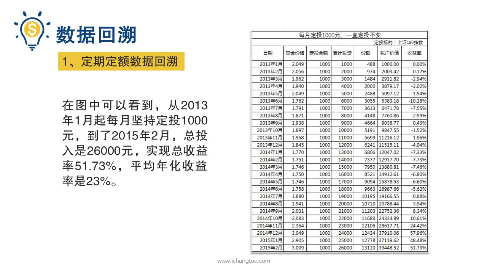
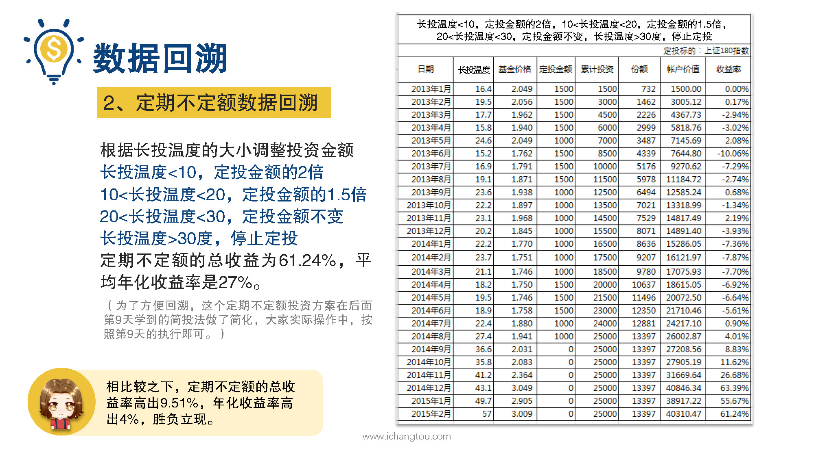

# 基金8-3-定期定额与定期不定额收益大PK

## PPT

## 课程内容

### 定期定额的效果

- xxxx1

  > 好了，上一节我们知道了，定期不定额投资与定期定额投资相比所具有的理论上的优点，并最终选择了定期不定额作为我们的终极投资知识，那定期不定额这种方式，实际的使用效果究竟如何呢？这要看真实的数据才更有说服力，我们用上证180指数基金回收的真实数据来对比一下定期定额与定期不定额的效果，先看定期定额的效果，在途中你可以看到从2013年1月起，每月坚持定投1000元，到了2015年2月总投入是26,000元，实现总收益率51.73%，平均年化收益率是23%，再来看定期不定额的效果就是根据。龙头温度的大小调整投资金额估值越高，买的越少，估值越低，买得越多，这里我们依然以1000元为基础，墙头温度小于10度，投入定投金额的两倍也就是2000元10度到20度之间，投入定投金额的1.5倍也就是1500元，20度到30度之间投入定投金额不变也就是1000元温度大于30度，停止定投这样最后的总收益比定期定额投资增加了9.5%亿，平均年化收益率是27%，比定期定额高了整整4%呢，定期定额与定期不定额投资，连续两年多的投资数据比对来看，我们计算出定期定额实现总收益率51%。平均年化收益率是23%，定期不定额总收益是61.24%，平均年化收益率是27%，相比较之下定期不定额的总收益率高出9.51%年化收益率高出4%，胜负立现结果一不意外惊不惊喜，定期不定额就是这么给力，小伙伴们明白为什么我们要推荐定期不定额的投资方法了吧，收益更高，所以你必须要选他。

### 定期不定额的效果

## 课后巩固

- 问题

  > 同样的投资基数，分别采用定期定额和定期不定额投资的话，哪一种方式收益会更高？
  >
  > A.定期定额
  >
  > B.定期不定额

- 正确答案

  > B。定期不定额采用在长投温度高时少买入，长投温度低时多买入的策略，长期坚持下来的话，平均成本会更低，收益自然会比定期定额要高一些。