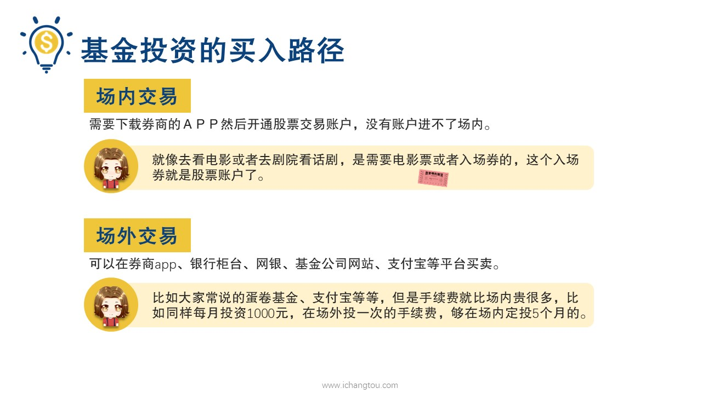
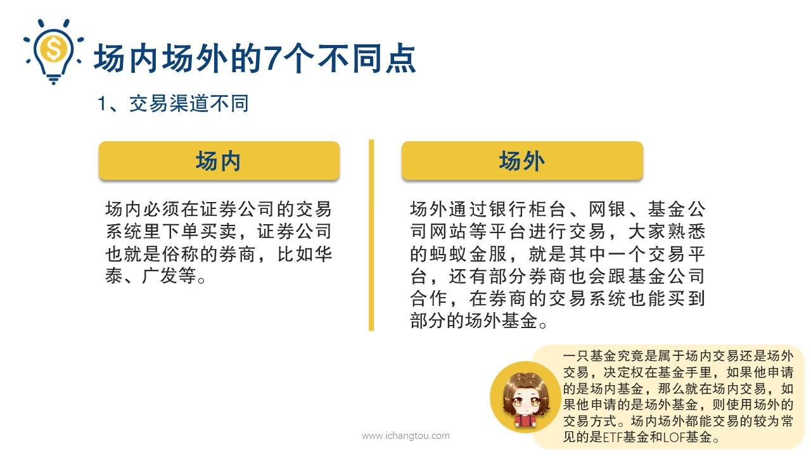
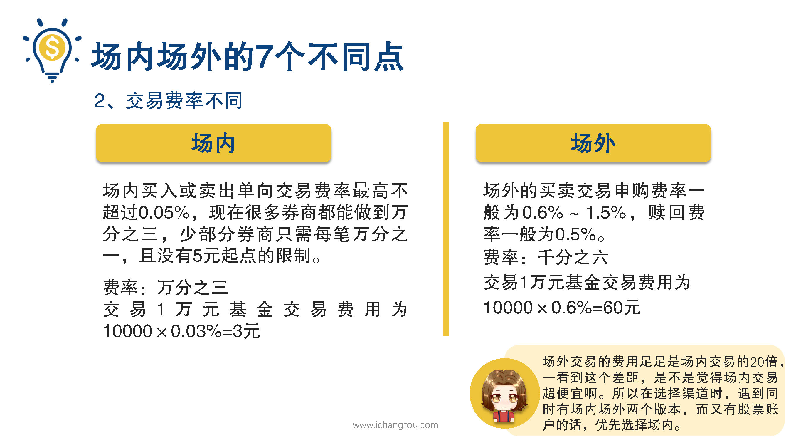
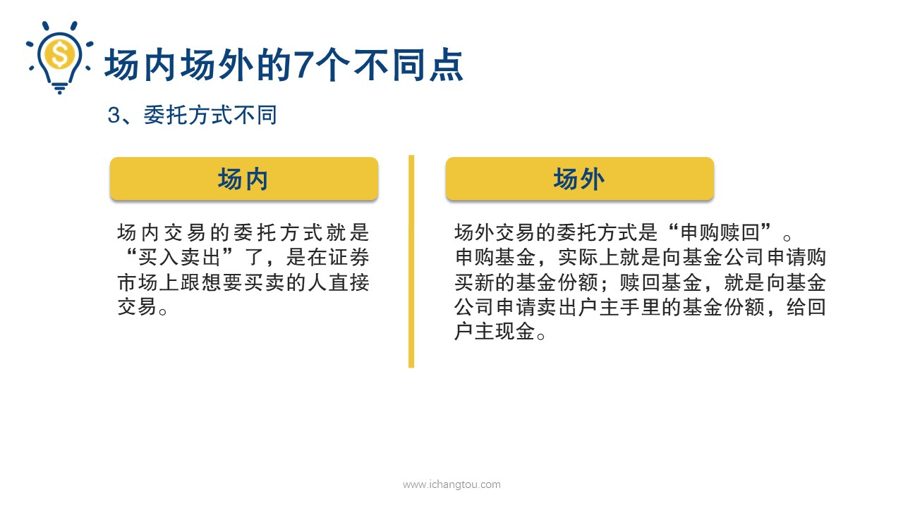

# 基金8-４-场内与场外的区别（上）

## PPT

## 课程内容

### 交易渠道不同

- xxxx1

  > 

### 交易费率不同

### 委托方式不同

## 课后巩固

- 问题

  > 如果已经选定了一只基金准备定投，它同时有场内场外两种购买路径，一般优先场内购买，为什么？
  >
  > A.场内交易费率更低廉
  >
  > B.场内交易费率与场外差不多

- 正确答案

  > A。场内交易费率更低廉。场内一般单向交易费率不超过0.05%，部分券商甚至是0.01%，且没有5元起点限制。场外申购费率是0.6~1.5%，相比较之下，场内交易成本更低廉。

