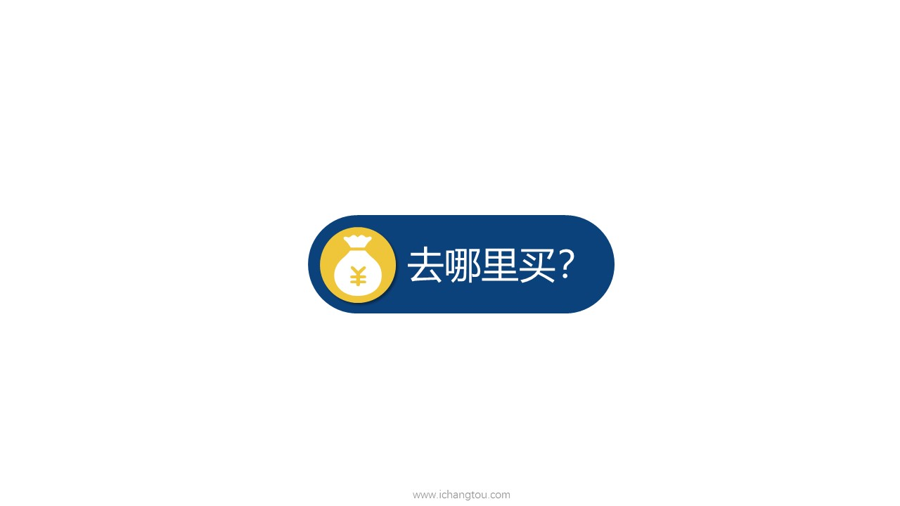

# 基金8-４-场内与场外的区别（上）

## PPT

## 课程内容

### 交易渠道不同

- xxxx1

  > 小伙伴们知道了，定期不定额是最适合投资基金的，买入姿势后，我们继续看第2个问题在哪里买每一种投资都有它特定的购买途径，比如买保险可以找保险代理人或者去网上买买股票，可以在股票账户买什么基金又在哪里买呢？基金投资的买入路径主要分为场内和场外，这个厂就是证券交易所，证券交易所之类的，都是场内证券交易所以外的都是场外场内交易，是需要入场券的，就像你去看电影或者去剧院看话剧，你是需要电影票或者入场券的，这个入场券就是我们的股票账户了，需要下载券商的APP，然后开通股票交易账户像买卖股票一样买卖场内基金。没有股票账户是进不了场内的，而场外交易呢，是直接与基金公司进行交易，基金公司通过委托各个平台代售的方式直接与我们交易渠道就比较多了，可以在券商的APP银行柜台网银基金公司网站，支付宝等平台购买，但是手续费呢，就比唱的要贵一些，比如同样每月投资1000元，在厂外头一次的手续费够在场内定投5个月的，知道了什么是场内什么是场外后，我们再来仔细的看一看场内和场外二者有什么区别，究竟哪种方式会更适合自己呢？场内场外一共有7个不同点，第一点是交易渠道不同，场内必须在证券公司的股票交易系统里下单买卖证券公司也就是俗称的券商，比如华泰广发的，而场外则是通过银行柜台，网银基金公司网站等进行交易，大家熟悉的蚂蚁金服就是其中一个交易平台，还有部分券商也会跟基金公司合作，在券商的APP上也能买到部分的场外基金，至于这只基金究竟是属于场内交易，还是场外交易决定权在基金手里，如果他申请的是场内基金，那么就在场内交易，如果他申请的是场外基金，则使用场外的交易方式，有些基金则是场内场外都可以交易，就像有些商品只能线下。或者代销店里购买，有的只能线上购买，有的则线上线下同时销售场内场外都能交易的较为常见的是ETF基金和lof基金，第2点是交易费率不同，强烈买入或卖出单向交易费率最高不超过0.05%，现在很多券商都能做到3/万，少部分券商只需每笔1/万，而且没有费用最低5元的限制，而场外的买卖交易申购费率一般为0.6~%0.15%，赎回费率一般为0.5%，有一部分基金同时有场内和场外两个版本，如果场内的买卖交易量能满足我们需求的话，可以优先场内买卖，因为场内的交易费率便宜呀。有羊毛不如白，不如省的钱就相当于赚了钱给大家举个例子，比如买1万块钱的基金，如果是场内交易的话，按费率3/万来计算，我们需要支付的交易费用为三元钱，而场外交易则需要支付1万元乘以0.六六十%元的费用，场外交易的费用足足是场内交易的20倍，一看到这个差距是不是觉得a场内交易超便宜，所以我们在选择渠道的时候，如果遇到同时有场内场外两个版本，而你又有股票账户的话，优先选择场内第3点是委托方式不同，对于我们普通投资者来说，交易基金最常见的方式主要有两种申购赎回和买入卖出场外交易的委托方式是。申购基金实际上就是向基金公司申请购买新的基金份额，赎回基金就是向基金公司申请卖出我们手里的基金份额，给回我们现金，好比我们想定制一套好看的衣服，需要去找做衣服的师傅下订单，师傅拿到钱后会去买布料做衣服，假如我们拿到衣服后觉得不想要了，也可以直接向师傅退货，这个师傅也是太好说话了一点，这里的师傅就相当于基金公司布料，相当于基金经理去买的股票衣服买，就是我们想要买的基金了，场内交易的委托方式就是买入卖出是在证券市场上更想要买卖的人直接交易，类似于买衣服还可以去专门的服装交易市场购买，有衣服要卖的人就直接把衣服放在这个专门的。想要衣服的人则可以直接在市场里购买，通过上面的分析我们可以总结如下，场外基金主要是申购赎回的方式，直接与基金公司交易基金份额，场内基金主要是买入卖出的方式与其他的基金持有者交易。

### 交易费率不同

### 委托方式不同

## 课后巩固

- 问题

  > 如果已经选定了一只基金准备定投，它同时有场内场外两种购买路径，一般优先场内购买，为什么？
  >
  > A.场内交易费率更低廉
  >
  > B.场内交易费率与场外差不多

- 正确答案

  > A。场内交易费率更低廉。场内一般单向交易费率不超过0.05%，部分券商甚至是0.01%，且没有5元起点限制。场外申购费率是0.6~1.5%，相比较之下，场内交易成本更低廉。

