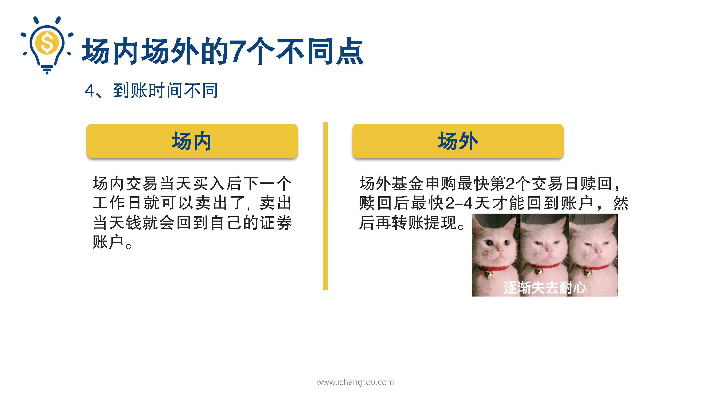
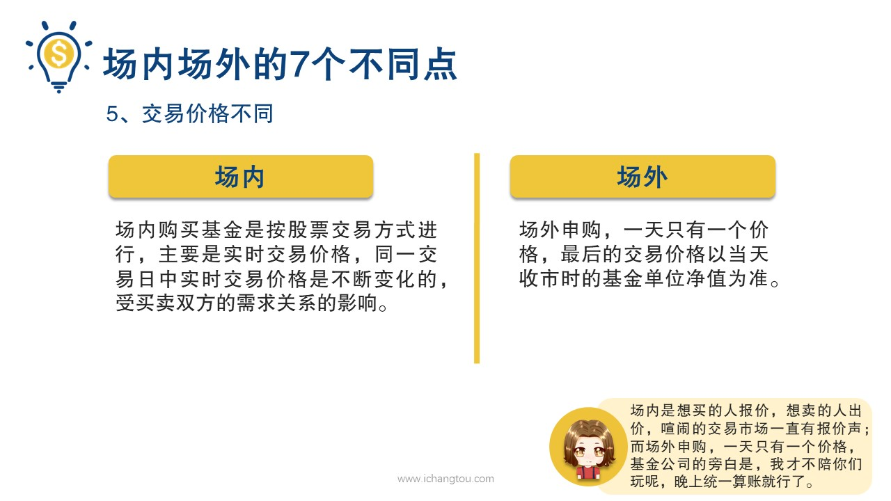
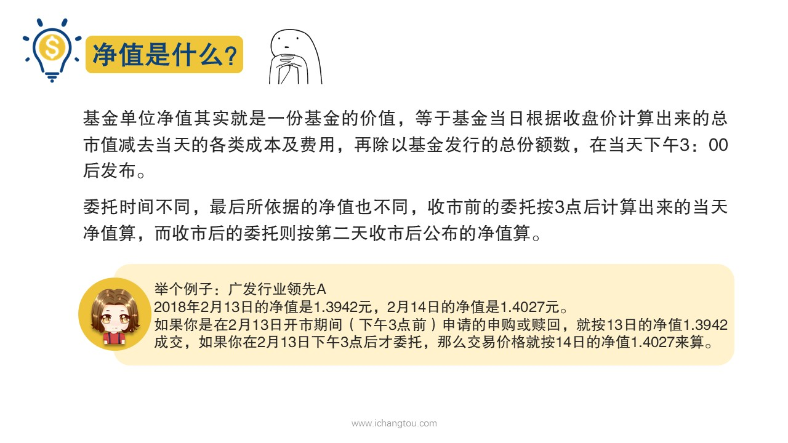
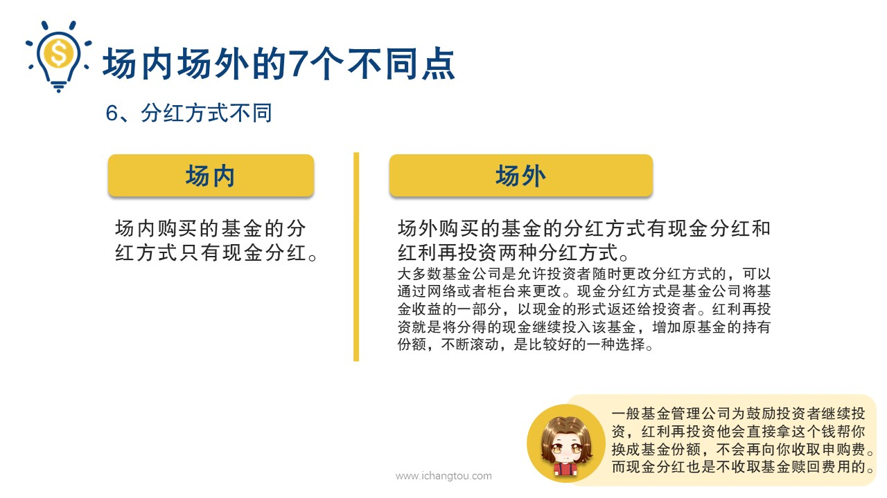
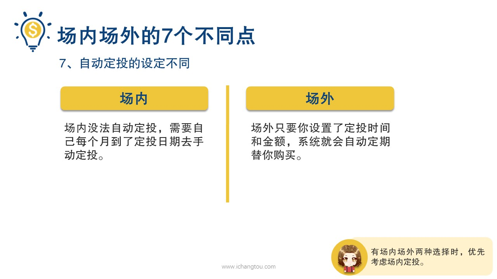
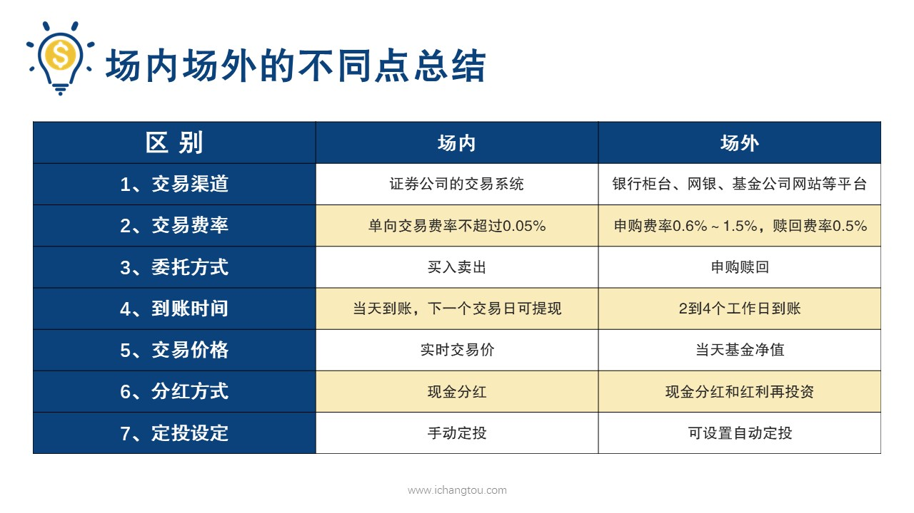

# 基金8-5-场内与场外的区别（下）

## PPT

## 课程内容

### 到账时间不同

- xxxx1

  > 上一节说到场内场外交易，在交易渠道交易费率和委托方式三个方面都有不同，下面我们再来看两种方式在到账时间，交易价格，分红方式以及自动定投的设定几个方面上的区别，第4点不同到账时间不同，强烈交易当天买入后，下一个工作日就可以卖出了，卖出当天钱就会回到自己的证券账户，举个例子，如果你1号买入基金，2号3:00前即可下单卖出资金当天就可以回到你的账户，你可以继续投资其他产品，如果要提现则要到3号才能把钱转到自己的银行卡里提现场外，基金申购后的下一个工作日确认份额，第2个工作日可以赎回，资金要在赎回的2~4个工作日才到账，然后再转账提现，也就是说如果你1号申购2号确认份额3号可以。但资金要在4号以后才能到账比较起来，当然是场内交易到账更快了，第5个区别是交易价格不同，在第2个基金分类中我们就已经学习过场内价格是实时变动的，前面我们说了场内交易是在服装交易市场买衣服是跟其他衣服持有者交易，想买的人报价，想卖的人出价喧闹的交易市场一直有报价声，而场外申购一天只有一个价格，最后的交易价格以当天收市时的基金单位净值为准，基金公司的旁白是我才不陪你们玩呢，晚上统一算账就行了，有小伙伴可能会问那统一算账的基金单位净值又是个什么鬼基金单位净值其实就是一份基金的价值，等于基金当日根据收盘价计算出来的总市值减去当天的各类成本及费用，再除以基金发行的总份额数，第6点是分红方式不同。基金分红就是基金公司将基金赚到的钱的一部分返还给投资者，分红方式主要有现金分红和红利再投资两种现金分红就像发现金红包，还有一种是红利再投资，红利再投资是用分红的钱直接再买这个基金，等于说把要分给你的钱变成分给你更多基金份额，但是这个跟给你钱然后再买还是不一样的，我们申购基金是是要付申购费的吗？但是红利再投资的时候是不需要支付这个费用的，场内购买的基金只有现金分红的方式，场外购买的基金两种方式都有，大多数基金公司是允许投资者随时更改分红方式的，可以通过网络或者柜台来更改最后一点，第7点是自动定投的设定不同，自动定投，就是直接设置好每月的投资时间和投资金额之后就不用管了。卡里有钱软件每月会按时扣除，就像银行扣的房贷一样，到底按时刻无需提醒，无需闹钟，场外投资具有这个功能，但是场内则没法自动定投，需要自己每个月到了定投日期，手动定投不过效果最好的定期不定额投资方式，需要根据指数温度来决定投资资金的温度低就多，头温度适中就少投，甚至温度高就卖出，所以场内基金定投需要手动操作这个小缺陷恰恰能根指数温度配合起来一起操作，再说了场内基金的交易费用跟场外比有更大的优势，所以我们还是建议由场内场外两种选择是优先考虑场内定投。以上7点，我们可以用最直观的图表显示区别好了，用图表来显示场内和场外的区别，大家是不是觉得更清晰了呢？场内场外的区别怎么选择看个人场内需要有证券账户交易费率更低。省到就是赚到到账时间更短，场外有自动定投功能，没有股票账户也能买，如果一只基金场内场外都可以购买时，建议选择手续费低的场内，但是如果投资金额想想要方便的话，就可以选择场外。

### 交易价格不同

### 分红方式不同

### 自动定投的设定

## 课后巩固

- 问题

  > 关于分红方式，下面哪些说法不正确？
  >
  > A.基金分红就是基金公司把赚到的钱的一部分返还给投资者
  >
  > B.场内购买的基金主要采用现金分红的方式
  >
  > C.场外购买的基金采用红利再投资的分红方式

- 正确答案

  > C。本题选择的是不正确的，C选项不正确。基金分红就是基金公司把赚到的钱的一部分返还给投资者，一般有现金分红和红利再投资两种方式。场内购买的基金主要采用现金分红的方式，场外购买的基金两种分红方式都有，可以选择现金分红，也可以选择红利再投资。