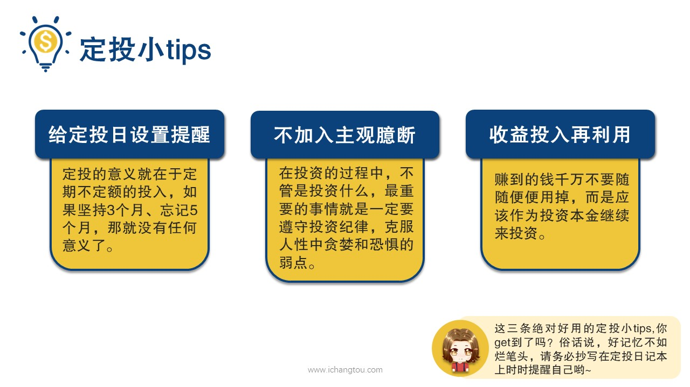
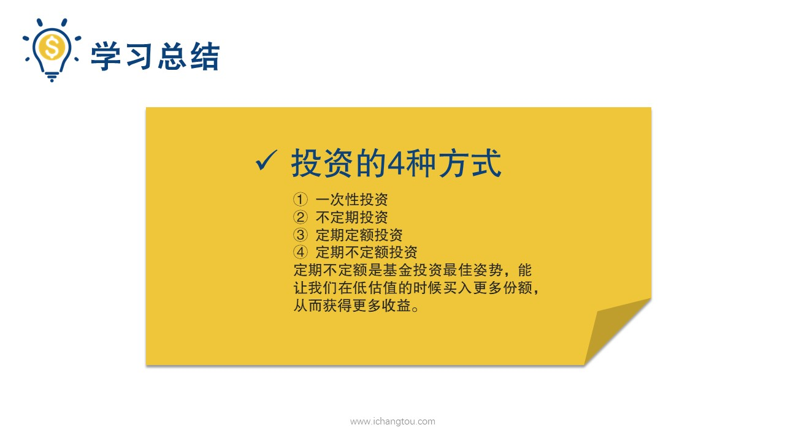
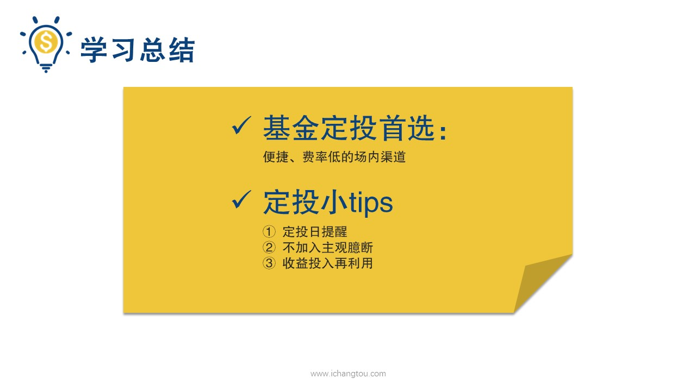

# 基金8-6-小Tips

## PPT

## 课程内容

### 设置定投日提醒

- xxxx1

  > 

### 千万不要在定投过程中加入自己的主观判断

### 收益投入再利用

## 课后巩固

- 问题

  > 关于定投，下面哪些说法不正确？
  >
  > A.设置定投日闹钟提醒可以帮助我们更好的坚持定投
  >
  > B.定投过程可以根据别人的推荐来进行
  >
  > C.定投的收益最好作为投资本金继续投入

- 正确答案

  > B。本题选择的是不正确的，B选项不正确。定投过程中千万不要加入主观判断，别人推荐的也不能随意投资，要遵守投资纪律。