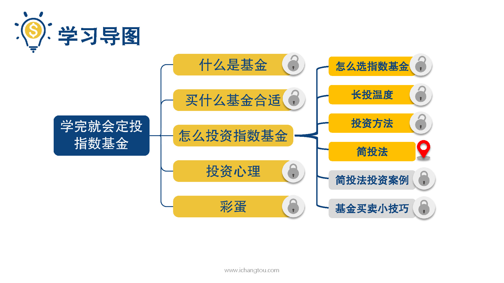
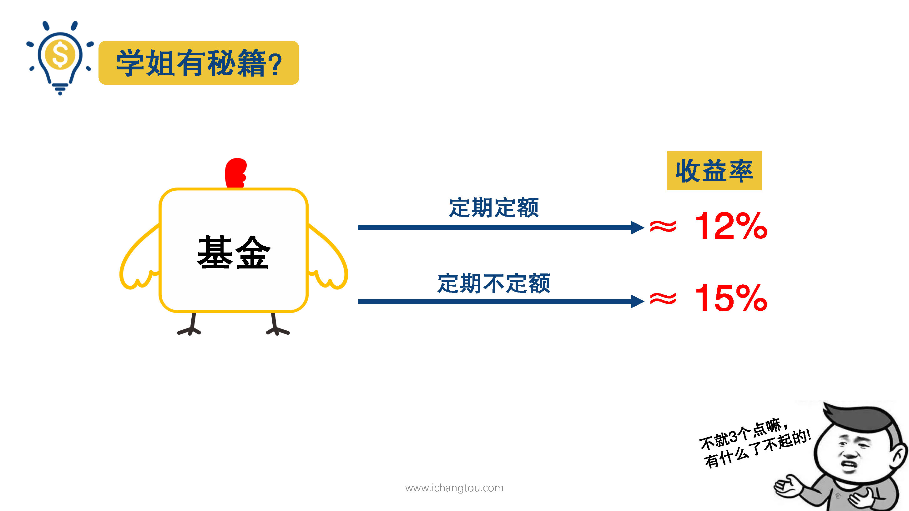
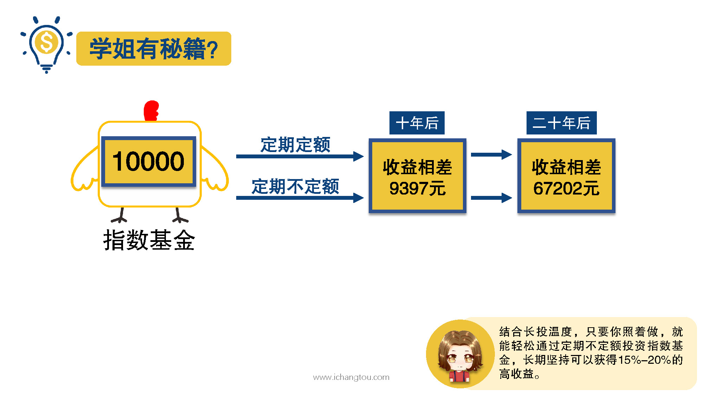

# 基金9-1-一起来做养老计划啦

## PPT

## 课程内容

### PMT(r/12,n*12,FV,1)

- xxxx1

  > 

### r为预期收益率，n为投资年限，FV为预期收益+本金

### 快速算出投资金额

## 课后巩固

- 问题

  > 下列说法错误的是？
  >
  > A.公式PMT(r/12,n*12/FV,1)中，r是预期年化收益率，n是投资年限，FV是本金和利息
  >
  > B.通过定期不定额定投指数基金，每年都可以获得15~20%的年化收益率
  >
  > C.长期来看，定期不定额定投指数基金可以获得比定期定额定投指数基金高3%的年化收益率

- 正确答案

  > B。本题选择的是错误的，B选项错误。年化收益率15%~20%是长期定投预期可获得的收益，并不是说每年都会有如此高的收益。如果碰上熊市，当年亏损也有可能。