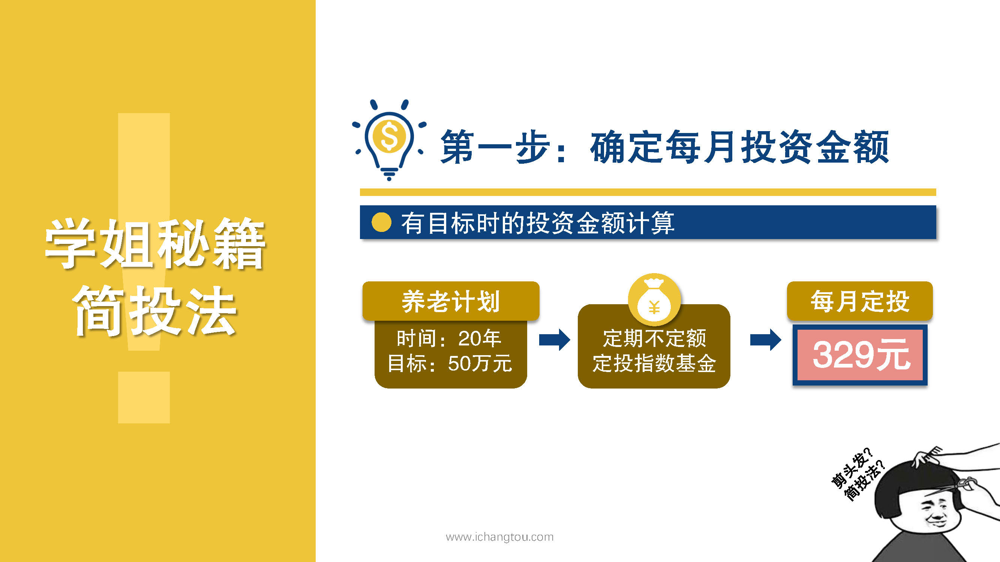

# 基金9-1-一起来做养老计划啦

## PPT

## 课程内容

### PMT(r/12,n*12,FV,1)

- xxxx1

  > hi大家好，我是百合学姐，昨天我们学习了两种定投方式，知道了定期不定额的优点是可以摊薄成本，增加收益率，从历史统计数据来看，投资同一只基金定投同样的时间，通过定期定额的方式，我们的收益率大概在12%左右，而定期不定额则可以获得15%的收益率，有的小伙伴可能会说不就三个点嘛，有什么了不起的，那我要给你算算账，如果你有1万元按定期定额的方式和定期不定额的方式，连续10年投资指数基金最终的收益会相差9397元，我们再拉长到20年看整整相差67,202元，1万元20年，最终相差将近7万元。100万呢。听到这里你们还会小瞧这三个点吗？那该如何用定期不定额的方法来进行定投呢？又该如何确定每个月不定额的投资金额呢？别急，我们这里可是有秘笈的，结合藏头温度，只要你照着做就能轻松，通过定期不定额投资指数基金长期坚持可以获得15~%20%的高收益，这个秘籍就叫做剪头发，它分为四步，接下来的课程大家可要竖起耳朵认真听了，我们先来看剪头发第1步，确定每月的投资金额基金是一种商品，就像我们出门逛街之前会想一下大概要花多少钱的呀？在掏钱买基金之前呢，我们也需要知道自己大概要花多少钱，这就是剪头发的第1步，确定每个月的投资金额。这里分为有目标式的投资金额以及没有目标时的投资金额的计算，先来看第1种有目标时的投资金额计算，什么叫做有目标有计划呢？比如说我们可以给自己制定一个20年期的养老计划，小伙伴可能要说什么养老，我们年轻着呢，现在就让我们想养老也太远了吧，那么拿起你们小时候的照片再看看现在的自己，你们觉得20年还太遥远吗？好了，现在跟着我一起想象一下那个时候的生活，那个时候再也不用担心每天时间不够用，不用再烦心乱七八糟的工作，每天就是吃吃喝喝，散散步，有兴致了还能跳跳广场舞，然后陪孙子孙女玩，想想就特别美好了，但是现实是什么呢？我要告诉你你可。红包都包不起，大多数人退休后的养老金大概在1000~2000元左右，假设20年后退休每月拿2000元的话，这个2000元只相当于现在的720元左右，可以做什么呢？也就够付个简单的日常伙食，怎么办才好呢？当然是从现在就要开始计划了，假如我们20年要攒50万，每个月要存多少钱呢？四五十万除以20年再除以12个月，得到每个月要存2081元吗？那是储蓄用定期不定额定投指数基金的话，每个月只用投入329元对不要？99只要329，不过就是一个月少买一件衣服，少出去吃几顿饭，20年后我们的养老金就能有50万元了，这里是怎么算的呢？要招待。公司具体的公司可以看PPT，我要重点讲一下的是公司里面每一个符号的具体含义，r为预期收益率，通过前面的学习，我们知道定期不定额，投资指数基金预期可以获得15~%20%的年化收益，我们这里保守起见，统一按15%计算n为投资年限，fv为预期收益加本金很快就可以算出每月要投资的金额，也就是我们的投资基数，再一看这个公司好像很复杂，可是实际上非常简单，我们不用动脑，只需要动手打开Excel表格，比如刚才养老计划20年化收益率15%n424f四五十万很快就能算的，每月应投资329元，有的小伙伴可能会问。我实在想不出自己有什么目标，那我要如何计算每月的投资金额呢？当然也是可以算的，下一节我们一起来计算一下，没有目标的时候我们该拿多少钱来定投。

### r为预期收益率，n为投资年限，FV为预期收益+本金

### 快速算出投资金额

## 课后巩固

- 问题

  > 下列说法错误的是？
  >
  > A.公式PMT(r/12,n*12/FV,1)中，r是预期年化收益率，n是投资年限，FV是本金和利息
  >
  > B.通过定期不定额定投指数基金，每年都可以获得15~20%的年化收益率
  >
  > C.长期来看，定期不定额定投指数基金可以获得比定期定额定投指数基金高3%的年化收益率

- 正确答案

  > B。本题选择的是错误的，B选项错误。年化收益率15%~20%是长期定投预期可获得的收益，并不是说每年都会有如此高的收益。如果碰上熊市，当年亏损也有可能。