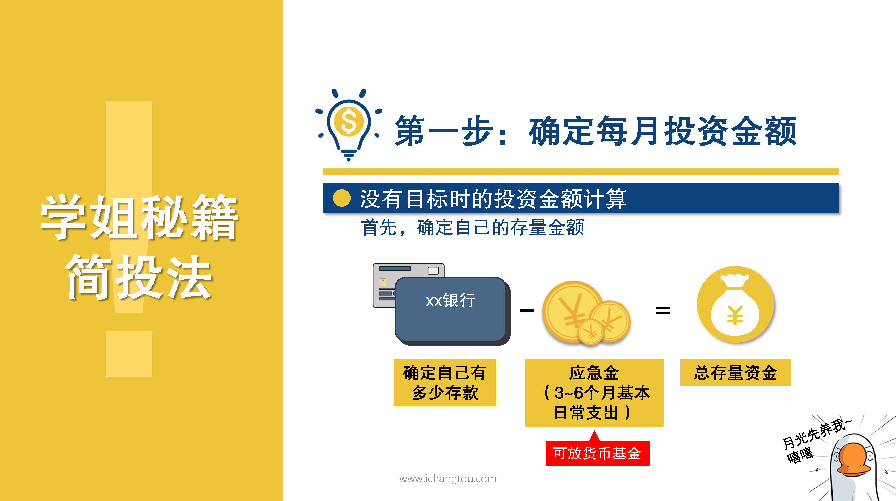
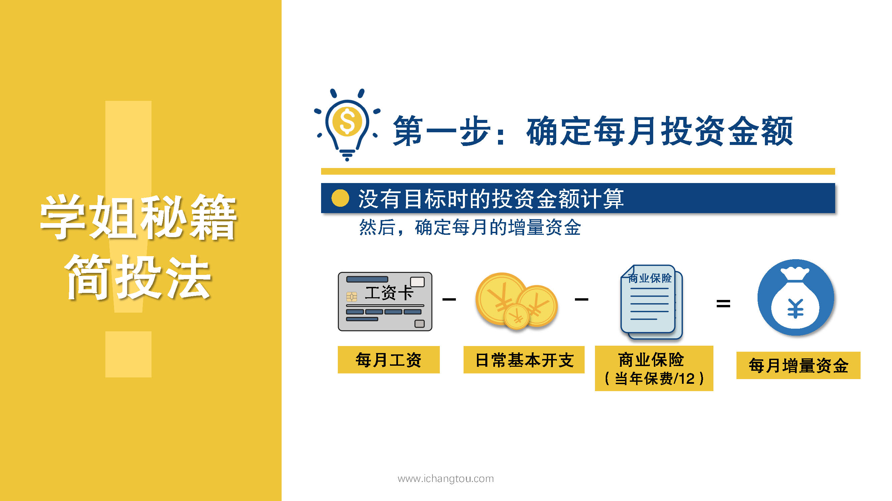
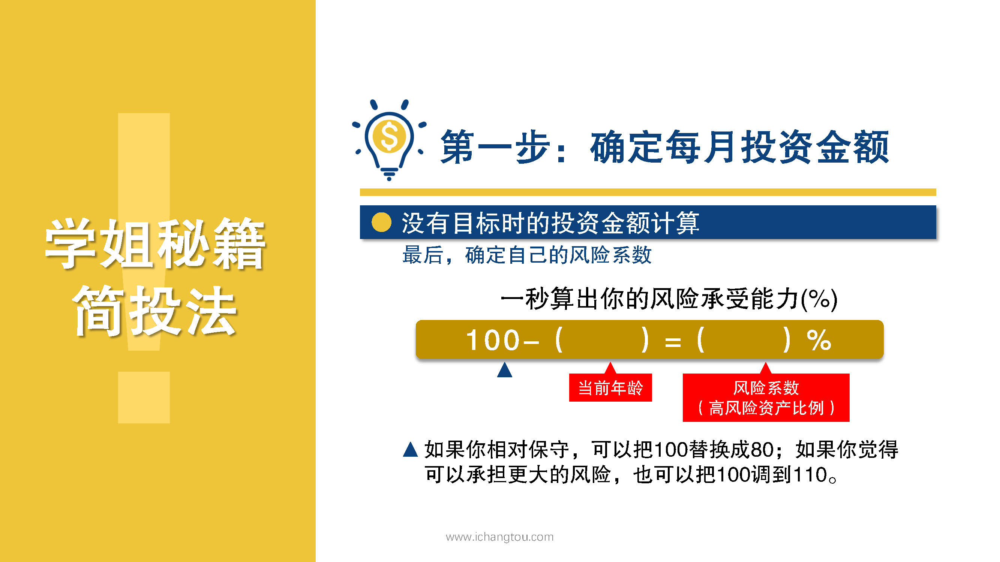
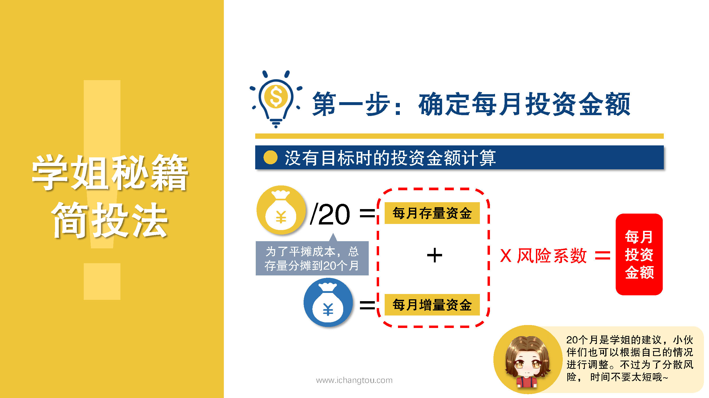
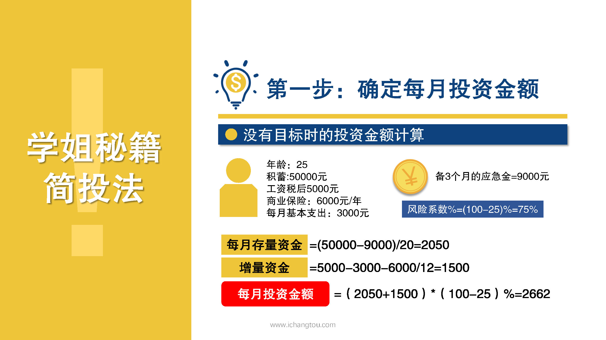

# 基金9-2-没有目标也不用纠结

## PPT

## 课程内容

### 确定存量资金

- xxxx1

  > 

### 确定增量资金

### 确定风险系数

## 课后巩固

- 问题

  > 下列说法错误的是？
  >
  > A.存量资金可以分20个月进行投资，也可以根据个人情况分大于或者小于20个月进行投资
  >
  > B.不能把所有存款都用来投资
  >

- 正确答案

  > A。本题选择的是错误的，A选项错误。风险系数不是固定不变的，可以按照个人实际的风险承担情况进行调整。