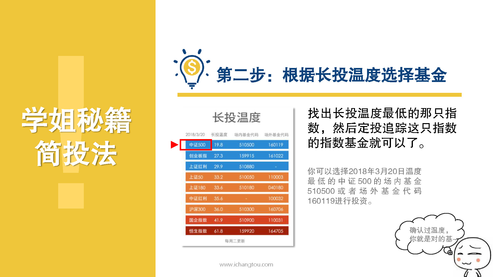

# 基金9-3-确认定温度，你就是对的基

## PPT

## 课程内容

### 选择最低温度指数对应的指数基金

- xxxx1

  > 

## 课后巩固

- 问题

  > 根据长投温度选择指数基金，下面选项中正确的是？
  >
  > A.随便选
  >
  > B.选择温度高于30度的
  >
  > C.选择温度低于30度的

- 正确答案

  > C。温度越低，表示这只指数目前估值相对较低，这择这只指数对应的指数基金就可以了。