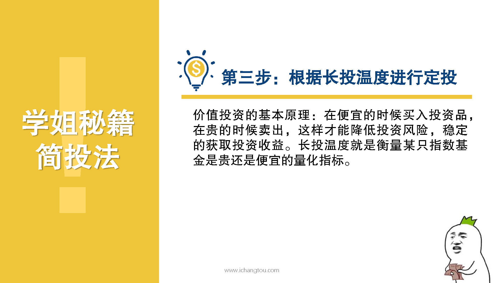
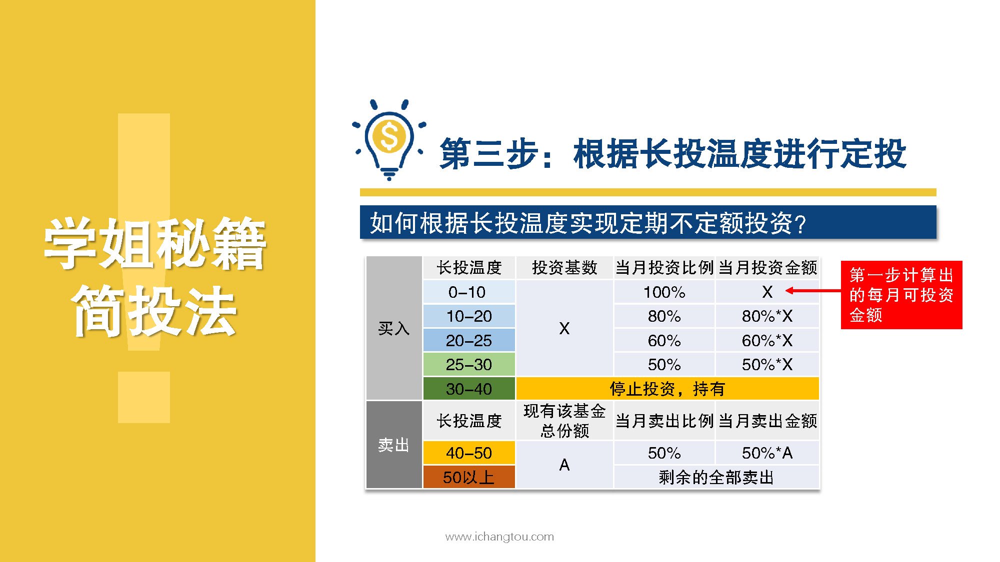
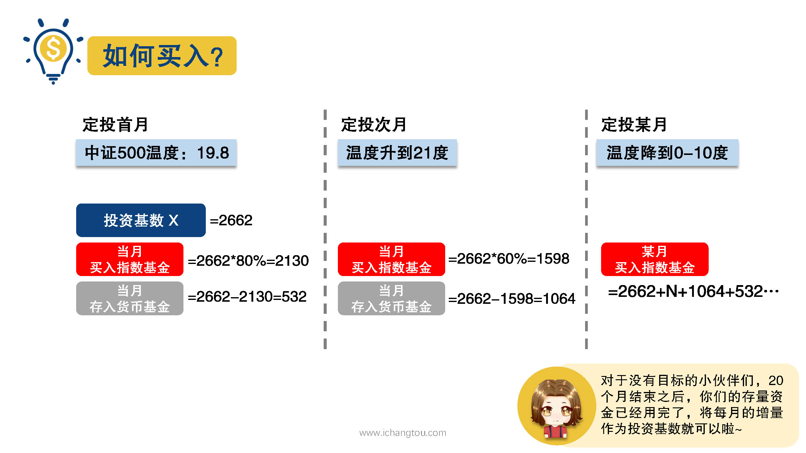
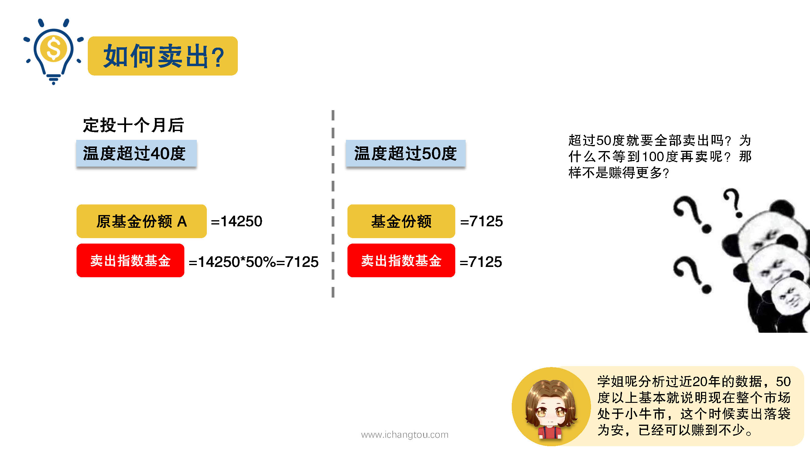

# 基金9-4-买卖小秘诀

## PPT

## 课程内容

### 0~30度按系数买入

- xxxx1

  > 

### 30~40度不再买入

### 40度以上分批卖出

## 课后巩固

- 问题

  > 假设你每个月的投资基金是1000元，定投当月最低温度是23度，那么当月的投资基金中存入货币基金的金额是多少？
  >
  > A.1000元
  >
  > B.400元
  >
  > C.200元

- 正确答案

  > B。23度的时候投资系数是0.6，则当月定投金额是600元，剩下的400元存入货币基金。