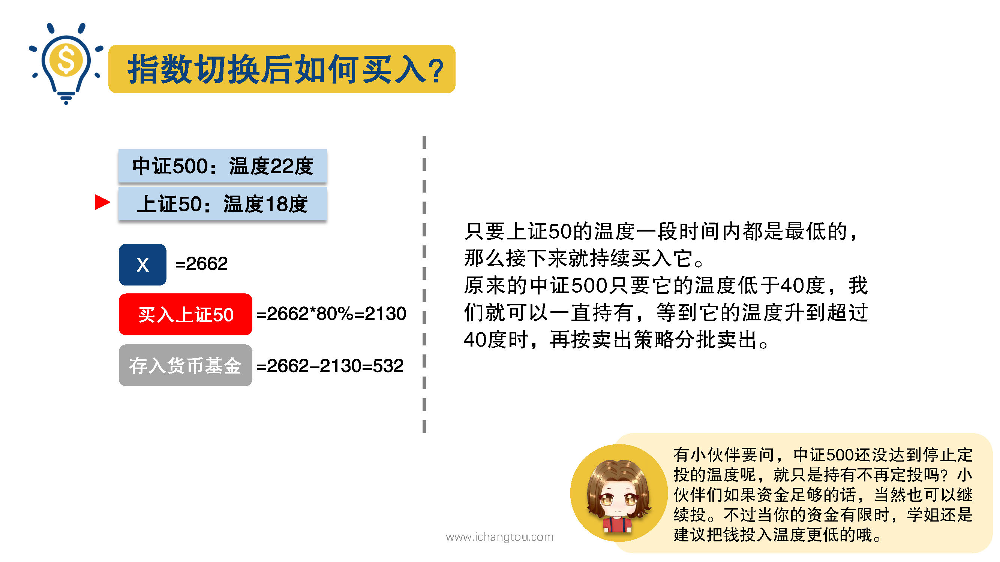
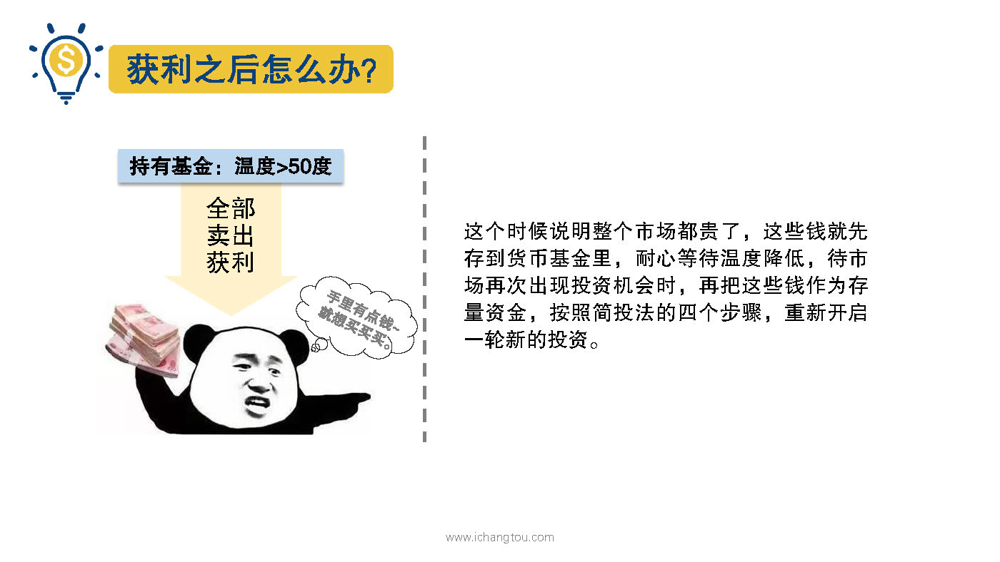
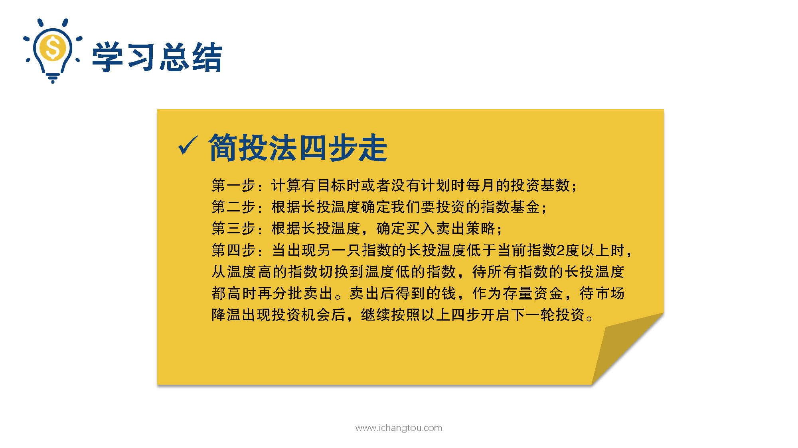

# 基金9-5-钱要花在刀刃上

## PPT

## 课程内容

### 怎样切换指数基金

- xxxx1

  > 

## 课后巩固

- 问题

  > 下列关长投温度的使用，说法错误的是？
  >
  > A.只要温度相差2度，就必须马上进行定投基金切换
  >
  > B.出现0~10度时是投资大好时机
  >
  > C.出现更低的温度后，原来的基金还是可以继续持有

- 正确答案

  > A。本选择的是错误的，A选项错误。温度差到2度以上是学姐的建议，小伙伴可以根据自己的情况确定切换的温度差。