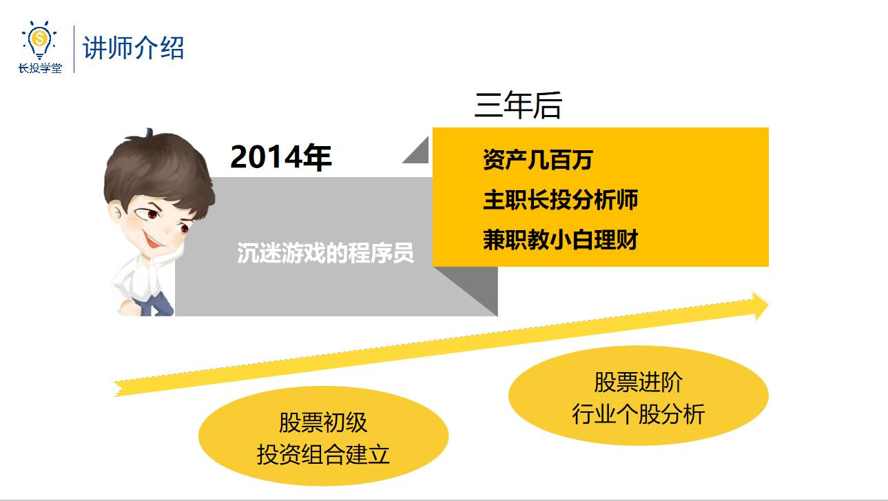
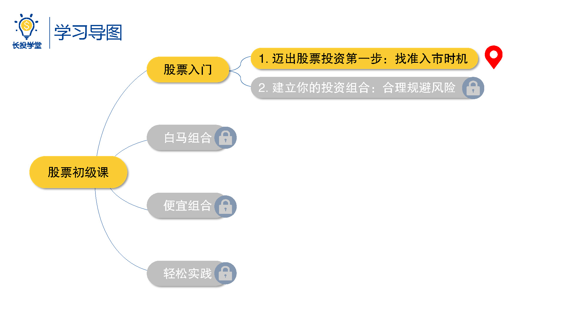

# 基金1-1-迈出股票投资第一步

## PPT

## 课程内容

### 讲师经历

- 从程序员到分析师之路

  > 欢迎大家和我一起学习股票初级课。也许大家还不认识我，这里先做一个自我介绍，2014的时候，我的好兄弟二狗刚入股市，而我则还是一个穿着背心、拖鞋，沉迷打游戏的程序员。时光荏苒，岁月如梭，短短三年之后，我的好兄弟二狗已经把新手能踩的坑全踩了一遍，而我则变成了资产几白万、兼职教大家理财的长投大师兄。难道这三年里，我中了彩票，或者我突然开了光捡了一大笔钱，其实都不是，我只是花了几千块钱学了一门课程，是不是很神奇，是不是很心动。那么从今天起，从股票初级的投资组合建立，到股票进阶的行业个股分析，我会一步一步的带着大家一起学习，让大家和我一样可以在股市里赚钱。

## 课后巩固

- 问题

  > 哪种股票投资流派更适合新手呢？
  >
  > A.价值投资派（估值法）
  >
  > B.技术投资（像是投术分析，图线分析，趋势分析等等）
  >
  > C.宏观投资（宏观分析，判断未来经济走势）

- 正确答案

  > A。价值投资是最适合新手的投资方法。为什么答案是A呢？继续学习就会知道答案