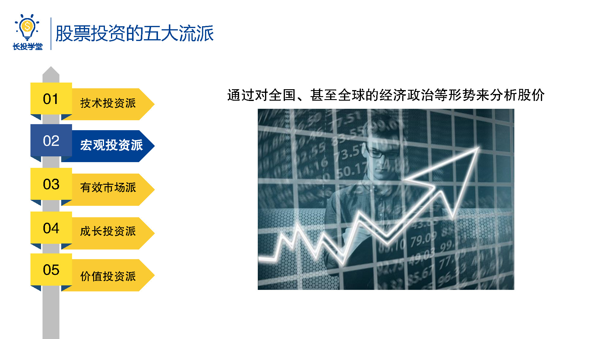
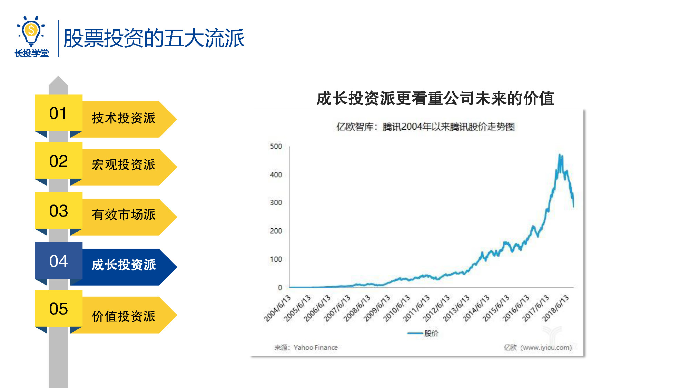

# 基金1-2-股票投资五大流派

## PPT

## 课程内容

### 五大股票投资流派

为什么价值投资就是最适合新手的投资方法呢?且听我慢慢道来。

说到股票投资，有很多不同的流派，主要有以下五个:

- 技术投资派

  > 通过分析股票的历史价格，来预测股票未来的涨跌
  
- 宏观投资派

  > 通过分析国内甚至是全球的经济、政治等形势，来分析股价

- 有效市场派

  > 通过大量的资金买入几十只几百只股票，来分散、管理风险

- 成长投资派

  > 看重公司未来的价值。其精髓是：找到刚刚起步，但未来价值高的公司

- 价值投资派

  > 看懂公司现在真正的价值，判断市场的价格相对公司价值是贵了还是便宜了

### 各流派的特点

- 技术投资派、宏观投资派、有效市场派

  > 这三个流派投资者的决策，很大程度上依赖于对数据、主场、宏观经济的大量分析，要求投资者有非常专业和深厚的数学、金融的背景知识，以及大量的资金，做为支撑。关键就在于靠历史数据、国家经济来预测明天的股市，就像是跟据一个人过去赚了多少钱，来预测他未来能赚多少钱一样，虽然感觉可行，但是你真的能预测准确吗。对于我们这种辛辛苦苦好不容易养个小白鹅的新手来说，要用自己辛苦积累的积蓄赌一个不确定的明天，还真的是不顾后果的壮举呀，因此这三个流派都不太适合新手。
  
- 成长投资派、价值投资派

  > 这两个流派都看重对公司的价值分析。不同的是，成长投资派更看重公司未来的价值。比如，你能在互联网刚刚异军突起的2004年，就凭借火眼金睛在鱼龙混杂的市场中，发现刚刚上市，发行价仅3.17港元的腾讯，并持有它的股票一直到现在。那么，请让我抱紧你的大腿感叹一句“优秀”，毕竟你在整个行业才刚刚萌芽，大家还都不知道未来如何发展的时候，就凭着敏锐的洞察力在一众互联网公司当中预估出了腾讯未来的价值。像这种找到刚刚起步，但未来价值高的公司的方法，就是成长投资派的精髓所在了。不过要知道，这种经验和眼界不是一朝一夕能够获得的，对小白来说，在企业真正成长之前，你很难判断谁会变成主板，分分钟可能就会看走眼了，谁知道看中的公司以后是会发展迅速还是会破产呢，不敢动不敢动。
  >
  > 而价值投资派呢，需要我们学会的是看懂公司现在真正的价值，比如一件古董，明明值1000万，但是市场有不懂行的卖家以500万在出售，如果我们能够看懂它值1000万左右，那么趁着只卖500w的时候买入。之后只要等着它的价值被市场发现，价格慢慢回升，我们就有很大的可能赚钱了，这就是价值投资的本质。
  >
  > 相比前四个流派，又要有宏观的金融知识，还要有雄厚的资金实力，最重要的是要不停的预测充满未知的未来，价值投资派真的是太友好了。我们只需要判断公司现在怎么样、现在值多钱，市场的价格相对公司价值是贵了还是便宜了，我们就能获得我们想要的结论。而且呀，价值投资派入门简单，同时能够达到的上限非常高，很适合新手学习。不过，入门简单并不代表着随随便便就能成功，价值投资同样讲究一份耕耘一份收获，想要精通，必需付出努力。而在我们都是新手玩家的时候，因为分析能力不强，一般只能享受到市场的平均收益，当然，将来精通后，你会明白价值投资就是细水长流，那时候你也就不一味追求短时间内的高收益了。

## 课后巩固

- 问题

  > 小伙伴知不知道，下面哪一个方法是基于价值投资派的呢？
  >
  > A.“捡烟蒂”投资法
  >
  > B.“好公司”投资法
  >
  > C.以上都是

- 正确答案

  > C。价值投资方法有“捡烟蒂”投资法、“好公司”投资法。