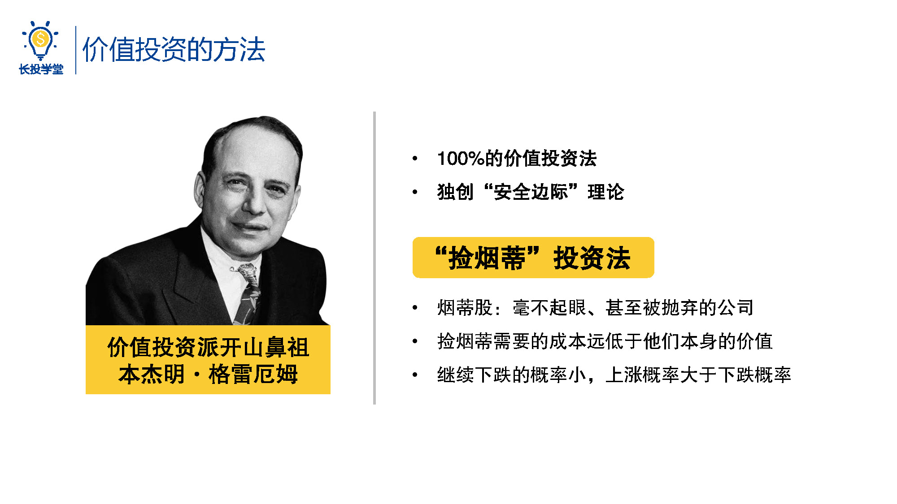
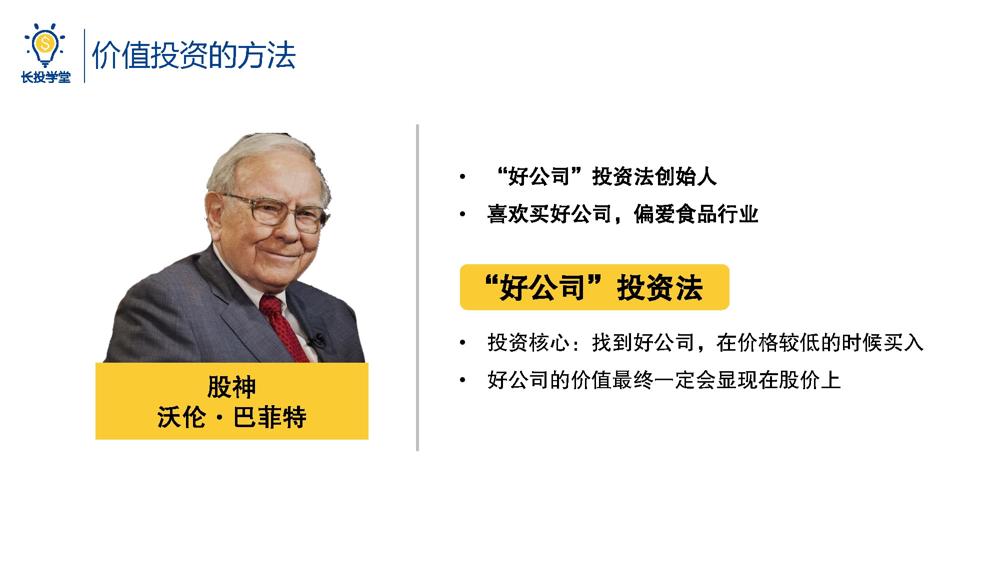
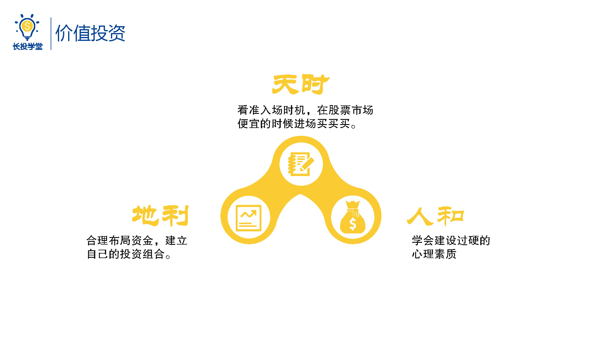

# 基金1-3-价值投资有哪些方法

<audio src="assets\股初-1.3.mp3"></audio>

## PPT

## 课程内容

### 价值投资的两种方法

捡烟蒂投资法和好公司投资法，就是在本次的股票初级课中，师兄要向大家介绍的基于价值投资派的两种投资思路。

- 捡烟蒂投资法

  > 我们先看捡烟蒂投资法，说到捡烟蒂投资法，有一个人师兄不得不提了，他就是价值投资派的开山鼻祖，本杰明格雷勒姆，格雷恩姆的投资手法被称为100%的价值投资手法，他极力主张投资者不应该花费太多的精力去猜测行情，而应该去理解股票代表的是公司，把投资重点放在判断公司的价值上。不仅如此，格雷勒姆独创出了安全边际的理论，安全边际，其实就相当于用4毛的价格买值1块钱的股票，讲究投资一定要给自己留一个后手，以降低风险，这些理论在后人的发扬光大之下形成了经典的捡烟蒂投资法。
  >
  > 那么什么是烟蒂股呢？其实就是那些毫不起眼甚至被人抛弃的公司，正因为这些公司没有人关注才导致他们的价格远低于他们的价值，也正是因为它们的价格实在太低而很难继续下跌，一旦市场稍稍恢复对它们的关注，股价就会上涨，也就是说上涨的概率比下跌的概率更大，这样就可以赚钱了，这就是著名的捡烟蒂投资法。
  
- 好公司投资法

  > 而另一种好公司投资法就很好理解了，我们知道投资股票的本质是投资一家公司，而一家公司业绩表现优秀、管理者可信，那么它所具有的价值最终会显现在股价上，我们只要找到好公司，并且在价格比较低的时候买入，之后呢，再烦耐心的等着它真正的价值显现出来，就躺着也能赚钱了，这么简单的投资方法的创始人就是我们大名鼎鼎的股神巴菲特，是不是很厉害呢，巴菲特特别喜欢买好公司，尤其偏爱食品行业，大概因为他自己也是个吃货吧。以上就是各有千秋的捡烟蒂投资法和好公司投资法。

### 有了投资策略，还需“天时地利人合”才能笑到最后

- 天时、地利、人和

  > 在初级课中，师兄就将带大家学习这两种投资方法，并且学会利用这两种方法开始自己的股票投资之路，听到这里大家是不是已经迫不及待的搓搓小手，想要好好的大干一场呢，别着急，这里师兄要敲黑板提醒一下大家了，这两种投资策略虽然简单，但是股市如战场，向来波诡云谲千万不要掉以轻心，即使有价值投资的良策在手，想要在这个瞬息万变的战场笑到最后，还需要找准成功克敌的天时、地利、人和。
  >
  > 那么什么才是股票投资的天时地利人和呢？这里师兄先给大家大概先解释一下：
  >
  > 天时即看准入场时机，在股票市场便宜的时候进场买买买；地利即合理的布局资金，建立自己的投资组合，在这部分，我们会结合A股的情况，教大家如何运用好公司投资法捡烟蒂投资法；人合即学会建设过硬的心理素质，不受投资道路上的魑魅魍魉的影响笑到到最后。
  >
  > 我们的课程也将围绕刚刚师兄说的天时、地利、人合，这三个要素层层展开，步步递进，听到这里小伙伴们是不是已经对课程有一个大致的了解了呢？接下来我们就来看一看什么是股票投资的天时。

## 课后巩固

- 问题

  > 如果是你，下面的两家公司你会选哪个呢？
  >
  > A.80块的中国平安（内在价值65）
  >
  > B.5块6的泰合健康（内在价值7块）
  >
  
- 正确答案

  > B。下节将会讲解为什么要选5.6的泰合健康。