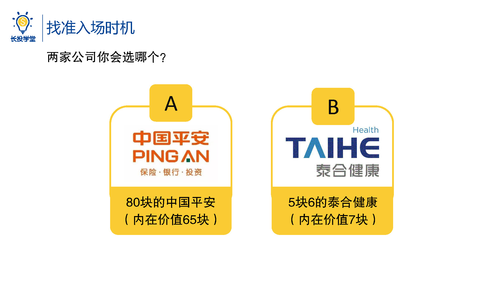
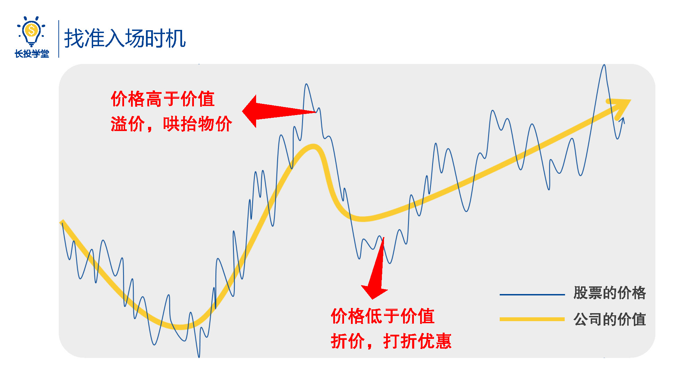
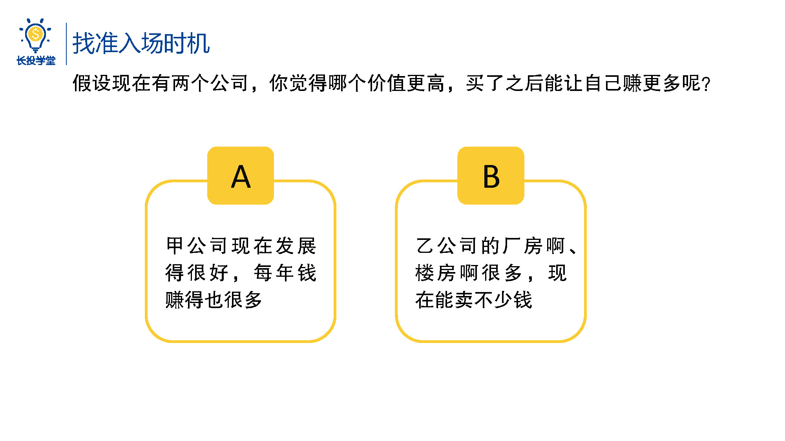
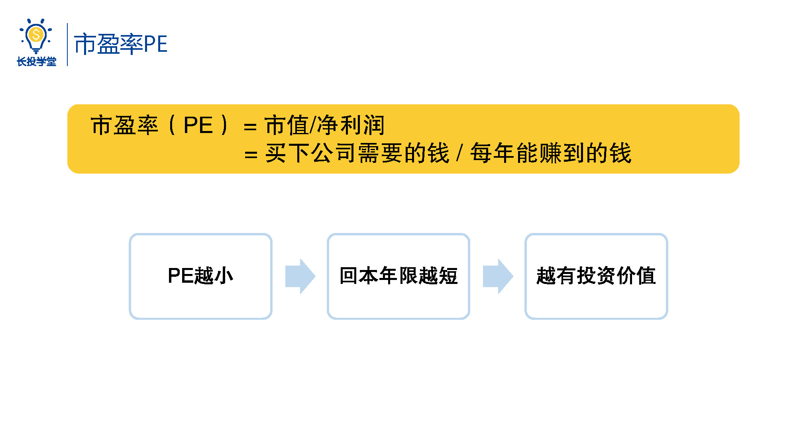
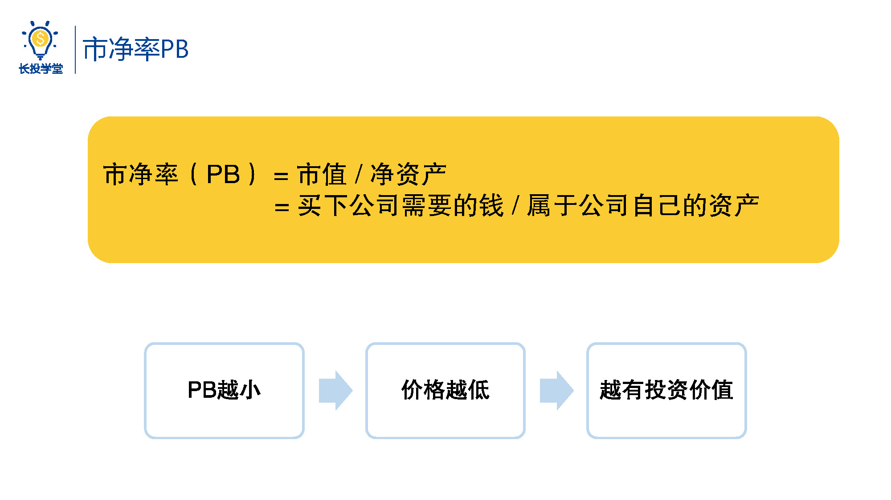

# 基金1-4-如何判断单支股票是否便宜呢

<audio src="assets\股初-1.4.mp3"></audio>

## PPT

## 课程内容

### 内容1

- 价格是围绕价值上下波动的

  > 单一的价格高低并不是判断股票好坏的，关键关键在于相对于公司的内在价值它的股价是便宜还是贵的。买股票就是买公司，每一家公司都有其内在价值，而价格会围绕价值上下波动，当价格高于价值时叫溢价，也就是俗话说的哄抬物价，当价格低于价值时叫折价，也就是俗话说的打折优惠，所以那些价值好的股票如果还打折优惠了，就是我们希望买进的。
  
- 何衡量公司内在价值的方法——估值（公司价值=公司现在价值+未来公司能赚取的价值）

  > 当我们说一支股票便宜的时候，其实是在和它自己的内在价值进行比较。题目中的选项是假设的内在价值，在实际中我们如何衡量一家公司的内在价值呢？
  >
  > 假设现在有两家公司，你觉得哪个价值更高，买了之后可能让自己赚的更多。A，甲公司现在发展的很好，每年钱赚的也很多；B，乙公司它有很多的厂房、楼房等等，现在能卖不少钱，到底是a还是b呢？其实这两种情况都有可能发生，a和b实际上是从两个不同的角度来对公司进行估值。
  >
  > 一家公司的价值，这里它等于现在公司的价值加上未来公司能赚取的价值。

- 市盈率PE = 买下公司需要花的钱 / 公司每年能赚到的钱 = 回本年限

  > a选项目，是通过衡量公司每年能帮自己赚多少钱来判断公司价值高低的。比如说现在有两家书店头悬梁和锥刺股他们都愿意以100万的价格卖给你，不同的是头悬梁每年能赚20万啊，而锥刺股每年只能赚10万，相信每个人都会选择能赚20万的那一家，毕竟投入100万只要5年就能回本了，另外一家要10年才能回本。
  >
  > 好，就在刚才你已经学会了一个非常有用的给公司估值的指标——市盈率，英文缩写PE，它的计算公式是市 盈率PE = 市值 / 净利润。
  >
  > 所谓市值就是把一整家公司买下来所需要支付的价格，对照上面的例子，两家书店的市值都是100万，尽利润就是收到的钱减去各种成本之后剩下的钱，对照上面的例子头悬梁书店，一年的净利润是20万。聪明的你有没有发现市盈率PE就等于买下公司需要花的钱除以每年能赚到的钱。唉，这不就是回本年限嘛。
  >
  > 一家公司的PE越小，说明回本年限越短就越具有投资价值，书店头悬梁的PE=100万÷20万=5，而书店追刺股的PE=100万÷10万=10。聪明的你会选择了吗？

-  净率PB =  买下公司需要花的钱 /  属于公司自己的资产 = 单价

  > 接着看选项b，是通过衡量一家公司的资产能卖多少钱来判断公司价值高低的，也就是从市净率，英文缩写pb的角度来判断书店的价值。好，来看一下这个公式市 净率pb = 市值 / 净资产。
  >
  > 市值和上面一样，是把一整家公司买下来需要支付的价格，而所谓净资产是指属于公司自己的资产。经营一家公司，我们除了自己的资金、设备等，也可能会问别人借钱、借材料，这些借来的东西虽然在日常经营中也会用到，但终究不属于我们，早晚是要还回去的，比如运营一家公司所需要的所有资产价值总计为100万，其中有20万是借来的，那么属于公司自己的就是80万。聪明的，你是不是又发现了市净率pb等于买下公司需要花的钱，除以属于公司自己的资产呢，所以一家公司的pb越小代表这家公司的价格越低越具有投资价值。
  >
  > 比如前面的投向量净资产有50万，非私募净资产有120万，他们都愿意以100万的价格卖给你，通过计算我们可以发现头悬梁和锥刺股的pb分别是2和0.83，相当于同样是一块钱的公司净资产，前者需要花两块钱去买，而后者只需要用8毛钱就能买到了，这么一看同样是花100万买一家书店，唉，锤子股似乎更便宜呢。

## 课后巩固

- 问题

  > 如果给你300家公司，让你判断它们是否便宜，你会判断吗？
  >
  > A.不会
  >
  > B.今天的课程学完，肯定就会啦
  
- 正确答案

  > A。估值方法将在后续的课程中讲。