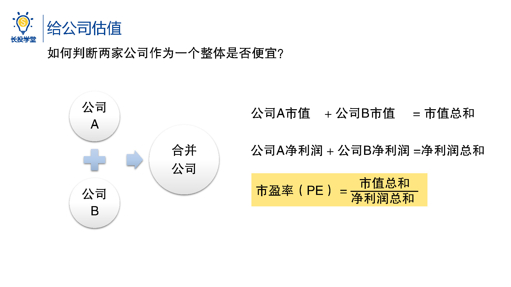
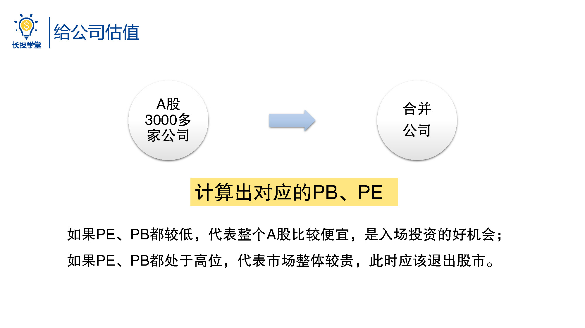
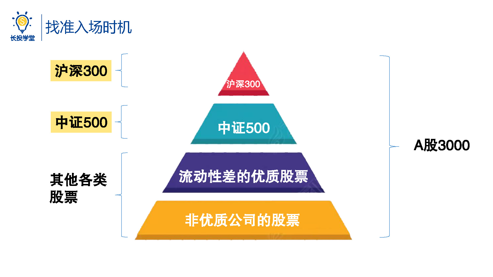
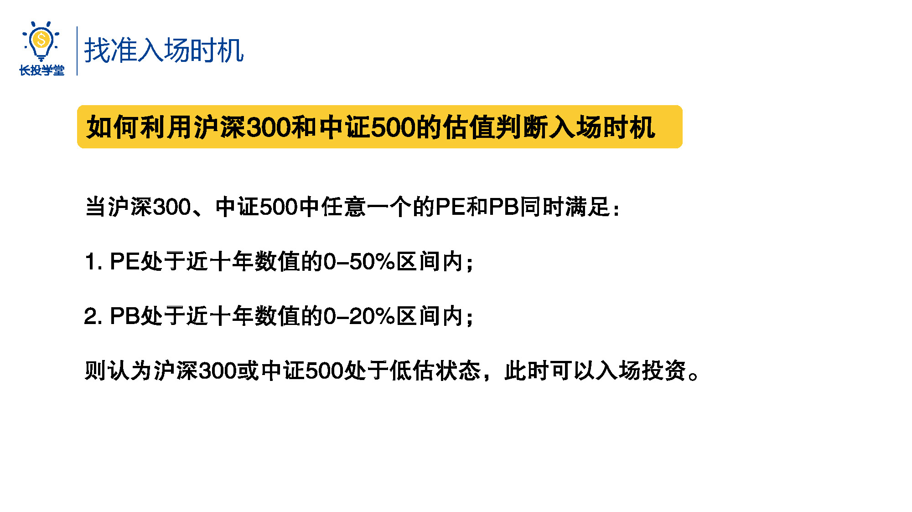
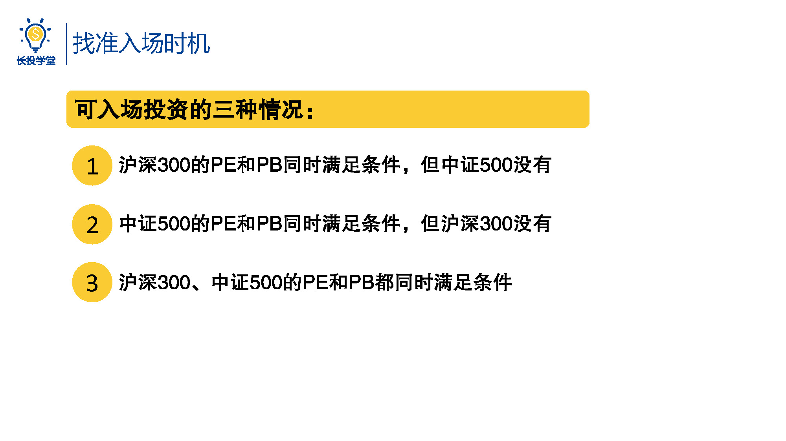
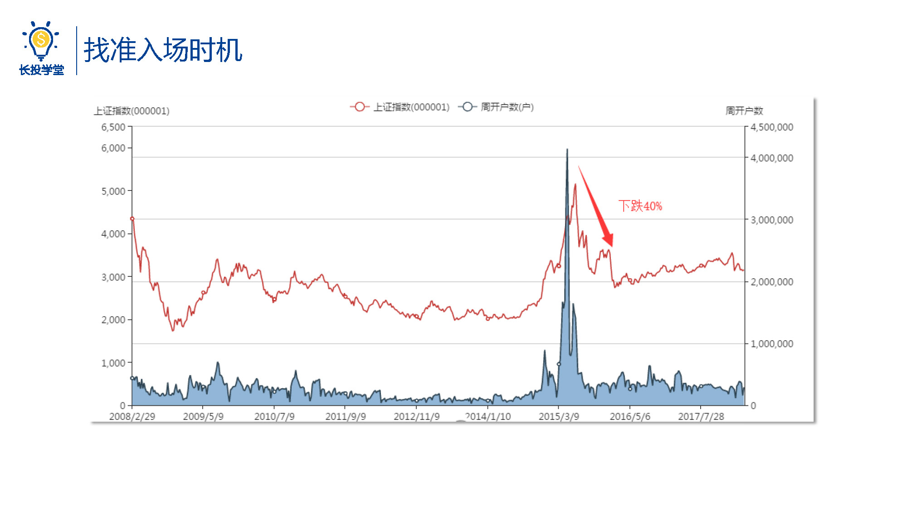
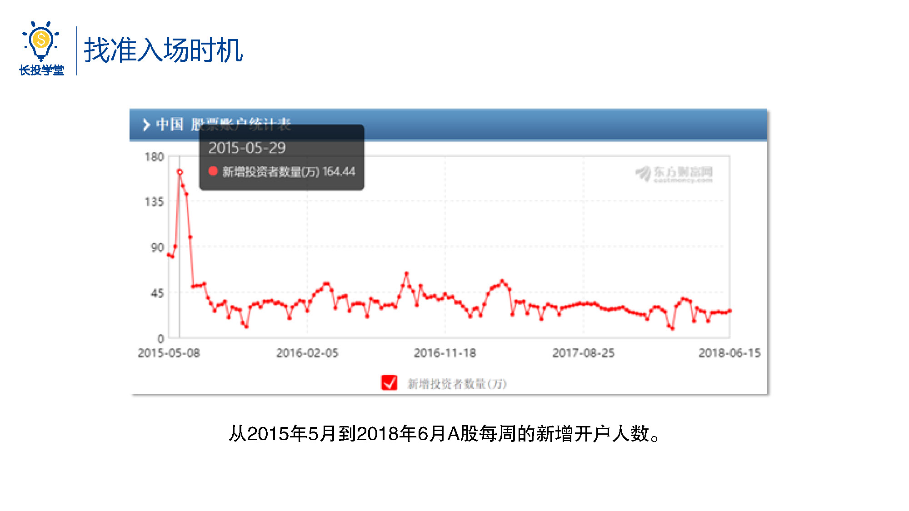

# 基金1-5-怎么判断是对的入场时机

<audio src="assets\股初-1.5.mp3"></audio>

## PPT

## 课程内容

### 多家公司整体估值

- 判断多家公司作为一个整体是否便宜的方法

  > 我们一步步来，假如现在我想判断两家公司作为一个整体是否便宜，要怎么做呢？很简单，我们把它们合并成一家公司就好了，将两家公司的市值相加都得到了市值总和，再将两家公司的净利润相加就得到了净利润总和，用市值总和除以净利润总和，就能计算出一个PE值，可以用来判断两家公司作为一个整体是否便宜。所以不管几家公司，我们都可以按照相同的办法来合并成一家大公司，从而计算出相应的PE和PB。
  >
  > 同样的道理，把中国A股的3000多家上市公司看成一个整体，也可以计算出对应的PE和PB，如果PE、PB都比较低，则代表整个A股都比较便宜，是入场投资的好机会。如果PE、PB都处于高位，则代表市场整体都比较贵，此时应该退出股市。
  
- A股市场前800家公司

  > 不过，我们投资的优质公司绝大多数都集中在规模较大企业流通性较好的前800家，所以我们计算PE、PB是只需要考虑这800家公司就可以了。同时再根据规模从大到小排列，这800家公司又可以分成两个集团，名称分别是沪深300（规模最大的前300家公司）、中证500（除去最大的300加后剩下的500家公司）。
  >
  > 作为投资新手来说，利用这两个集团的PE、PB值，就足够帮助我们判断入场的时机了，假如沪深300的PE、PB较高，则说明规模最大的300家公司作为一个整体来说比较贵。同理，如果中证500的PE、PB较低，则代表这500家公司作为一个整体来说比较便宜。那么究竟多少的PE、PB算高多少的PE、PB又算低呢？高和低其实是比较出来的，光看一个数字是无法作出判断的。那么，接下来师兄就来告诉你，如何利用沪深300和中证500的公司判断入场时机，听好了哟。

### 入场时机判断

- 通过沪深300、中证500指数判断入场时机

  > 当沪深300、中证500中，任意一个的PE和PB，同时满足：
  >
  > 一、PE处于近十年数值的0~50%区间内；
  >
  > 二、PB处于近十年的0~20%区间内。
  >
  > 则认为沪深300或中证500处于低估状态，此时，可以入场投资。这两个范围都是通过经验判断的，比较安全的入声指标。
  >
  > 总结一下，就会有三种情况：
  >
  > 第一、沪深300的PE、PB同时满足条件，但中证500没有；
  >
  > 第二、中证500的PE、PB同时满足条件，但沪深300没 ；
  >
  > 第三、沪深300、中证500的PE、PB都同时满足条件。
  >
  > 当出现任意一种情况就可以入场投资啦。

- 躲过大牛市末期的下跌

  > 以上的判断条件，小朋友们掌握了吗？好，说到这里师兄又想问一问大家了，你们还记得2015年的那个大牛市吗？那个时候股市一片红海，股价连创新高，连菜市场的大妈每天谈论的都是炒股、牛市，大批大批的人怀揣着一夜暴富的美梦杀入股市，却在三个月后经历了整个A股暴跌40%的暗黑时刻。那么，当时遭受损失的人群究竟有多少呢？我们来看一张图，这张图展示的是从2015年5月到2018年6月A股每周的新增开户人数，师兄先解释一下，投资股票需要开设证券账户，所以开户的人越多，我们就可以近似的认为进入股票市场的人也越多，大家可以看到，在2015年5月29日这天，尽然有将近165万的人冲进了股市，远远高于其他的时间段，这些人加上一些老股民，共计几百万人，损失惨重，一同化为乌有的，不仅仅是暴富的梦想，还有积攒多年的本金。如果时光倒流，我们是否可以用今天学到的知识躲开这场下跌呢？

## 课后巩固

- 问题

  > 如果时光倒流，用今天学到的知识，能否帮助我们躲开2015年A股的暴跌呢？
  >
  > A.能
  >
  > B.不能
  >
  
- 正确答案

  > A。下节实操看一看。