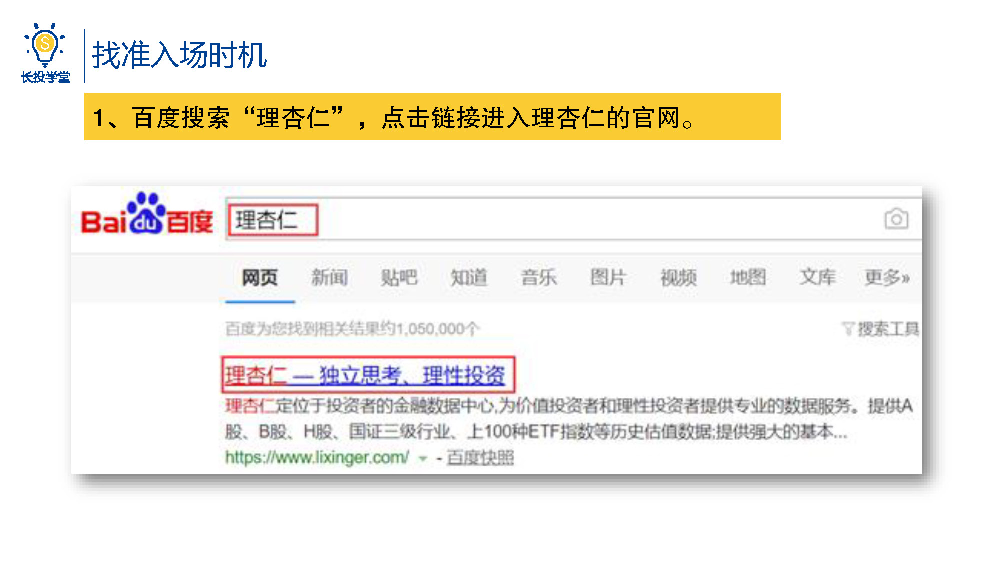
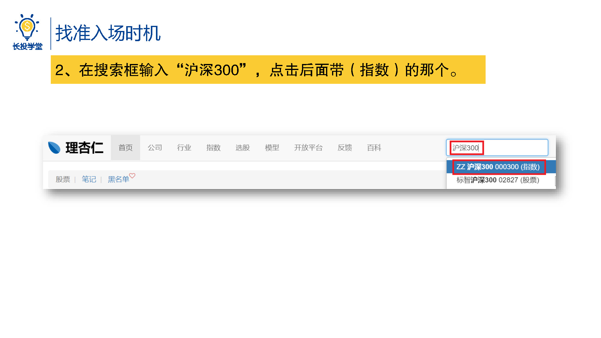
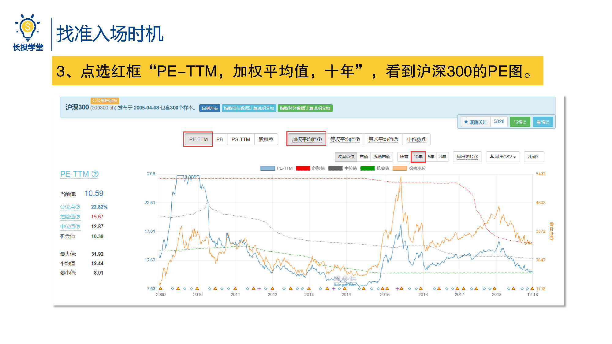
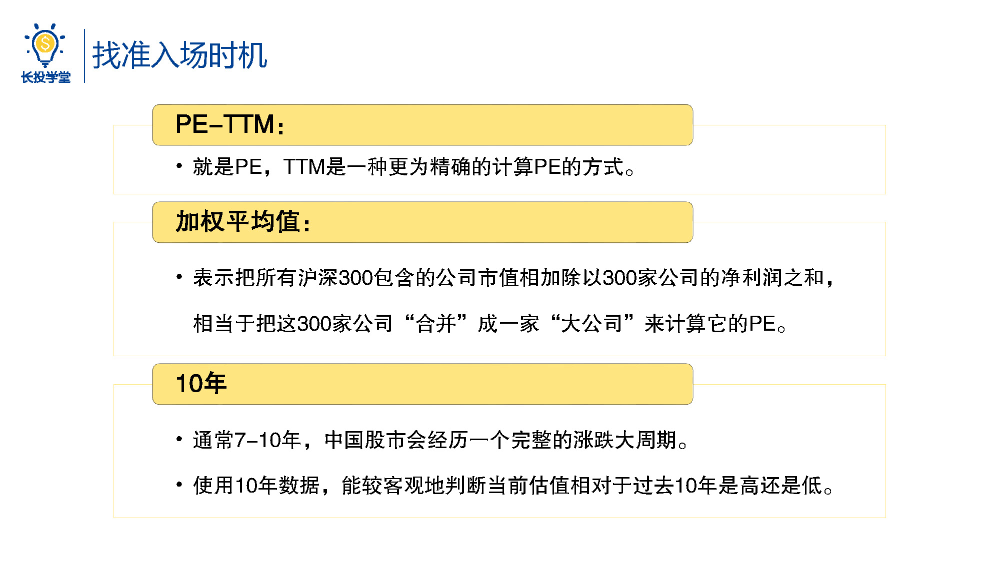
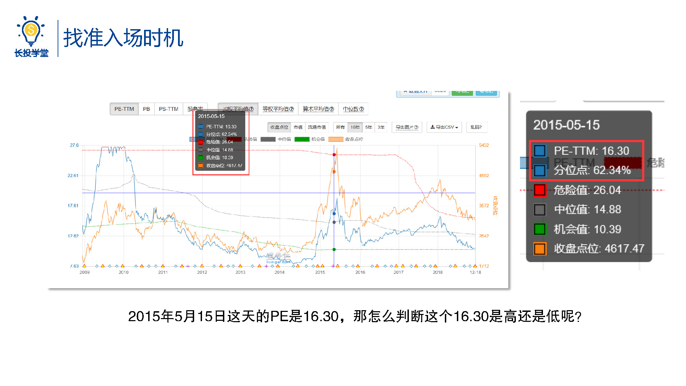
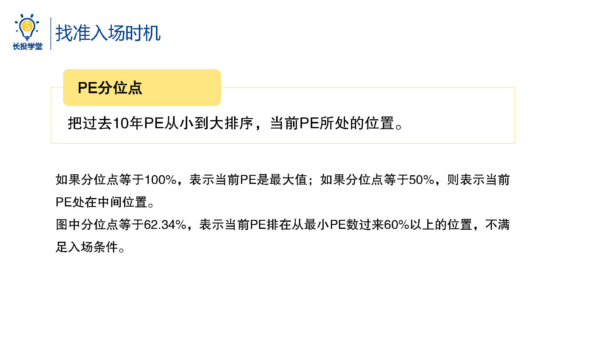
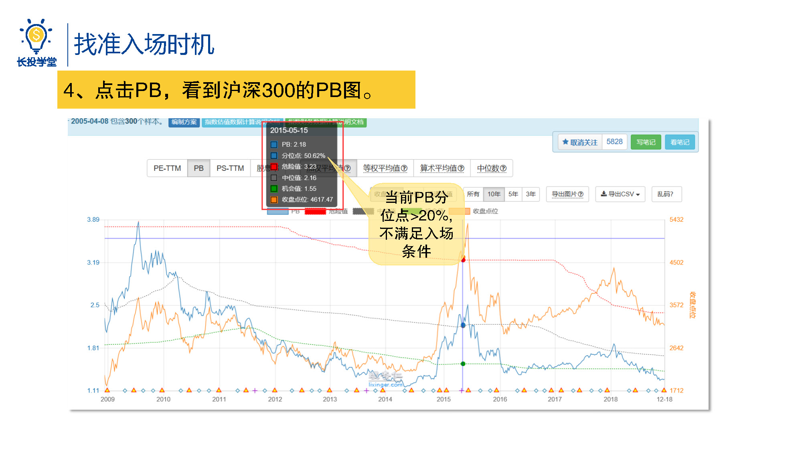
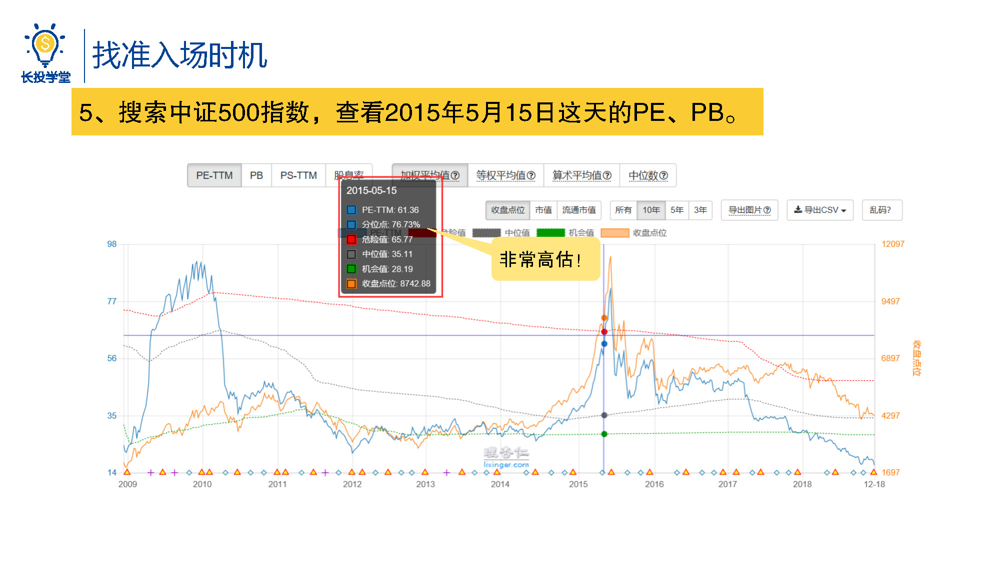
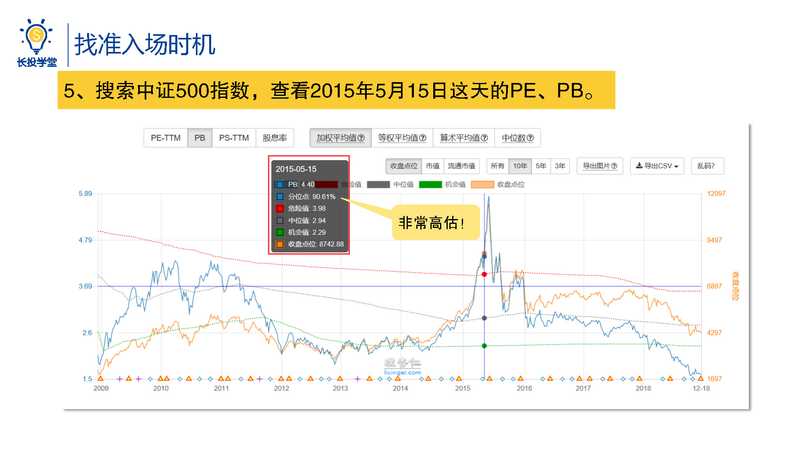
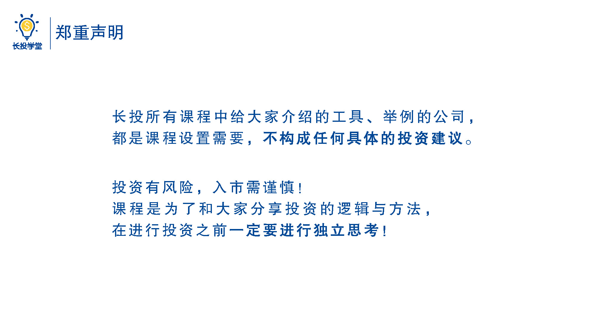

# 基金1-6-基金的优势与特点

<audio src="assets\股初-1.6.mp3"></audio>

## PPT

## 课程内容

### 实操判断入场时机

- 通过理杏仁网站相看沪深300、中证500指数估值

  > 我们一起通过理杏仁网站来实际操作一下，首先百度搜索杏，点击链接进入杏的官网。登录后在搜索框输入沪深300，点击后面带指数二字的那个，然后点选红框pe-ttm加权平均10年，我们看到的就是沪深300的pe图了。
  >
  > 好，先来解释一下红框中的三个参数，第1个PE-TTM，不被马甲所迷惑，这货其实就是PE啦，TTM可以认为是一种更为精准的计算PE的方式；第2个，加权平均值，表示把所有沪深300包含的公司市值相加除以300在公司的净利润之和，相当于把这300家公司合并成一家大公司来计算它的PE；第3个，10年，通常来说7~10年中国股市会经历一个完整的涨跌大周期，在来查看当前的数值时，选择10年的数据，就能在一个完整的周期里看到沪深300的表现，从而能比较客观的判断当前估值相对于过去10年来说是高还是低。
  >
  > 图中那条弯弯曲曲的蓝线就是沪深300过去的PE值，我们发现它总是在变化的，涨的太多就会下跌，跌的太多又会上涨，差不多是在一个比较固定的区间内波动。我们把鼠标放在图标上，移动鼠标来找到2015年5月，这里师兄选的是2015年5月15日的数据，就是下图了，可以看到这于的PE是16.3，怎么判断这个p16.3是高还是低呢？如果我们把之前以前10年沪深300所有的PE数据搜集起来，从小到大排个序，再把当前的PE拿出来比较一下，不就可以知道当前PE是大还是小了吗？唉，bingo，这是个好主意，就是工作量好像太大了呀，别急，神器的理杏仁已经帮我们计算好了，就是下面的这个分位点，PE的分位点表示的就是，把过去10年的PE从小到大排序后，当前PE所处的位置。如果分位点等于100%表示当前PE是最大值；如果分位点等于50%，则表示当前的PE正好处在中间位置。前面我们说过当沪深300的PE处于0~50%的区间内时，我们认为此时的PE已经够低了，可以入场投资股票。图中分位点是62%，表示当前PE排在从最小PE数过来60%以上的位置，不满足入场条件。
  >
  > 最后同样的道理点击PB，我们就能看到沪深300的PB图，可以看到，当天沪深300的PB是2.18分位点，也是不符合入场条件的。沪深300不满足入场条件了，那么我们再来看看中证500呢，毕竟只要其中一个满足也是可以考虑的呀，按照刚才的流程，搜索中证500指数查看2015年5月15日这天的PE、PB，依然是根据分位点做出判断，我们可以看到那天中证500的PE分位点在75%以上 pb分位点在90%以上处于非常高估的状态。很明显，中证500和沪深300都处于高估的位置，我们肯定不会进场，完美避开股市的暴跌。
  >
  > 虽然我们无法预测市场，但是什么时候入场投资并不是仅仅看心情或拍脑袋就行了，从来没有一个优秀的投资者是通过随大流、撞大运来取得成功的，相信通过今天的学习起码在判断要不要进入股市这点上，你会比大多数人做得更好，而这点特别的关键，即使是你之后选了股票进阶课，会分析行业个股了之后，判断进入股票市场时机依然是很关键的一个分析，想知道进入股市之后我们应该怎么买吗？答案明天揭晓，天时已在，静候地利。

## 课后巩固

- 问题

  > 请大家查一下2015年5月20日沪深300和中证500的PE、PB，判断下是否适合入场？
  >
  > A.我现在就去理杏仁查
  >
  > B.我觉得很难啊，不想查
  >
  
- 正确答案

  > A。实践出真知，快去练习使用吧。