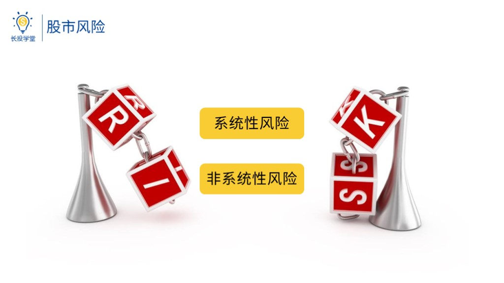
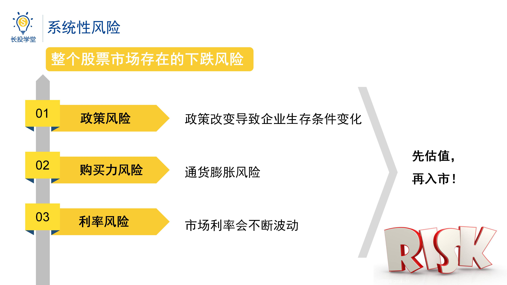
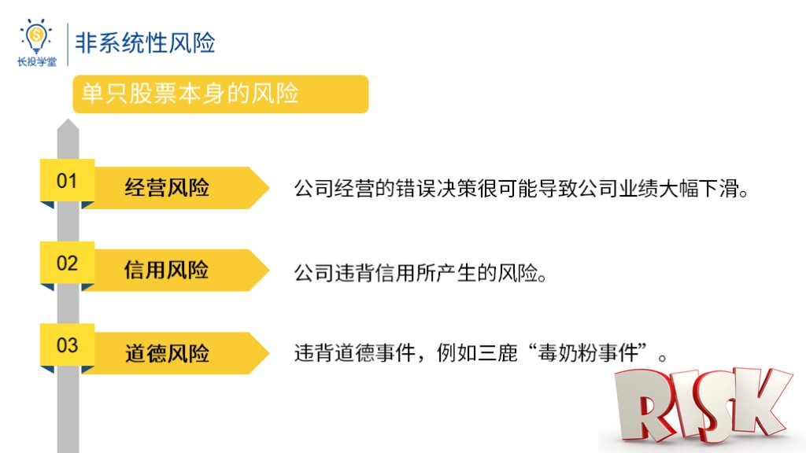

# 股初2-2-投票投资有哪些风险

<audio src="assets\股初-2.2.mp3"></audio>

## PPT

## 课程内容

### 内容1

- xxxx1

  > 

### 内容2

## 课后巩固

- 问题

  > 现实生活中保管基金这些钱的第三方是谁？
  >
  > A.基金经理
  >
  > B.基金公司
  >
  > C.银行

- 正确答案

  > C。银行是负责保管我们投资基金的钱财安全的第三方机构。