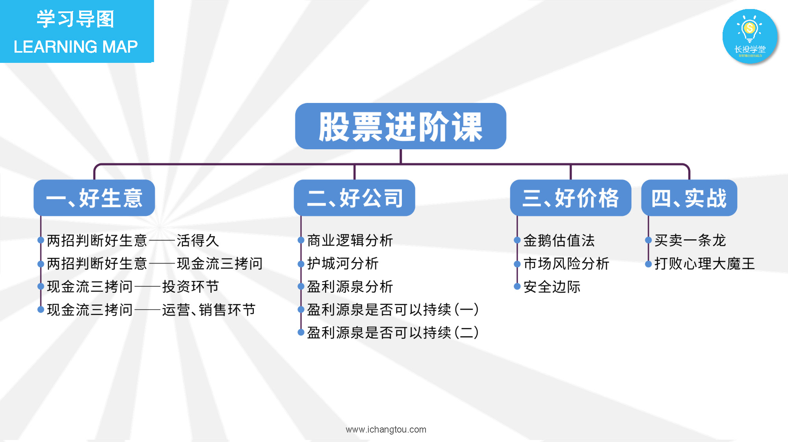
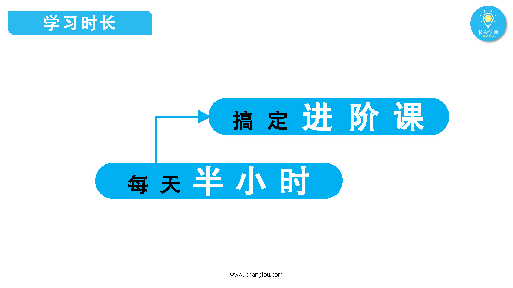
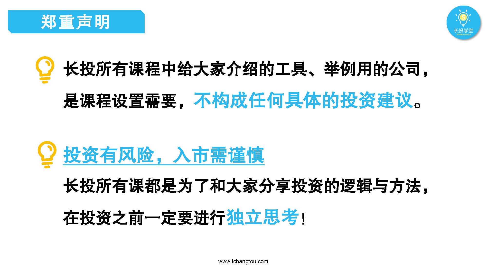

# 股进1-1-进阶课的前世今生

## PPT

## 课程内容

### 进阶课的开发创作者

- xxxx1

  > 

### 进阶课能学到的知识

- xxxx1

  > 

### 课前小贴士

- xxxx1

  > 

## 课后巩固

- 问题

  > 看完进阶大纲，你有信心学完进阶课吗？
  >
  > A.我这么机智，肯定没问题
  >
  > B.有点害怕进阶课
  >
  
- 正确答案

  > A。大家都很机智，进阶课其实不太难，加油。