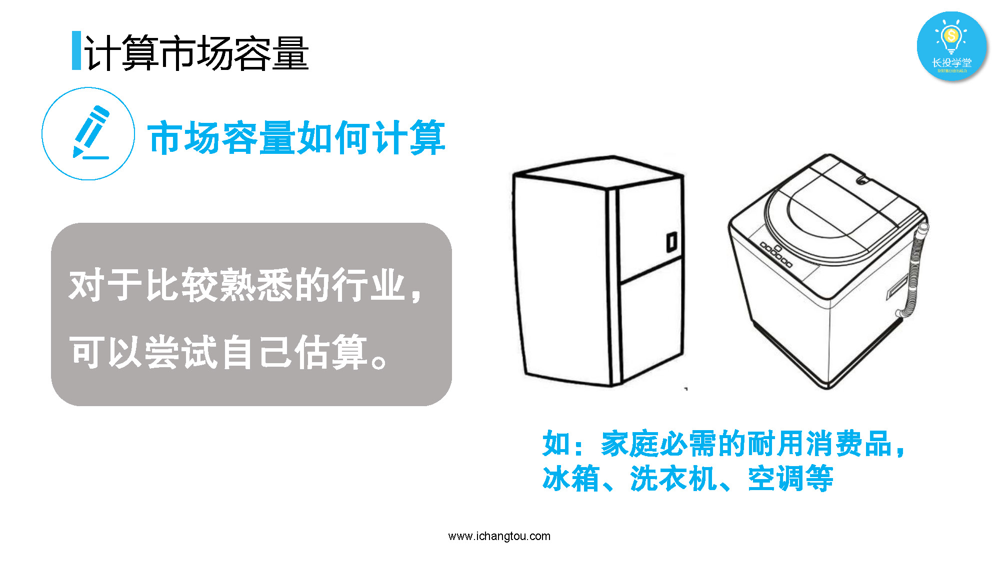

# 股进1-3-判断好生意第一招

## PPT

## 课程内容

### 看生意市场容量

- xxxx1

  > 

### 估算市场需求

- xxxx1

  > 

### 国内保有量比较法

- xxxx1

  > 

## 课后巩固

- 问题

  > 下列说法哪个是错误的？
  >
  > A.对于我们熟悉的行业，我们可以估算其市场容量
  >
  > B.用我们生活常识和搜索到数据估算市场容量的方法，叫国内保有量比较法
  >
  > C.我任性，可以随意估算市场容量

- 正确答案

  > C。我们估算市场容量时不能生搬硬套，要掌握计算思路不能自己任性随意估算哦。