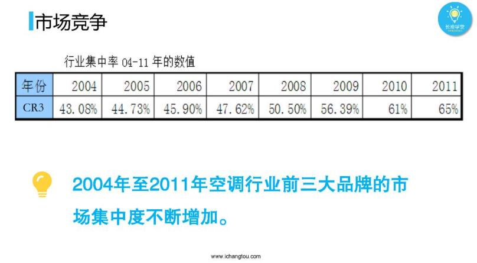

# 股进1-5-从研报中看市场竞争力

## PPT

## 课程内容

### 市场集中度

- xxxx1

  > 

### 空调发展史

- xxxx1

  > 

### 市场集中度越高越容易存活

- xxxx1

  > 

## 课后巩固

- 问题

  > 下列说法哪个是错误的？
  >
  > A.市场集中度低，竞争弱
  >
  > B.企业数量越多，竞争越激烈
  >
  > C.市场集中度高，越容易存活

- 正确答案

  > A。选项A比较片面，市场集中度低时，哪果是行业发展最早期，那里企业数量少，竞争可能会弱，但随着行业发展，企业数量逐渐增多，竞争逐渐增强，甚至竞争惨烈。