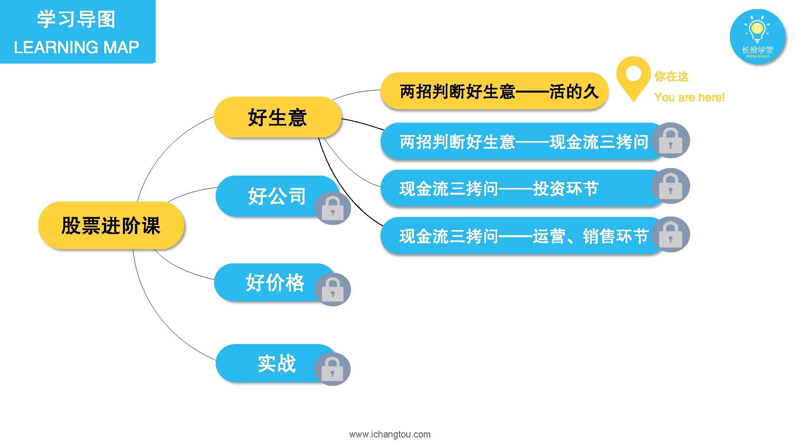
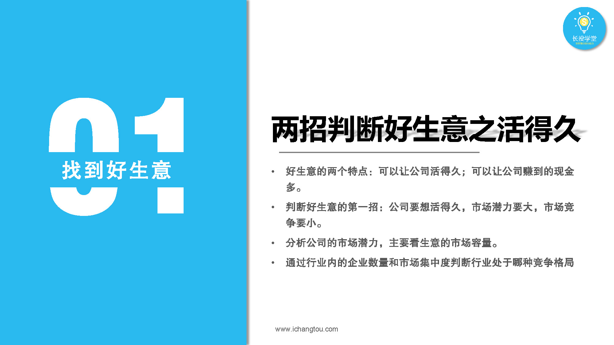
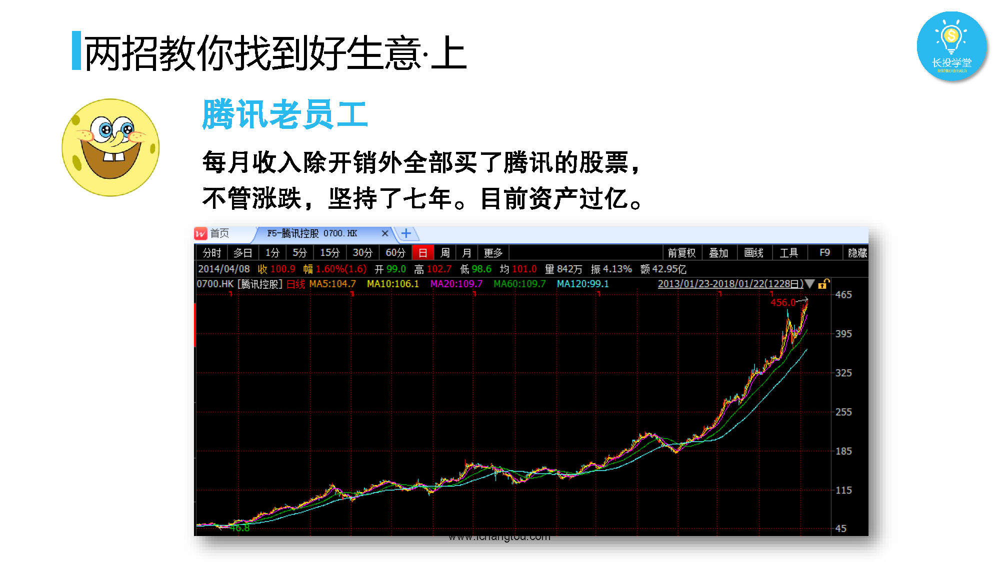
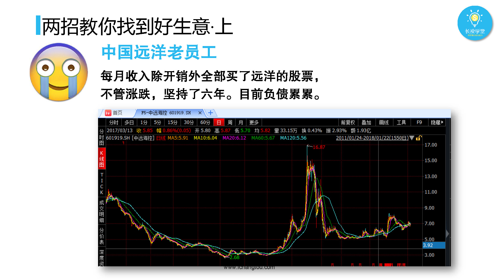
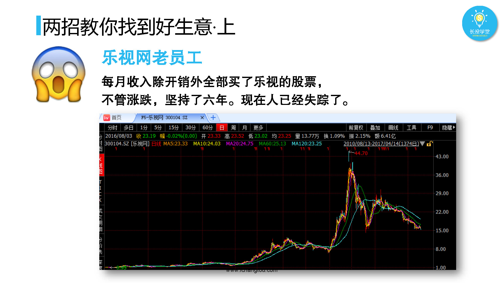

# 基金3-x-基金的优势与特点

## PPT

## 课程内容

### 为什么找好生意

- xxxx1

  > 

### 好生意的特点

- xxxx1

  > 

## 课后巩固

- 问题

  > 如果买股票，你会选择以下什么行业？
  >
  > A.医疗保障
  >
  > B.煤炭行业
  >
  > C.航空业

- 正确答案

  > A。医疗保健行业属于一个好生意，买入好生意的股票更容易获得高收益。