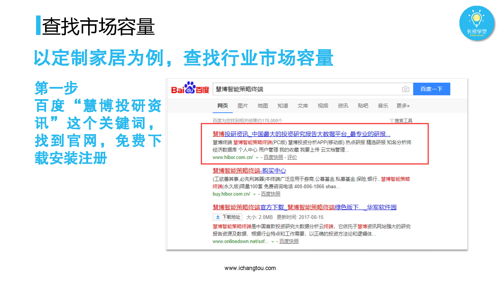
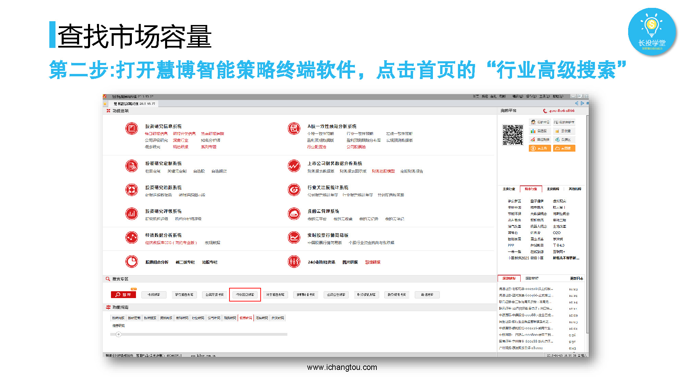
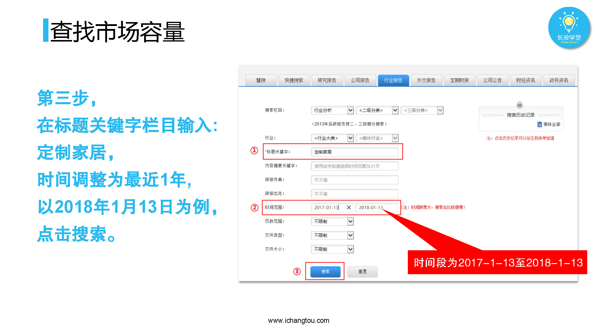
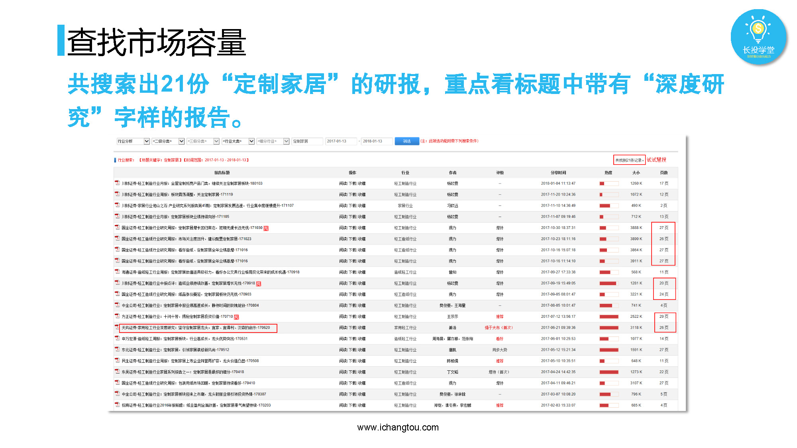
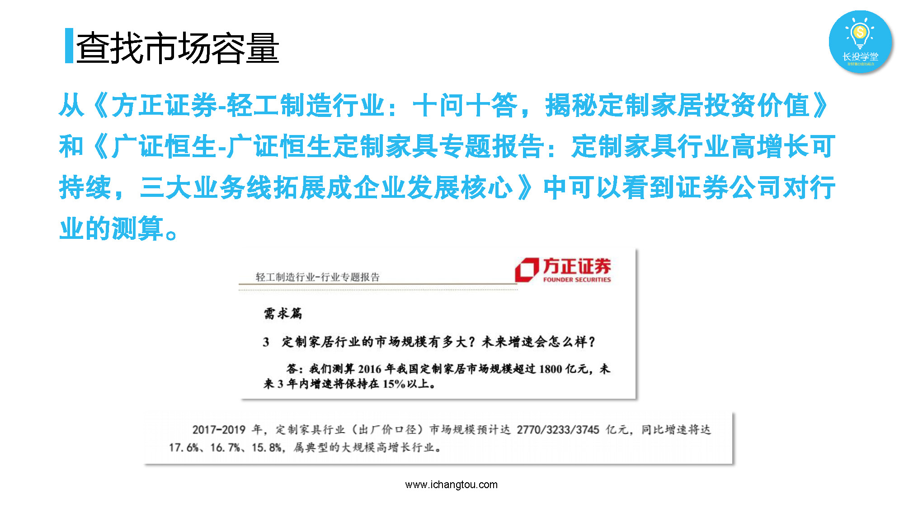
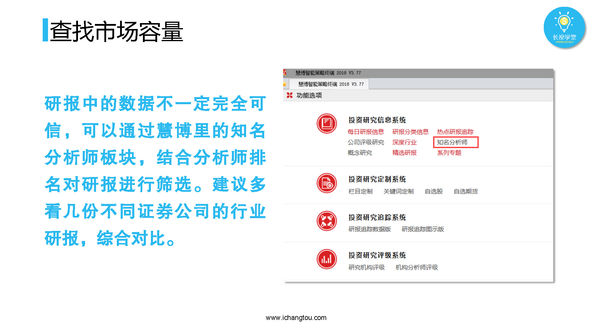

# 基金3-x-基金的优势与特点

## PPT

## 课程内容

### 研报怎么下载

- xxxx1

  > 

### 研报怎么看

- xxxx1

  > 

### 研报的局限性

- xxxx1

  > 

## 课后巩固

- 问题

  > 下列说法哪个是错误的？
  >
  > A.我们可以到慧博智能策略终端下载研报
  >
  > B.可完全信任研报中的一切信息
  >
  > C.看研报时需要多看几份，综合对比

- 正确答案

  > B。不是所有的研报都真实可信，单份报告的信息可能不够全面，单个券商的分析也会存在一定的局限性，所以我们在看研报时需要多看几份，用火眼金睛对比分析。